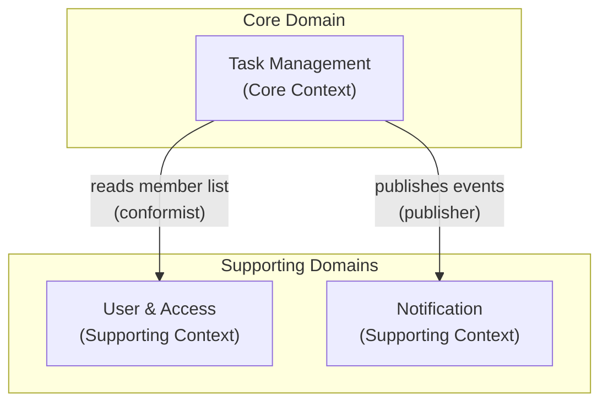
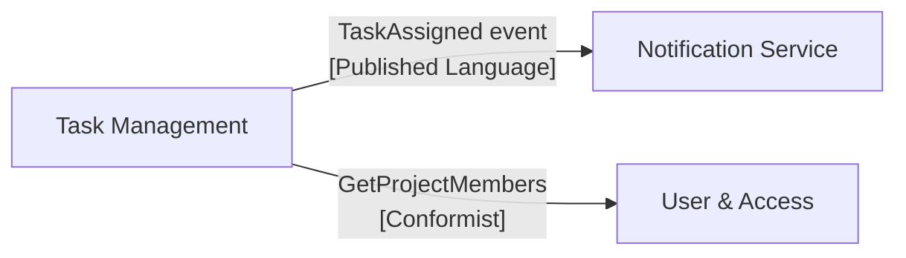
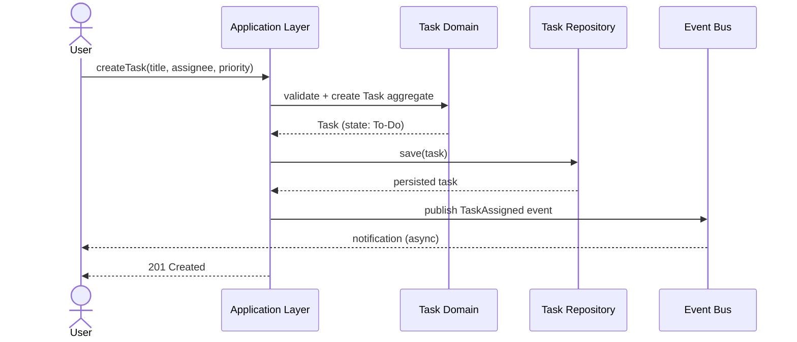
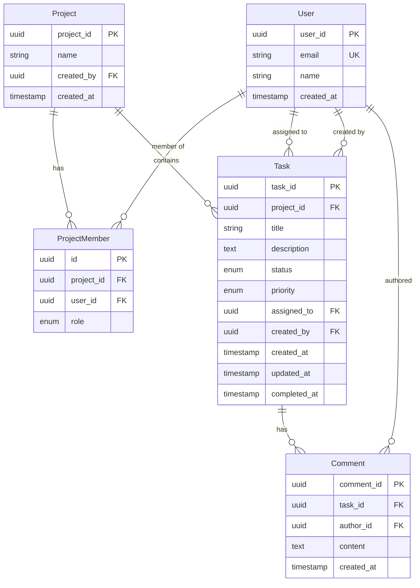
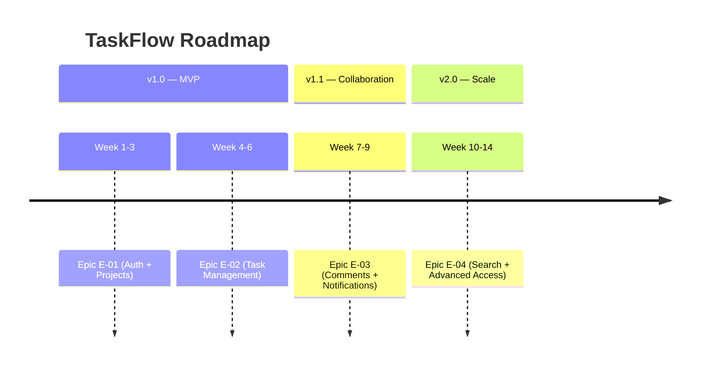
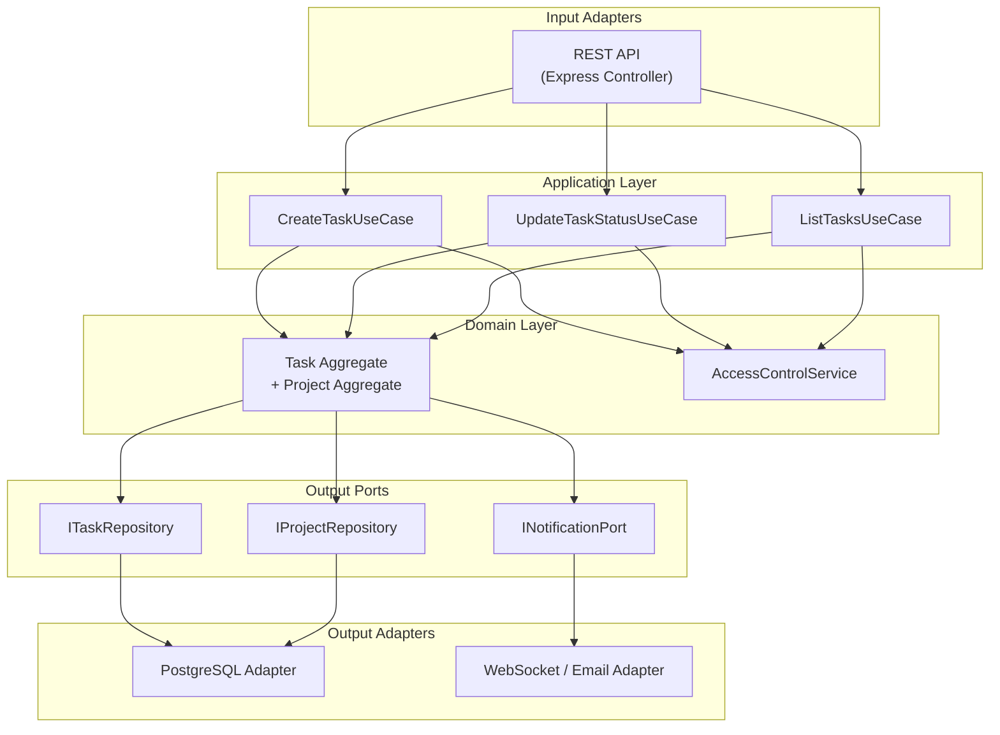
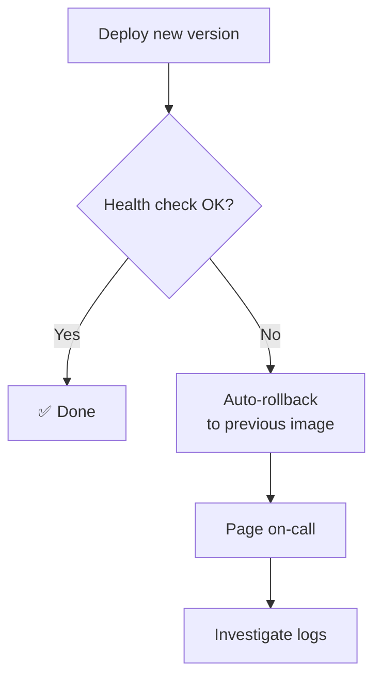
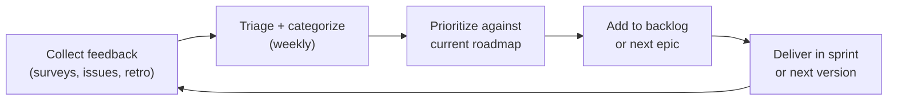

[← Index](./README.md)

---

# Example Implementation: TaskFlow

> A complete worked example of documenting a real project through all 12 SDLC phases using the DDD + Hexagonal Architecture Template.

**What This Is:** A compact, self-contained reference showing what each phase's documentation looks like when completed for a real project — TaskFlow, a collaborative task management application.

**How to Use:** Read alongside the template files for each phase. Each section links to the corresponding template folder. For extended per-phase examples with full detail, see the [URL Shortener tutorial](../01-templates/data-output/url-shortener/).

> **Agnostic boundary:** Phases 0–5 contain zero technology names. Technology-specific choices appear starting in Phase 6.

---

## Contents

- [Phase 0: Documentation Planning](#phase-0-documentation-planning)
- [Phase 1: Discovery](#phase-1-discovery)
- [Phase 2: Requirements](#phase-2-requirements)
- [Phase 3: Design](#phase-3-design)
- [Phase 4: Data Model](#phase-4-data-model)
- [Phase 5: Planning](#phase-5-planning)
- [Phase 6: Development](#phase-6-development)
- [Phase 7: Testing](#phase-7-testing)
- [Phase 8: Deployment](#phase-8-deployment)
- [Phase 9: Operations](#phase-9-operations)
- [Phase 10: Monitoring](#phase-10-monitoring)
- [Phase 11: Feedback](#phase-11-feedback)
- [Traceability Summary](#traceability-summary)

---

## Phase 0: Documentation Planning

> **Template:** [`01-templates/00-documentation-planning/`](../01-templates/00-documentation-planning/)

### SDLC Scope Decision

| Phase | Name | Owner | In Scope | Notes |
|-------|------|-------|----------|-------|
| 0 | Documentation Planning | Lead Architect | ✅ | Framework setup |
| 1 | Discovery | Product Owner | ✅ | Problem + vision |
| 2 | Requirements | Product Owner + Tech Lead | ✅ | FR/NFR/scope |
| 3 | Design | Tech Lead | ✅ | DDD strategic design |
| 4 | Data Model | Tech Lead | ✅ | Aggregates + ERD |
| 5 | Planning | Product Owner | ✅ | Roadmap + epics |
| 6 | Development | Engineering Team | ✅ | Architecture + APIs |
| 7 | Testing | QA + Engineering | ✅ | Test strategy |
| 8 | Deployment | DevOps | ✅ | CI/CD + environments |
| 9 | Operations | DevOps + SRE | ✅ | Runbooks |
| 10 | Monitoring | SRE | ✅ | Metrics + alerts |
| 11 | Feedback | Product Owner | ✅ | Retrospectives |

### Documentation Conventions

- All documents in English.
- Diagrams: Mermaid (preferred) → PlantUML → ASCII.
- Phases 1–5: technology-agnostic.
- Each phase document cross-references the previous phase.

[↑ Back to top](#contents)

---

## Phase 1: Discovery

> **Template:** [`01-templates/01-discovery/`](../01-templates/01-discovery/)

### Vision

**Project:** TaskFlow — Collaborative task management for teams

**Vision statement:** Empower distributed teams to organize work transparently and collaborate effectively.

**Problem:** Teams struggle with scattered task information across email, chat, and multiple tools, leading to missed deadlines and unclear ownership.

**Success indicator:** Teams adopt TaskFlow as their single source of truth for project work.

### Key Actors

| Actor | Role | Goal |
|-------|------|------|
| Team Member | Creates and updates tasks | Manage own work and collaborate |
| Project Manager | Oversees projects | Visibility into team progress |
| Administrator | Manages workspace | Control access and settings |
| System | Automated notifications | Keep actors informed on events |

[↑ Back to top](#contents)

---

## Phase 2: Requirements

> **Template:** [`01-templates/02-requirements/`](../01-templates/02-requirements/)

### Glossary

| Term | Definition |
|------|-----------|
| Task | A unit of work with a title, status, and optional assignee |
| Project | A container for related tasks, shared among team members |
| Assignee | The team member responsible for completing a task |
| Status | The lifecycle stage of a task: To-Do, In Progress, Done |

### Functional Requirements

| ID | Description | Priority | Actor |
|----|-------------|----------|-------|
| FR-001 | Team Member can create a task with title, description, and assignee | Must Have | Team Member |
| FR-002 | Team Member can change task status | Must Have | Team Member |
| FR-003 | Project Manager can view all tasks in a project | Must Have | Project Manager |
| FR-004 | System sends notification to assignee when a task is assigned | Should Have | System |
| FR-005 | Team Member can comment on a task | Should Have | Team Member |

#### FR-001 Detail: Create Task

| Field | Value |
|-------|-------|
| **Actor** | Team Member |
| **Trigger** | User clicks "New Task" |
| **Preconditions** | Authenticated; member of the project |
| **Main Flow** | 1. Open project → 2. Click "New Task" → 3. Fill form (title, description, assignee, priority) → 4. Click "Create" → 5. Task appears in list; assignee notified |
| **Exception: empty title** | Show validation error; block submission |
| **Exception: assignee not found** | Show "User not found"; keep form open |
| **Acceptance criteria** | Task created with all fields; assignee notified; task visible in list immediately |

### Non-Functional Requirements

| ID | Category | Requirement | Measurement |
|----|----------|-------------|-------------|
| NFR-001 | Performance | Task list loads in < 500 ms for projects with < 1000 tasks | p95 < 500 ms in load test |
| NFR-002 | Availability | Service available 99.5% of the time | Monthly uptime monitor |
| NFR-003 | Security | All API endpoints require authentication | Auth audit |
| NFR-004 | Privacy | Assignee email is never exposed in public task URLs | Data audit |

### Scope

**In scope (v1.0):** Task CRUD, project access control, assignment notifications, basic commenting.

**Out of scope (v1.0):** Subtasks, file attachments, Gantt chart view, external integrations.

[↑ Back to top](#contents)

---

## Phase 3: Design

> **Template:** [`01-templates/03-design/`](../01-templates/03-design/)

> ⚠️ **Agnostic boundary:** This section contains no technology names.

### Bounded Contexts

TaskFlow is divided into three bounded contexts:



| Context | Type | Responsibility |
|---------|------|---------------|
| Task Management | Core | Task lifecycle, project organization, comment threads |
| User & Access | Supporting | Identity, team membership, roles |
| Notification | Supporting | Delivery of assignment and status-change alerts |

### Context Map



- **Task Management → User & Access:** Conformist — Task Management accepts the User & Access model without translation.
- **Task Management → Notification:** Published Language — Task Management publishes domain events that Notification Service consumes.

### Key Flow: Create Task



### UI Sketch: Task Board

```
┌─────────────────────────────────────┐
│  Project: Alpha  [+ New Task]       │
├────────────────┬────────────────────┤
│  TO-DO (3)     │  IN PROGRESS (2)   │
│  ─────────     │  ─────────────     │
│  Fix login bug │  Design review     │
│  Write tests   │  API docs          │
│  Team sync     │                    │
├────────────────┴────────────────────┤
│  DONE (5) ▼                         │
└─────────────────────────────────────┘
```

[↑ Back to top](#contents)

---

## Phase 4: Data Model

> **Template:** [`01-templates/04-data-model/`](../01-templates/04-data-model/)

> ⚠️ **Agnostic boundary:** This section contains no technology names.

### Aggregates and Invariants

#### Aggregate: Task (Root)

**Invariants:**
- `title` must be 3–200 characters; cannot be null.
- `status` transitions follow: `To-Do → In Progress → Done`; no backwards transitions.
- `assignee` must be a member of the task's project.
- `completed_at` is set only when status transitions to `Done`; cannot precede `created_at`.

**Entities inside aggregate:**
- `Task` (root) — carries identity and lifecycle
- `Comment` — embedded; no identity outside Task

**Value objects:**
- `TaskStatus` — enum: `To-Do`, `In Progress`, `Done`
- `Priority` — enum: `Low`, `Medium`, `High`

#### Aggregate: Project (Root)

**Invariants:**
- A project must have at least one `owner` member at all times.
- A task can only exist inside an existing project.

### Entity Relationship Diagram



[↑ Back to top](#contents)

---

## Phase 5: Planning

> **Template:** [`01-templates/05-planning/`](../01-templates/05-planning/)

> ⚠️ **Agnostic boundary:** This section contains no technology names.

### Roadmap



### Epics

| ID | Epic | Target Version | FRs Covered |
|----|------|----------------|-------------|
| E-01 | User Authentication + Project Management | v1.0 | FR-003, NFR-003 |
| E-02 | Task Lifecycle | v1.0 | FR-001, FR-002, NFR-001 |
| E-03 | Collaboration | v1.1 | FR-004, FR-005 |
| E-04 | Advanced Search + RBAC | v2.0 | NFR-002, NFR-004 |

#### E-02 Detail: Task Lifecycle

**Description:** Full task CRUD — creation, assignment, status transitions, closure.

**User stories:** Create task (FR-001), change status (FR-002), view task list (FR-003).

**Acceptance criteria:**
- All FR-001 acceptance criteria pass.
- Status machine enforced; backwards transitions rejected.
- Task list renders under NFR-001 threshold (p95 < 500 ms).

**Priority:** P0 — Must ship in v1.0.

### Milestones

| ID | Milestone | Epics | Version |
|----|-----------|-------|---------|
| M-001 | Core working app | E-01, E-02 | v1.0 |
| M-002 | Collaboration features | E-03 | v1.1 |
| M-003 | Enterprise ready | E-04 | v2.0 |

### [CHECK-PHASE5-CHAIN] Traceability

FR-001 → E-02 → M-001 → v1.0 ✅
FR-002 → E-02 → M-001 → v1.0 ✅
FR-003 → E-01 → M-001 → v1.0 ✅
FR-004 → E-03 → M-002 → v1.1 ✅
FR-005 → E-03 → M-002 → v1.1 ✅

[↑ Back to top](#contents)

---

## Phase 6: Development

> **Template:** [`01-templates/06-development/`](../01-templates/06-development/)

### Architecture: Hexagonal



### Port Definitions

| Port | Direction | Contract |
|------|-----------|---------|
| `ICreateTaskUseCase` | Inbound | `execute(cmd: CreateTaskCommand): Task` |
| `IUpdateTaskStatusUseCase` | Inbound | `execute(cmd: UpdateStatusCommand): Task` |
| `IListTasksUseCase` | Inbound | `execute(query: ListTasksQuery): Task[]` |
| `ITaskRepository` | Outbound | `save(task: Task): void`, `findById(id): Task` |
| `IProjectRepository` | Outbound | `findById(id): Project`, `findMembers(id): User[]` |
| `INotificationPort` | Outbound | `publish(event: TaskAssigned): void` |

### ADR-001: TypeScript + Node.js 20 LTS

| Field | Value |
|-------|-------|
| **Status** | Accepted |
| **Context** | Need a typed, async-friendly language for the task service |
| **Decision** | TypeScript 5.x on Node.js 20 LTS |
| **Rationale** | Shared language with frontend team; strong DDD library ecosystem; LTS support |
| **Consequences** | Build step required; compile-time safety mitigates runtime surprises |

### REST API: POST /projects/{projectId}/tasks

**Request:**

```json
{
  "title": "Fix login bug",
  "description": "Mobile users cannot reset password",
  "assignedTo": "user-uuid",
  "priority": "high"
}
```

**Response 201:**

```json
{
  "id": "task-uuid",
  "projectId": "project-uuid",
  "title": "Fix login bug",
  "status": "To-Do",
  "priority": "high",
  "assignedTo": { "id": "user-uuid", "name": "Jane Smith" },
  "createdAt": "2024-02-01T10:30:00Z"
}
```

**Error codes:** 400 (validation), 401 (unauthenticated), 403 (not project member), 404 (project not found).

[↑ Back to top](#contents)

---

## Phase 7: Testing

> **Template:** [`01-templates/07-testing/`](../01-templates/07-testing/)

### Test Strategy

```
         ╔══════════════════╗
         ║   E2E (10%)      ║  10+ workflows: create task, status change, assignment
    ╔════╩══════════════════╩════╗
    ║    Integration (20%)       ║  30+ tests: API → DB, notification events
╔═══╩════════════════════════════╩═══╗
║       Unit (70%)                    ║  100+ tests: domain logic, use cases, services
╚═════════════════════════════════════╝
```

**Tools:** Vitest (unit/integration), Supertest (API), Playwright (E2E).

**Coverage targets:** Domain layer ≥ 90%; Application layer ≥ 85%; Overall ≥ 80%.

### Unit Tests — Domain Layer

| ID | Test | What It Verifies |
|----|------|-----------------|
| UT-001 | `Task.create()` with valid input | Task created with status To-Do |
| UT-002 | `Task.create()` with empty title | Throws `DomainError.INVALID_TITLE` |
| UT-003 | `Task.transitionStatus(In Progress)` from To-Do | Transition allowed |
| UT-004 | `Task.transitionStatus(To-Do)` from In Progress | Throws `DomainError.INVALID_TRANSITION` |
| UT-005 | `Task.assign()` with non-member user | Throws `DomainError.NOT_PROJECT_MEMBER` |
| UT-006 | `CreateTaskUseCase` — happy path | Calls `ITaskRepository.save` + `INotificationPort.publish` |
| UT-007 | `CreateTaskUseCase` — project not found | Throws `UseCaseError.PROJECT_NOT_FOUND` |

### Integration Tests — API Layer

| ID | Test | What It Verifies |
|----|------|-----------------|
| IT-001 | `POST /projects/{id}/tasks` — valid body | 201 + task persisted in DB |
| IT-002 | `POST /projects/{id}/tasks` — empty title | 400 + field error message |
| IT-003 | `PATCH /tasks/{id}/status` — To-Do → In Progress | 200 + status updated |
| IT-004 | `PATCH /tasks/{id}/status` — backwards transition | 422 + error message |
| IT-005 | `POST /projects/{id}/tasks` — with assignee | Notification event published |

[↑ Back to top](#contents)

---

## Phase 8: Deployment

> **Template:** [`01-templates/08-deployment/`](../01-templates/08-deployment/)

### Environment Matrix

| Environment | Trigger | Database | Notes |
|-------------|---------|----------|-------|
| `ci` | Every push | In-memory / test DB | Runs unit + integration tests |
| `staging` | Merge to `main` | PostgreSQL (staging) | Smoke tests + manual QA |
| `production` | Git tag `v*.*.*` | PostgreSQL (prod, HA) | Manual approval gate |

**Version alignment:** Phase 5 roadmap versions (v1.0, v1.1, v2.0) map to git tags v1.0.0, v1.1.0, v2.0.0 respectively.

### CI/CD Pipeline

```yaml
# .github/workflows/ci.yml
on: [push, pull_request]
jobs:
  test:
    steps:
      - uses: actions/checkout@v4
      - run: npm ci
      - run: npm run lint
      - run: npm test           # Vitest unit + integration
      - run: npm run build

  deploy-staging:
    needs: test
    if: github.ref == 'refs/heads/main'
    steps:
      - run: docker build -t taskflow:${{ github.sha }} .
      - run: docker push ghcr.io/org/taskflow:${{ github.sha }}
      - run: ./scripts/deploy.sh staging
      - run: npm run test:smoke

  deploy-prod:
    needs: deploy-staging
    if: startsWith(github.ref, 'refs/tags/v')
    environment: production    # manual approval gate
    steps:
      - run: ./scripts/deploy.sh production ${{ github.ref_name }}
```

### Rollback Strategy



[↑ Back to top](#contents)

---

## Phase 9: Operations

> **Template:** [`01-templates/09-operations/`](../01-templates/09-operations/)

### SLA

| Metric | Target | Alert |
|--------|--------|-------|
| Task API availability | 99.5% / month | < 99.5% → P2 |
| Task create latency | p95 < 200 ms | > 500 ms → P2 |
| RTO (recovery time) | < 30 min | Exceeded → P1 escalation |
| RPO (data loss) | < 24 h | Exceeded → post-mortem |

### Incident Severity Matrix

| Severity | Example | Response SLA | On-Call |
|----------|---------|-------------|---------|
| P1 — Critical | Task service completely down | 15 min | Page immediately |
| P2 — High | Task creation failing > 5% of requests | 1 h | Page in business hours |
| P3 — Medium | Notification delivery delayed > 10 min | 4 h | Team notification |
| P4 — Low | UI cosmetic glitch | Next sprint | Backlog |

### Runbook RB-001: Restart Task Service

**When:** Service degraded, responding slowly, or throwing errors.

**Impact:** Users may fail to create or update tasks.

**Steps:**

1. **Verify the issue**
   ```bash
   curl -s https://api.taskflow.com/health | jq .
   systemctl status taskflow
   tail -100 /var/log/taskflow/error.log
   ```
   Look for: high error rates, DB connection errors, memory exhaustion.

2. **Open incident** — post in `#incidents` Slack channel; assign severity (P1/P2).

3. **Restart service**
   ```bash
   sudo systemctl restart taskflow
   sleep 30
   curl -s https://api.taskflow.com/health | jq .
   ```

4. **Monitor recovery** — watch error rate drop below 1%; verify DB pool healthy.

5. **If still unhealthy** — check DB connectivity, check downstream services, consider rollback.

6. **Rollback**
   ```bash
   docker pull ghcr.io/org/taskflow:previous
   ./scripts/deploy.sh production previous
   ```

7. **Post-incident** — schedule post-mortem if P1; update runbook if steps were unclear.

[↑ Back to top](#contents)

---

## Phase 10: Monitoring

> **Template:** [`01-templates/10-monitoring/`](../01-templates/10-monitoring/)

### Key Metrics

| Metric | Type | Normal | Alert Threshold |
|--------|------|--------|----------------|
| `task_create_latency_p95` | Service | < 200 ms | > 500 ms → P2 |
| `task_api_error_rate` | Service | < 0.1% | > 1% → P1 |
| `notification_delivery_success` | Business | > 99% | < 95% → P3 |
| `db_query_latency_p95` | Infrastructure | < 50 ms | > 200 ms → P2 |
| `tasks_created_per_day` | Business | Tracked | Sudden drop → P3 |
| `active_users_daily` | Business | Tracked | < 50% baseline → P2 |

### Alert Rules

| Alert | Condition | Severity | Action |
|-------|-----------|----------|--------|
| `HighErrorRate` | error_rate > 1% for 2 min | P1 | Page on-call |
| `HighLatency` | task_create_latency_p95 > 500 ms | P2 | Create ticket |
| `NotificationFailure` | delivery_success < 95% | P3 | Team notification |
| `LowDailyActivity` | tasks_created < 50% of 7-day avg | P3 | Alert product team |

### Dashboard Layout

```
ROW 1 │ Service Availability (%)  │ Error Rate (%)         │ p95 Latency (ms)
ROW 2 │ Requests per Minute       │ Active Users           │ Tasks Created Today
ROW 3 │ DB Query Latency          │ Notification Success   │ CPU / Memory
```

### Logging

All log entries are structured JSON with fields: `timestamp`, `level`, `service`, `traceId`, `message`, `context`.

**Privacy constraint (NFR-004):** The `assignedTo.email` field is NEVER logged — only `assignedTo.userId`.

[↑ Back to top](#contents)

---

## Phase 11: Feedback

> **Template:** [`01-templates/11-feedback/`](../01-templates/11-feedback/)

### Feedback Channels

| Channel | Cadence | Owner |
|---------|---------|-------|
| In-app survey (NPS) | Monthly | Product Owner |
| User interviews | Quarterly | Product Owner |
| GitHub Issues | Continuous | Engineering |
| Sprint retrospective | End of each sprint | Scrum Master |

### v1.0 Retrospective (Sprint 5, Feb 1–15)

**What Went Well ✅**
- Strong API design collaboration between frontend/backend.
- Zero rollbacks to production.
- Test coverage exceeded target (85% vs 80%).
- Early user feedback shaped task priority display.

**What Could Improve 🔄**
- Testing took 40% longer than estimated.
- Database migration strategy was unclear (2 h to resolve).
- Documentation trailed implementation.
- Mobile performance testing done too late in the sprint.

**Action Items:**
- [ ] Document DB migration process — @alice — due +7 days
- [ ] Invest in test automation framework — @bob — due +14 days
- [ ] Establish doc-first development approach — team — ongoing
- [ ] Add mobile performance tests to CI pipeline — @charlie — due +10 days

### Feedback-to-Backlog Cycle



### v1.1 Backlog (Surfaced from v1.0 Feedback)

| ID | Item | Source | Target |
|----|------|--------|--------|
| BL-001 | Keyboard shortcut to create task | User interview | v1.1 |
| BL-002 | Bulk status change | In-app survey | v1.1 |
| BL-003 | Mobile app (basic) | GitHub Issues | v1.1 |
| BL-004 | Task dependencies | User interview | v2.0 |
| BL-005 | Audit log export | Enterprise user request | v2.0 |

[↑ Back to top](#contents)

---

## Traceability Summary

| Phase | Links to | Key Connection |
|-------|----------|---------------|
| Phase 1 | → Phase 2 | Problem + vision define requirements |
| Phase 2 | → Phase 3 | FRs drive system flows and bounded contexts |
| Phase 3 | → Phase 4 | Domain model emerges from bounded contexts |
| Phase 4 | → Phase 5 | Aggregates define epics and acceptance criteria |
| Phase 5 | → Phase 6 | Epics and milestones drive architecture decisions |
| Phase 6 | → Phase 7 | Ports and adapters drive test cases |
| Phase 7 | → Phase 8 | Test strategy drives CI/CD pipeline stages |
| Phase 8 | → Phase 9 | Deployment triggers runbook events |
| Phase 9 | → Phase 10 | Incident categories define alert thresholds |
| Phase 10 | → Phase 11 | Metrics inform retrospective discussion |
| Phase 11 | → Phase 2 | Backlog items feed next requirements cycle |

[↑ Back to top](#contents)

---

[← Index](./README.md)

