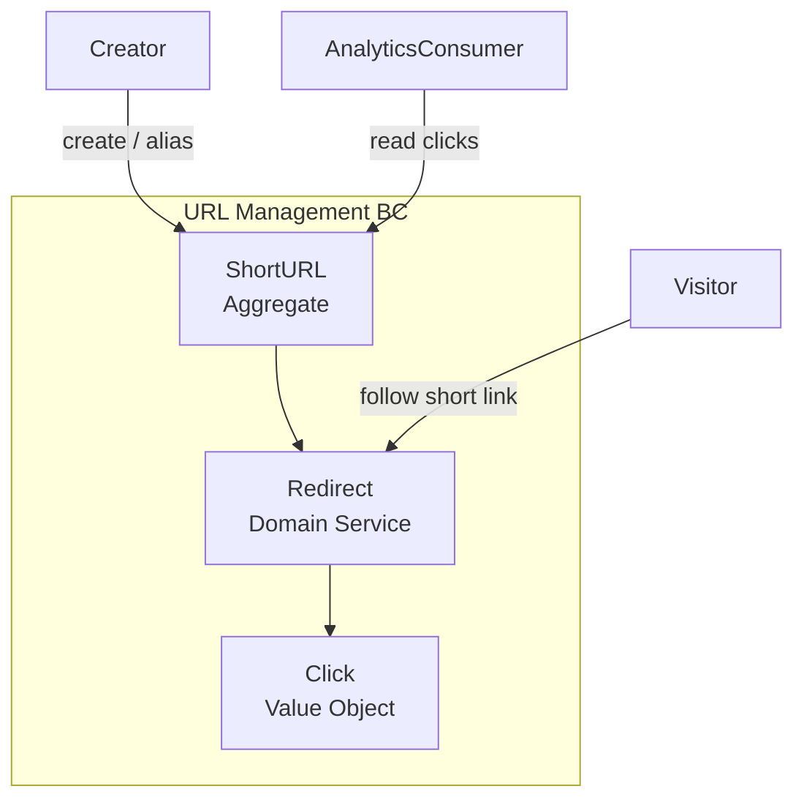

[← Index](./README.md)

---

# Tutorial: Full Cycle Documentation — URL Shortener

> **What This Is:** A step-by-step tutorial demonstrating how to produce complete SDLC documentation for a real project using the DDD + Hexagonal Architecture framework, covering all 12 phases from Documentation Planning to Feedback.
> **How to Use:** Read the introduction and case overview first, then navigate to each phase section in order. Each section explains what was decided, what was generated, and why — with links to the actual output files in `01-templates/data-output/url-shortener/`.
> **Why It Matters:** Provides a concrete, fully worked example of the documentation lifecycle for a simple domain, giving teams a reference they can compare against their own work and adapt for their project.
> **When to Use:** When starting a new documentation project and wanting a complete reference to follow; or when learning how the 12 phases connect, depend on each other, and produce traceable artifacts.
> **Owner:** DDD + Hexagonal AI Template contributors.

---

## Contents

1. [Introduction](#introduction)
2. [The URL Shortener Case](#the-url-shortener-case)
3. [Domain Vocabulary](#domain-vocabulary)
4. [Bounded Context](#bounded-context)
5. [How to Use This Tutorial](#how-to-use-this-tutorial)
6. [Phase Navigation](#phase-navigation)

---

## Introduction

This tutorial walks you through the **complete documentation lifecycle** of a software project using the DDD + Hexagonal Architecture template. It uses the **URL Shortener** as the working case: a simple, universally understood service that is complex enough to illustrate all DDD and documentation patterns, but small enough to document without becoming a reference manual.

Each phase section below:
- Explains what decisions were made and why
- Links to the actual output files produced for that phase
- Highlights what would change for a more complex project
- Flags the key inputs the next phase will rely on

By following this tutorial, you will see the full chain from a blank page (Phase 0) to a complete, stakeholder-ready documentation set (Phase 11).

**Prerequisites:** Read [`AI-WORKFLOW-GUIDE.md`](./AI-WORKFLOW-GUIDE.md) before Phase 1. Read [`INSTRUCTIONS-FOR-AI.md`](./INSTRUCTIONS-FOR-AI.md) when generating your own phases.

[↑ Back to top](#tutorial-full-cycle-documentation--url-shortener)

---

## The URL Shortener Case

### Project Summary

**Name:** LinkSnap (working title)
**Type:** Web service
**Core Value:** Allow users to convert long, unwieldy URLs into short, shareable links that can be tracked and managed.

### Vision Statement

> *Enable anyone to share long URLs as short, memorable links, with basic analytics on usage, without requiring authentication for casual use.*

### Problem Statement

Long URLs are hard to share in messages, social media, and printed materials. Users need a way to create short, stable aliases that redirect to the original resource, with the ability to see basic usage statistics.

### Why URL Shortener for This Tutorial

| Property | Value |
|----------|-------|
| Domain complexity | Low — one aggregate, one bounded context |
| DDD fit | Clear entity (`ShortURL`), value objects (`Click`, `ShortCode`), one domain service (`Redirect`) |
| Hexagonal fit | HTTP adapter (in) → domain → storage port (out) — textbook example |
| Documentation depth | Each phase has real, non-trivial content without being overwhelming |
| Phase agnosticism | Easy to describe in business terms (phases 1–5) before naming technologies (phases 6–11) |

[↑ Back to top](#tutorial-full-cycle-documentation--url-shortener)

---

## Domain Vocabulary

These terms constitute the **ubiquitous language** of the URL Shortener. They are used consistently across all 12 phases. Technology-agnostic terms apply to phases 1–5; implementation terms are introduced only in phases 6–11.

| Term | Definition | Type | First Used |
|------|-----------|------|-----------|
| **ShortURL** | The core aggregate: a mapping from a short code to an original URL. Has identity, creation date, optional expiry, and optional alias. | Aggregate Root | Phase 1 |
| **Short Code** | A unique alphanumeric string (e.g., `abc123`) that forms the path of the shortened URL. System-generated unless an alias is provided. | Value Object | Phase 1 |
| **Original URL** | The long, complete URL that a ShortURL maps to. Must be a valid, absolute URL. | Value Object | Phase 1 |
| **Redirect** | The domain operation that resolves a short code to its original URL. Produces a `Click` event on success. Returns "not found" if the code is unknown or expired. | Domain Service | Phase 1 |
| **Click** | A value object representing one access of a ShortURL. Carries: timestamp, referrer (optional), user agent (optional). | Value Object | Phase 1 |
| **Click Count** | The total number of `Click` events recorded for a given `ShortURL`. The primary analytics metric. | Derived value | Phase 2 |
| **Expiry** | An optional point in time after which a ShortURL stops redirecting. If absent, the ShortURL never expires. | Value Object | Phase 2 |
| **Alias** | A user-supplied, human-readable short code used instead of the system-generated one. Subject to uniqueness and format constraints. | Value Object | Phase 2 |
| **URL Management** | The single bounded context that owns all ShortURL operations: creation, redirect, analytics, and lifecycle management. | Bounded Context | Phase 3 |
| **Creator** | The actor who creates a ShortURL. May be anonymous or authenticated depending on the feature set. | Actor | Phase 1 |
| **Visitor** | The actor who follows a short URL and is redirected to the original URL. Does not interact with the system beyond the redirect. | Actor | Phase 1 |
| **Analytics Consumer** | The actor who reads click statistics for one or more ShortURLs they created. | Actor | Phase 2 |

[↑ Back to top](#tutorial-full-cycle-documentation--url-shortener)

---

## Bounded Context

The URL Shortener has a single bounded context: **URL Management**. This is intentional — the domain is small enough that splitting into multiple bounded contexts would add accidental complexity.

**Key Architectural Point (Phase 6):** The HTTP layer (adapter in) calls the `Redirect` domain service directly. Persistence (adapter out) stores `ShortURL` state and `Click` events. The domain knows nothing about HTTP, databases, or messaging.

[↑ Back to top](#tutorial-full-cycle-documentation--url-shortener)

---

## How to Use This Tutorial

### If you are learning the framework

Read each phase section in order. For each section:
1. Read the **What this phase decided** summary
2. Open the linked output file(s) and read them
3. Note the **Key inputs for next phase** — these are the traceability links
4. Then move to the next phase

### If you are building your own project

Use this tutorial as a reference, not a template. Your project will have different actors, a different domain vocabulary, and different architectural choices. Use the URL Shortener outputs to understand what "done" looks like at each phase, then generate your own equivalents.

### If you are validating your existing documentation

Use the done criteria listed in each phase section as a checklist. Compare your documents against what was produced for the URL Shortener.

### Agnostic / specific boundary reminder

- **Phases 0–5:** No technology names. Not "REST", not "PostgreSQL", not "React". Business terms only.
- **Phases 6–11:** Technology names are expected and required. Name the stack, the patterns, the tools.

[↑ Back to top](#tutorial-full-cycle-documentation--url-shortener)

---

## Phase Navigation

Each phase links to its output files in `01-templates/data-output/url-shortener/`. Content is added as this tutorial progresses through its scopes.

---

### Phase 0 — Documentation Planning

> *Output folder:* [`data-output/url-shortener/00-documentation-planning/`](../01-templates/data-output/url-shortener/00-documentation-planning/README.md)

**Purpose:** Establish the documentation framework for the project: naming conventions, phase ownership, and the macro plan.

**What this phase decided:**
- Project name: LinkSnap
- Documentation owner: single-person team (tutorial context)
- Phase conventions: follows the standard 12-phase SDLC structure
- All 12 phases selected (tutorial context — show every phase)
- Naming convention: `FR-NNN`, `NFR-NNN`, `TC-NNN`, `ADR-NNN` for IDs
- Diagram preference: Mermaid > PlantUML > ASCII

**Key inputs for next phase (Phase 1 — Discovery):** Project name, owner, blank macro plan with all phases listed.

---

### Phase 1 — Discovery

> *Output folder:* [`data-output/url-shortener/01-discovery/`](../01-templates/data-output/url-shortener/01-discovery/README.md)

**Purpose:** Define the problem, the vision, and the actors. Establish the business context before any requirements are written.

**What this phase decided:**
- Vision: enable anyone to shorten and share URLs with basic analytics
- Three actors: Creator (anonymous), Visitor (always anonymous), Analytics Consumer
- Core problem: long URLs are unshareable; no tracking without a tool
- Scope boundary: no team collaboration in v1.0; single-user creation only
- Redirect uses HTTP 302 (not 301) — preserves ability to change target
- Visitor IP must NOT be stored (privacy constraint)

**Key inputs for next phase (Phase 2 — Requirements):** Actor list, vision statement, success criteria (SC-001 to SC-006), scope boundaries.

---

### Phase 2 — Requirements

> *Output folder:* [`data-output/url-shortener/02-requirements/`](../01-templates/data-output/url-shortener/02-requirements/README.md)

**Purpose:** Specify what the system must do (functional) and how it must perform (non-functional). Define the glossary used across all phases.

**What this phase decided:**
- FR-001: Creator can shorten a URL → receives a short link
- FR-002: Visitor follows a short link → is redirected (302) to the original URL + click recorded
- FR-003: Creator can view click count for each of their ShortURLs
- FR-004: Creator can provide a custom alias (format: alphanumeric + hyphens, 3–30 chars)
- FR-005: ShortURLs can have an optional expiry date (expired → HTTP 410)
- NFR-001: Redirect latency < 100 ms (p95)
- NFR-002: System handles 1,000 concurrent redirect requests within NFR-001 threshold
- NFR-003: Redirect endpoint 99.5% uptime monthly
- NFR-004: Visitor IP must not be stored (PII constraint)
- NFR-005: Short code uniqueness is a hard system invariant
- Out of scope (v1.0): authentication, teams, QR codes, bulk creation, link editing

**Key inputs for next phase (Phase 3 — Design):** FR list, NFR list, glossary, scope boundary.

---

### Phase 3 — Design

> *Output folder:* [`data-output/url-shortener/03-design/`](../01-templates/data-output/url-shortener/03-design/README.md)

**Purpose:** Design the system flows, the bounded context map, and the domain model. No technology names.

**What this phase decided:**
- Single bounded context: **URL Management** (Core) — no supporting BCs in v1.0
- Aggregate root: `ShortURL` with embedded value objects (`ShortCode`, `OriginalURL`, `Alias`, `Expiry`, `Click[]`)
- Two domain services: `Redirect` (resolves code, records click, enforces expiry), `ShortCodeGenerator` (generates unique codes)
- Three system flows modeled: create short URL, redirect, view click count
- Domain events raised (in-process only in v1.0): `ShortUrlCreated`, `VisitorRedirected`, `ShortUrlExpired`
- Redirect uses 302 (not 301) to preserve ability to retarget — decided in Phase 1 (OQ-003)

**Key inputs for next phase (Phase 4 — Data Model):** Aggregate structure, value object list, invariants from bounded context model.

---

### Phase 4 — Data Model

> *Output folder:* [`data-output/url-shortener/04-data-model/`](../01-templates/data-output/url-shortener/04-data-model/README.md)

**Purpose:** Define the data entities, their attributes, and their relationships. Still technology-agnostic — no SQL, no collection names.

**What this phase decided:**
- Entity: `ShortURL` — id, short_code (UK), original_url, alias (nullable, UK), expires_at (nullable), created_at
- Entity: `Click` — id, short_url_id (FK), occurred_at, referrer (nullable), user_agent (nullable)
- Relationship: one ShortURL → many Clicks (1:N)
- 6 invariants defined (INV-001..006): uniqueness, valid URL, future expiry, immutable Click
- Derived values (not persisted in v1.0): `click_count`, `is_expired`
- Privacy: Visitor IP is NOT an attribute — enforces NFR-004

**Key inputs for next phase (Phase 5 — Planning):** Entity list, relationships, invariants, derived metrics.

---

### Phase 5 — Planning

> *Output folder:* [`data-output/url-shortener/05-planning/`](../01-templates/data-output/url-shortener/05-planning/README.md)

**Purpose:** Define the roadmap, epics, and versioning strategy. Translate requirements into a delivery plan.

**What this phase decided:**
- v1.0: anonymous creation + redirect + alias + expiry + click count (all 5 FRs)
- v1.1: operations improvements based on monitoring feedback
- v2.0: authenticated creators + analytics dashboard + link management (Epic E-04)
- v3.0: teams, custom domains, advanced analytics
- 4 epics: E-01 (Core Redirect), E-02 (Creator Enhancements), E-03 (Analytics), E-04 (Auth — v2.0)
- 4 milestones for v1.0: M-001 Redirect MVP → M-002 Creator Control → M-003 Analytics → M-004 Release
- `[CHECK-PHASE5-CHAIN]` verified: every FR/NFR traces to an epic; every epic to a milestone; every milestone to a version

**Key inputs for next phase (Phase 6 — Development):** Epic list, v1.0 scope (all 5 FRs), milestone dependency chain.

---

### Phase 6 — Development

> *Output folder:* [`data-output/url-shortener/06-development/`](../01-templates/data-output/url-shortener/06-development/README.md)

**Purpose:** Define the technical architecture, coding standards, API design, and hexagonal structure. Technology-specific — this is where language, database, and framework choices are made explicit.

**What this phase decided:**
- Runtime: **TypeScript 5 on Node.js 20 LTS** (ADR-001)
- Persistence: **PostgreSQL 15** — ACID uniqueness for `short_code` and `alias` (ADR-002)
- Branch strategy: **GitHub Flow** — `main` always deployable; `feature/*` and `fix/*` PRs (ADR-003)
- Hexagonal structure: `domain/` → `application/` → `adapter/inbound/http/`, `adapter/outbound/persistence/`
- 3 inbound ports (use cases): `ICreateShortUrlUseCase`, `IRedirectUseCase`, `IGetClickCountUseCase`
- 3 outbound ports: `IShortUrlRepository`, `IClickRepository`, `IShortCodeGeneratorPort`
- REST API: `POST /urls`, `GET /{code}` (302 redirect), `GET /urls/{code}/stats`
- Short code: 6-char base62 via `crypto.randomBytes`; uniqueness enforced by DB UNIQUE constraint (not by pre-check)
- PR merge strategy: **squash and merge** (linear `main` history)

**Key inputs for next phase (Phase 7 — Testing):** API contract (request/response schemas), port interfaces, domain invariants list.

---

### Phase 7 — Testing

> *Output folder:* [`data-output/url-shortener/07-testing/`](../01-templates/data-output/url-shortener/07-testing/README.md)

**Purpose:** Define the test strategy, test pyramid, and concrete test cases for every FR, NFR, and invariant.

**What this phase decided:**
- Test runner: **Vitest 1.x**; HTTP testing: **Supertest**; Performance: **k6**
- 25 unit tests (UT-001..025): domain aggregate, value objects, domain services — use in-memory fakes only
- 10 integration tests (IT-001..010): adapter correctness against a real PostgreSQL test DB
- 13 E2E tests (E2E-001..013): full API flow via HTTP against a running server
- Performance threshold: `p(95) < 100 ms` at 100 RPS sustained 60 s (NFR-001 / NFR-002)
- Privacy test: IT-009 explicitly verifies no `visitor_ip` column exists in the schema (NFR-004)
- Coverage targets: ≥95% domain layer, ≥90% use cases, 100% FR happy paths in E2E

**Key inputs for next phase (Phase 8 — Deployment):** CI stage names (`test:unit`, `test:integration`), environment needs (Postgres Docker service), performance threshold values.

---

### Phase 8 — Deployment

> *Output folder:* [`data-output/url-shortener/08-deployment/`](../01-templates/data-output/url-shortener/08-deployment/README.md)

**Purpose:** Define CI/CD pipelines, environment strategy, and release process consistent with the dev workflow (Phase 6) and versioning strategy (Phase 5).

**What this phase decided:**
- 3 environments: `ci` (PR/ephemeral), `staging` (auto on push to `main`), `production` (tag `v*.*.*` + manual gate)
- GitHub Actions workflows: `ci.yml` (lint → type-check → test:unit → test:integration), `deploy-staging.yml`, `deploy-prod.yml`
- Container image: Docker; registry: GitHub Container Registry (GHCR)
- DB migrations run as a dedicated step before each deploy (both staging and prod)
- Manual approval gate in GitHub Environments for production
- Rollback: re-deploy last known-good image tag for most cases; DB snapshot restore for non-reversible migrations
- Release tag format: `v{MAJOR}.{MINOR}.{PATCH}` — v1.0.0 on first production release
- `[CHECK-VERSIONING-ALIGNMENT]`: Phase 5 versions (v1.0, v1.1, v2.0) map to `v1.0.0`, `v1.1.0`, `v2.0.0` — **PASS**

**Key inputs for next phase (Phase 9 — Operations):** Environment names, rollback procedure, DB snapshot retention strategy.

---

### Phase 9 — Operations

> *Output folder:* [`data-output/url-shortener/09-operations/`](../01-templates/data-output/url-shortener/09-operations/README.md)

**Purpose:** Define runbooks, SLA commitments, incident severity matrix, on-call responsibilities, and backup strategy.

**What this phase decided:**
- Redirect endpoint SLA: **99.5% availability** rolling 30 days; latency p95 < 100 ms
- 4 runbooks: RB-001 (redirect down), RB-002 (DB connection failure), RB-003 (rollback), RB-004 (high latency)
- Incident severity: P1 = redirect or DB down (< 15 min response); P2 = create/stats unavailable; P3 = latency degraded
- RTO < 30 min; RPO < 24 h for DB recovery
- Daily PostgreSQL backup, 7-day retention, S3-compatible storage
- v1.0: single on-call engineer; escalation to project lead after 30 min unreachable

**Key inputs for next phase (Phase 10 — Monitoring):** SLA thresholds (100 ms p95, 99.5% availability), incident severity matrix, alert response times.

---

### Phase 10 — Monitoring

> *Output folder:* [`data-output/url-shortener/10-monitoring/`](../01-templates/data-output/url-shortener/10-monitoring/README.md)

**Purpose:** Define key metrics, alert rules, dashboard layout, logging strategy, and known observability gaps.

**What this phase decided:**
- 7 service metrics tracked: redirect latency (p50/p95/p99), error rates, requests/min, active URLs, new URLs/hour
- 6 alert rules: `RedirectEndpointDown` (P1), `DatabaseConnectionFailing` (P1), `RedirectLatencyHigh` (P3), `HighErrorRateOnCreate` (P2), `DiskUsageHigh` (P3), `MemoryUsageHigh` (P2)
- Dashboard: 5 rows — Availability, Latency, Error Rates, Traffic, Infrastructure
- Logging: structured JSON; `requestId` propagated through all layers; **no Visitor IP ever logged** (NFR-004)
- v1.0 observability gaps documented: no tracing, click count not cached, no external uptime check
- Gap table feeds directly into v1.1 backlog (Phase 11)

**Key inputs for next phase (Phase 11 — Feedback):** Observability gaps, operational findings, metric baselines.

---

### Phase 11 — Feedback

> *Output folder:* [`data-output/url-shortener/11-feedback/`](../01-templates/data-output/url-shortener/11-feedback/README.md)

**Purpose:** Capture user feedback channels, conduct the v1.0 retrospective, and produce the backlog for the next planning cycle.

**What this phase decided:**
- 4 feedback channels: in-app button → GitHub Discussions, GitHub Issues, monitoring alerts, Slack `#linksnap-feedback`
- v1.0 retrospective findings: agnostic boundary and traceability from Phase 2 were the highest-value practices
- 3 pain points: click count under load, no tracing, stats latency 3× redirect — all traceable to deferral decisions in Phases 7–10
- 5 lessons learned for future documentation cycles (e.g., "define observability requirements in Phase 2 NFRs")
- Backlog: BL-001..005 for v1.1 (performance + observability); BL-006..011 for v2.0 (authenticated creators)
- Feedback-to-backlog cycle: weekly triage → monthly synthesis → next planning cycle input
- All backlog items trace to Phase 5 epics or new epics to be defined in v2.0 planning

---

[↑ Back to top](#tutorial-full-cycle-documentation--url-shortener)

---

[← Index](./README.md)
