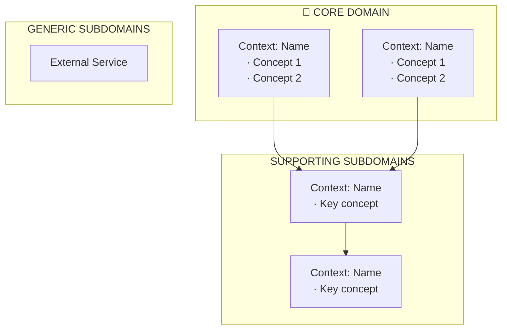

[← Index](./README.md) | [< Previous] | [Next >](./TEMPLATE-008-system-flows.md)

---

# Strategic Design Template

Use this template to define the DDD strategic design before any detailed modeling begins. Your goal is to classify the domain into subdomains, articulate where the competitive advantage lives, and identify the bounded context candidates that will guide all subsequent design decisions.

Apply this template after Discovery (Phase 1) and before detailed flows or domain modeling. If you are working on a simple MVP, skip this template and go directly to System Flows.

**Owner**: Architect + Domain Expert

---

## Contents

- [Domain Vision Statement](#domain-vision-statement)
- [Subdomain Classification](#subdomain-classification)
- [Core Domain Justification](#core-domain-justification)
- [Bounded Contexts Candidates](#bounded-contexts-candidates)
- [Implications for Modeling](#implications-for-modeling)
- [Completion Checklist](#completion-checklist)

---

## Domain Vision Statement

Write a concise statement that defines what the system exists to do and where its unique value lies. This statement should distinguish the system's real differentiator from its supporting capabilities. It will be used as a north-star reference throughout the rest of the design phase.

Use the structure below. Replace the placeholder text with real information about the product.

> [PRODUCT NAME] exists to be [core value proposition].
>
> [Differentiating factor] is not [common feature] — that's the means. The real value is [unique capability].
>
> The system is successful when [desired outcome for users].

### Example: Authentication Platform

The following example shows a filled-in Domain Vision Statement for an authentication platform. Use it to calibrate the level of specificity expected in your own statement.

> Keygo exists to be the single source of truth about **who an identity is, what they can do, and under what conditions**, within any SaaS ecosystem that doesn't want to build or maintain its own identity and access infrastructure.
>
> Multi-tenancy is not the differentiator — that's the form. The value is **delegated, secure, and auditable identity, session, and access management** with the granularity each organization needs.
>
> The system is successful when an organization can connect any application, define its access rules, and trust that Keygo enforces them — without writing a single line of authentication logic.

---

## Subdomain Classification

Identify every subdomain in the system and classify it as Core, Supporting, or Generic. This classification determines how deeply you model each area: deep investment goes to Core, sufficient modeling to Supporting, and minimal or delegated handling to Generic.

In DDD, not all subdomains deserve equal investment. Classification determines where deep modeling applies.

### Core Domain — The Differentiator

**How to identify**: Core subdomains are where your product's competitive advantage lives. Ask yourself: "If we couldn't build this, could we still compete?" If the answer is no, it's Core. Core domains require the deepest modeling, best names, and most careful abstractions.

List the subdomains where the product's competitive advantage lives. These are the capabilities the system does that cannot be bought, replicated with a generic framework, or delegated. Apply your deepest modeling effort here.

| Subdomain | Description |
|----------|------------|
| **[Subdomain 1]** | [What it does — this is where the competitive advantage lives] |

Core Domain is where you can't buy, replicate with a generic framework, or delegate. Deepest modeling, best names, most careful abstractions.

### Supporting Subdomains — Necessary, Not Differentiators

**How to identify**: Supporting subdomains are needed for the system to function, but they do not create competitive advantage. Examples: user authentication (used by many systems), email delivery, logging. You should model these sufficiently to work, but avoid over-engineering.

List the subdomains that the system needs to function but that do not constitute a competitive advantage. Model these sufficiently to work, but avoid over-engineering them.

| Subdomain | Description |
|----------|------------|
| **[Subdomain A]** | [What it does] — needed to function, but not competitive advantage |
| **[Subdomain B]** | [What it does] |
| **[Subdomain C]** | [What it does] |

### Generic Subdomains — Buy or Delegate

**How to identify**: Generic subdomains are commodities available as off-the-shelf solutions or external services. Examples: payment processing, SMS delivery, file storage. Do not build deep domain models for generic subdomains—integrate them instead.

List the subdomains that are commodities. These should be fulfilled by external services or off-the-shelf solutions. Do not build deep domain models for generic subdomains.

| Subdomain | Description |
|----------|------------|
| **[Subdomain X]** | [What it does] — commodity, consume external service |
| **[Subdomain Y]** | [What it does] — generic, no competitive value |

---

## Core Domain Justification

Answer the question below to validate that the subdomains classified as Core are genuinely irreplaceable. If you cannot answer it convincingly, reconsider the classification.

Ask: **What does the system do that a customer can't just buy or replicate easily?**

- [Answer 1]: [Why it's not commodity]
- [Answer 2]: [Why it's not delegable]

What customers buy is [core value] — and that lives in [Core Domain subdomains].

---

## Bounded Contexts Candidates

Identify the bounded context candidates based on the subdomain classification above. Each bounded context is an explicit boundary within which a domain model is valid and consistent. The same concept may exist in multiple contexts with different meanings — that is correct and intentional in DDD.

Draw a diagram showing the contexts and their grouping. Use Mermaid. Then, document the terms that appear in multiple contexts to establish that different meanings are explicit and deliberate.

### Same Term, Different Contexts

List any term that appears in more than one context and document what it means in each. Acknowledging these differences explicitly prevents confusion during detailed modeling and development.

| Term | In Context A | In Context B | In Context C |
|------|-------------|-------------|-------------|
| **User** | [Meaning here] | [Meaning here] | [Meaning here] |
| **Account** | [Meaning here] | [Meaning here] | [Meaning here] |
| **Role** | [Meaning here] | [Meaning here] | [Meaning here] |

This multiplicity is intentional and healthy in DDD. Each context has its own perspective.

---

## Implications for Modeling

Translate each strategic decision into a concrete modeling implication. This table connects the classification choices you made above to the work that follows in detailed design and development.

| Decision | Implication |
|----------|-------------|
| **[Core] are Core Domains** | Most deep modeling: precise language, detailed events, careful flows |
| **[Subdomain] is Supporting** | Model sufficiently to work, avoid over-engineering |
| **[Subdomain] is Generic** | Simple integration contract, not deep domain modeling |
| Multi-tenancy is the means | Isolation is a cross-cutting constraint, not a context itself |
| External services are Generic | Define integration contract, not internal model |

---

## Completion Checklist

Before moving to System Flows or detailed bounded context modeling, verify that all items below are complete. An incomplete strategic design will cause inconsistencies in every subsequent design artifact.

### Deliverables

- [ ] Domain Vision Statement defined
- [ ] Subdomains classified (Core / Supporting / Generic)
- [ ] Core Domain justified (why it's core)
- [ ] Bounded Contexts identified
- [ ] Cross-context term ambiguities resolved
- [ ] Modeling implications documented

### Sign-Off

- [ ] **Prepared by**: [Architect], [Date]
- [ ] **Reviewed by**: [Domain Expert], [Date]
- [ ] **Approved by**: [Tech Lead], [Date]

---

[← Index](./README.md) | [< Previous] | [Next >](./TEMPLATE-008-system-flows.md)
