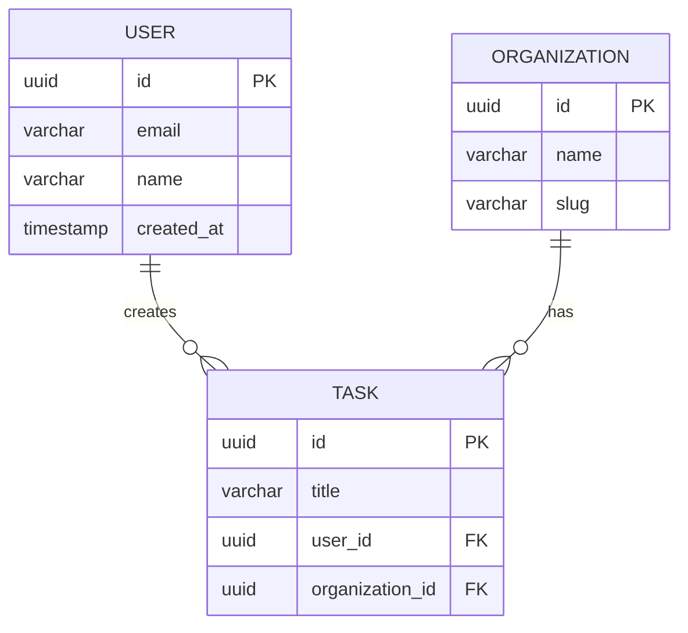
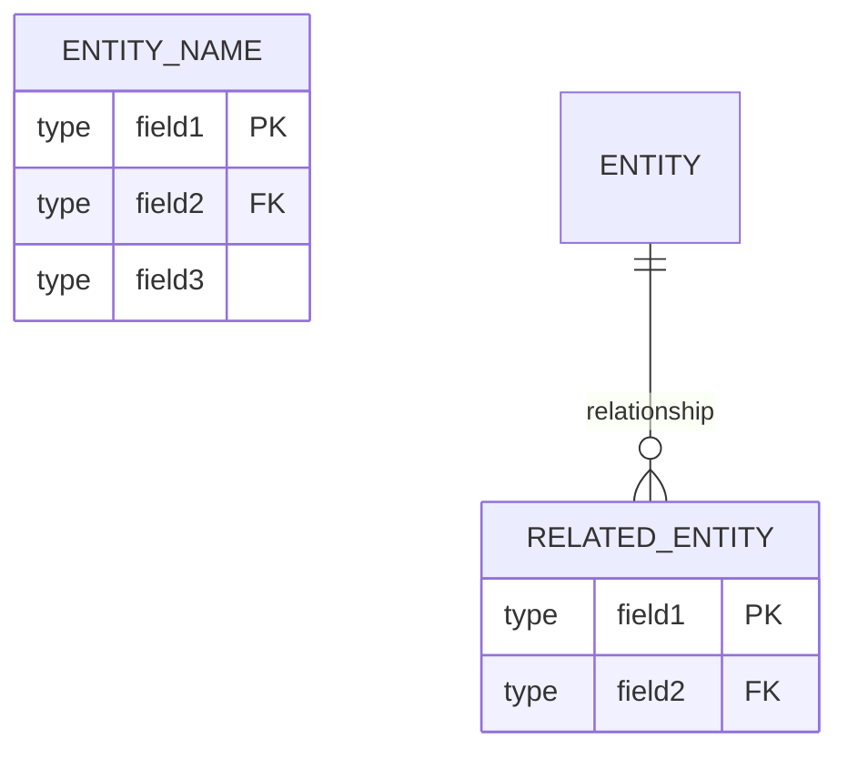
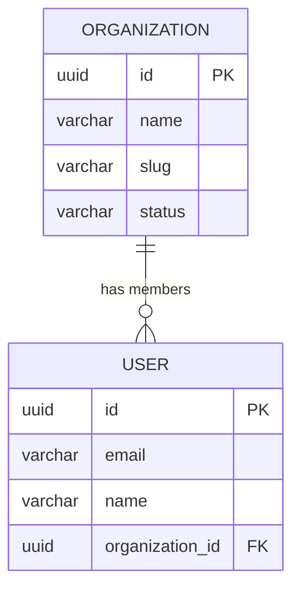
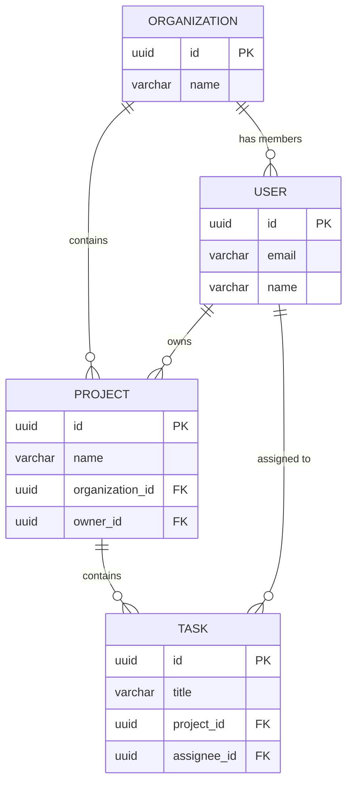
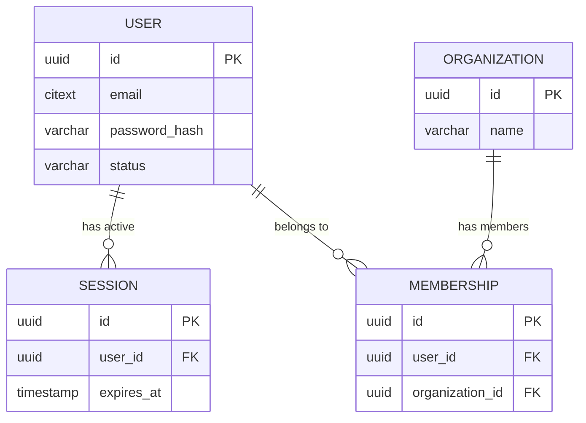
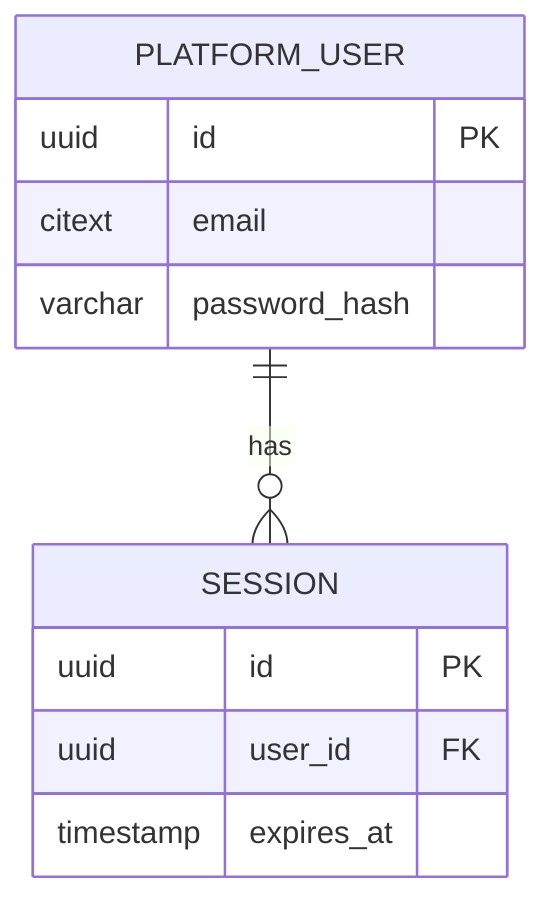
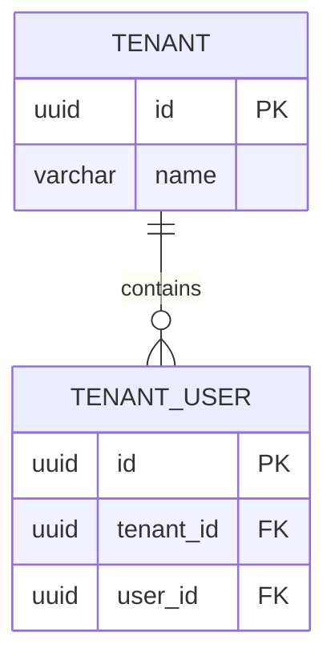
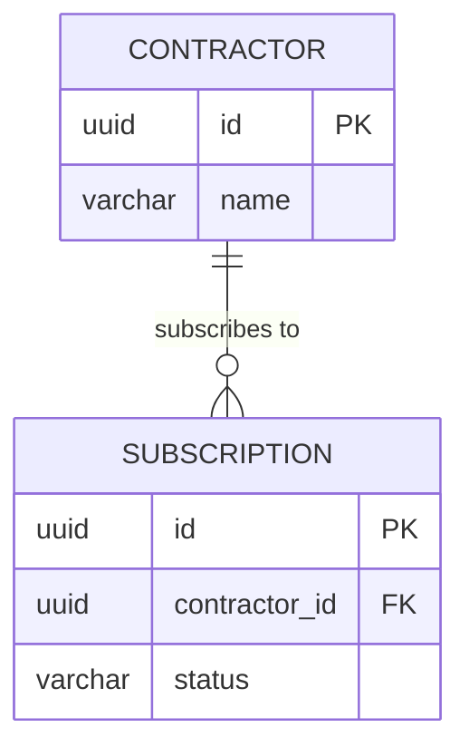

[← Index](./README.md) | [< Previous](./TEMPLATE-011-entities-and-relationships.md) | [Next >](./TEMPLATE-013-data-flows.md)

---

# ERD Diagram Template

You are an AI agent or database architect responsible for creating the visual data model diagram. This template guides you in translating entity definitions from TEMPLATE-011 into a comprehensive Entity-Relationship Diagram (ERD) that shows structure, relationships, and dependencies at a glance.

**What This Is**: A template for creating visual Entity-Relationship Diagrams (ERDs) that represent database structure using Mermaid syntax

**How to Use**: Create one ERD per logical grouping of entities (typically per bounded context). Use Mermaid syntax for consistency and version control compatibility

**Why It Matters**: Visual models catch relationship errors that text definitions miss. ERDs enable quick validation of referential integrity and help teams understand the schema structure

**When to Use**: After Entities and Relationships (TEMPLATE-011). Second document in Phase 4 (Data Model)

**Owner**: Database Architect

**Diagram Convention**: Mermaid → PlantUML → ASCII (see root README.md)

---

## Contents

- [ERD Format](#erd-format)
- [Relationship Notation](#relationship-notation)
- [ERD Examples](#erd-examples)
- [Grouping by Context](#grouping-by-context)
- [Completion Checklist](#completion-checklist)

---

## ERD Format

**What This Section Is**: The technical format and syntax for creating ERDs in Mermaid. Mermaid is the preferred format because it integrates with documentation and version control.

Use Mermaid database ERD syntax for all diagrams. This format is machine-readable, easily versioned in Git, and renders in most documentation platforms:



### Structure



---

## Relationship Notation

**What This Section Is**: The standard symbols used in Mermaid ERDs to represent different types of entity relationships. Understanding these notations enables you to read and create accurate ERDs.

The following notations show the cardinality and dependency direction in your diagram:

| Notation | Meaning | Example |
|----------|---------|---------|
| `||--o{` | One-to-Many | One User → Many Tasks |
| `||--||` | One-to-One | One User → One Profile |
| `o{ --o{` | Many-to-Many | Users ↔ Teams |

### Visual Reference

```
1:1    One-to-One           A ── B
1:N    One-to-Many         A ──┐
                              │
N:M    Many-to-Many         A ──┼── B
                              │
                            o──┘
```

---

## ERD Examples

**What This Section Is**: Complete, worked examples showing how to structure ERDs in Mermaid. These examples demonstrate proper syntax, relationship representation, and organization by bounded context.

Study the syntax and structure of these examples carefully. Each example shows a different pattern from simple relationships to multi-entity scenarios:

### Example: Basic User-Organization Relationship

**What This Example Demonstrates**:
- How to structure an organization-member relationship (One-to-Many)
- Proper primary key notation (PK) and foreign key notation (FK)
- Clear relationship labeling with descriptive text



### Example: Task Management

**What This Example Demonstrates**:
- Multiple relationships from a single entity (User, Project, Task interactions)
- Complex cardinality patterns (1:N and N:M relationships)
- How foreign keys connect related entities



### Example: Authentication System



---

## Grouping by Context

Organize ERD by bounded context from Design phase:

### Context: Identity



### Context: Organization



### Context: Billing



---

## Completion Checklist

### Deliverables

- [ ] ERD created for all entities
- [ ] Relationships clearly shown (1:1, 1:N, N:M)
- [ ] Primary keys marked (PK)
- [ ] Foreign keys marked (FK)
- [ ] Grouped by bounded context
- [ ] No orphan relationships
- [ ] No circular dependencies (unless intentional)
- [ ] Reviewed with backend team

### Visual Checks

- [ ] Clear which entity is parent
- [ ] Clear which entity is child
- [ ] Relationship direction makes sense
- [ ] No many-to-many without junction table

### Sign-Off

- [ ] **Prepared by**: [Database Architect], [Date]
- [ ] **Reviewed by**: [Backend Lead], [Date]
- [ ] **Approved by**: [Tech Lead], [Date]

---

[← Index](./README.md) | [< Previous](./TEMPLATE-011-entities-and-relationships.md) | [Next >](./TEMPLATE-013-data-flows.md)