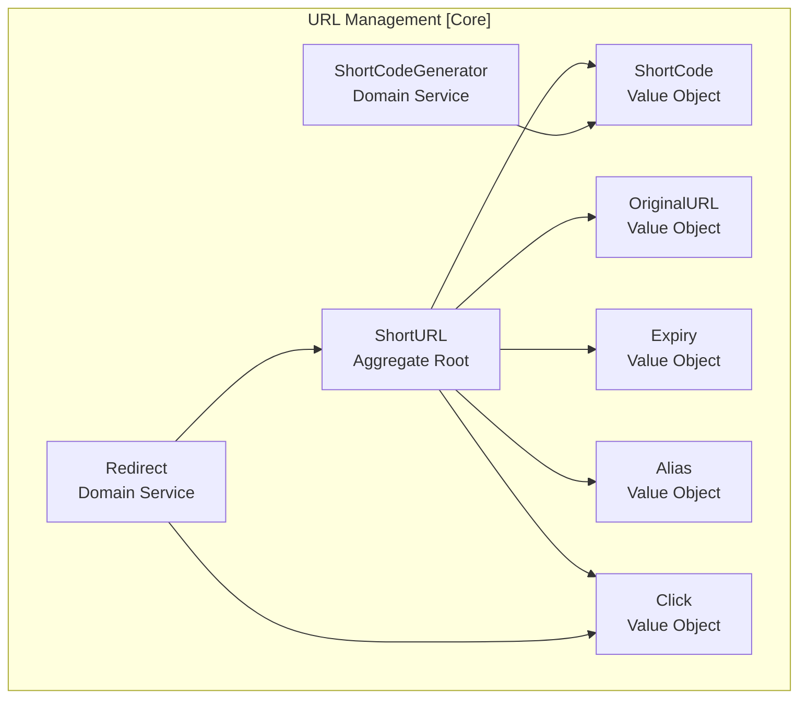
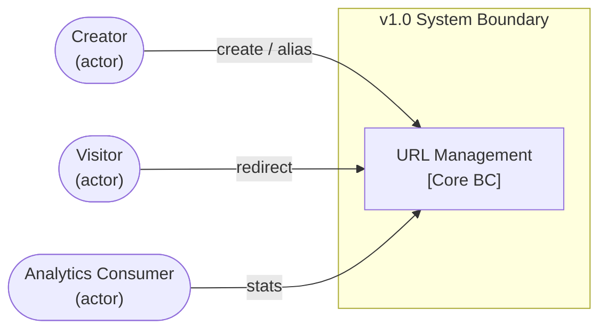
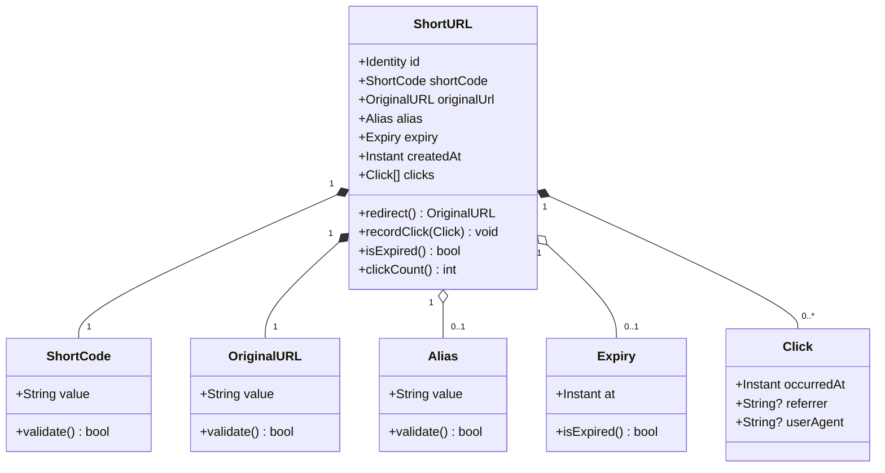
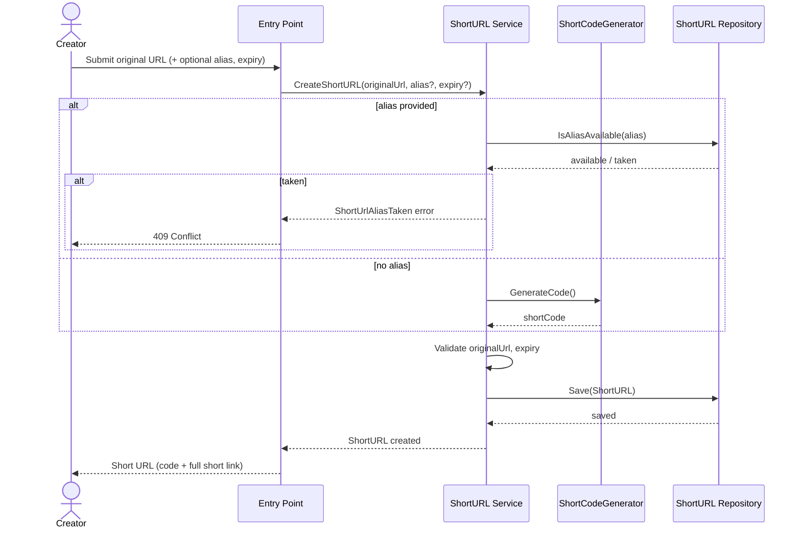
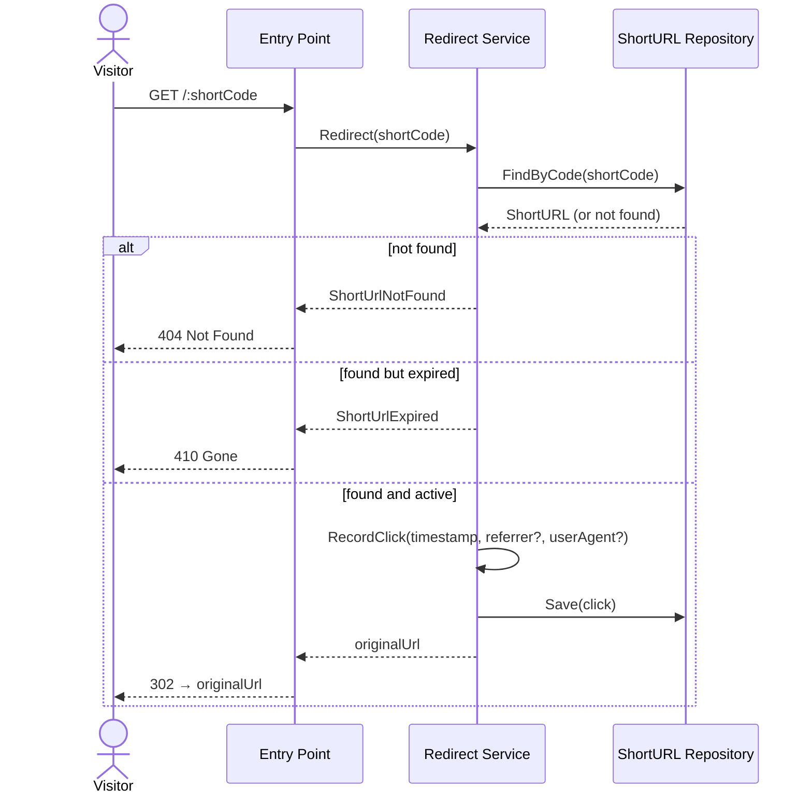
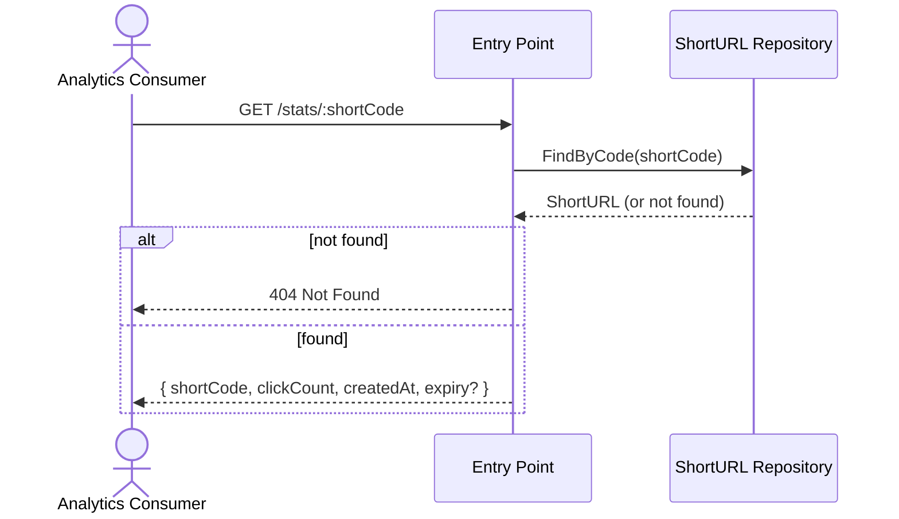

[← 02-requirements/](../02-requirements/README.md) | [← url-shortener/README.md](../README.md) | [Next >](../04-data-model/README.md)

---

# Phase 3 — Design
## LinkSnap (URL Shortener)

> **What This Is:** Design phase output for the LinkSnap URL Shortener. Defines the bounded context map, DDD strategic design, domain model structure, and the primary system flows. Technology-agnostic.
> **How to Use:** Read after Phase 2 (Requirements). Phase 4 (Data Model) derives entities from the aggregate structure here. Phase 6 (Development) implements the hexagonal architecture described here.
> **Owner:** Tutorial contributor (DDD + Hexagonal AI Template)

---

## Contents

1. [Strategic DDD Map](#strategic-ddd-map)
2. [Bounded Context: URL Management](#bounded-context-url-management)
3. [Context Map](#context-map)
4. [Domain Model](#domain-model)
5. [System Flows](#system-flows)
6. [Domain Events](#domain-events)

---

## Strategic DDD Map

### Subdomains

| Subdomain | Type | Description |
|-----------|------|-------------|
| URL Management | **Core** | Creating, storing, redirecting, and tracking ShortURLs — the primary value of the system |
| Identity (v2.0) | Supporting | User accounts and authentication — deferred; does not exist in v1.0 |
| Analytics (v2.0) | Supporting | Aggregated click analytics and reporting — deferred; in v1.0 only raw count is exposed |

The URL Management subdomain is the **only** subdomain for v1.0. There are no integration points with other systems.

---

## Bounded Context: URL Management

All domain logic lives in a single bounded context.

### Aggregate: ShortURL

| Property | Type | Description |
|----------|------|-------------|
| `id` | Identity | System-assigned opaque identifier |
| `shortCode` | ShortCode (VO) | Unique alphanumeric path segment |
| `originalUrl` | OriginalURL (VO) | The target URL; must be absolute and valid |
| `alias` | Alias (VO) | Optional; user-supplied code; nullable |
| `expiry` | Expiry (VO) | Optional; instant after which redirect is rejected; nullable |
| `clicks` | Click[] | Collection of recorded accesses |
| `createdAt` | Instant | When the ShortURL was created |

**Invariants:**
1. `shortCode` is globally unique across all ShortURLs (generated or alias)
2. `originalUrl` must be a syntactically valid, absolute URL (http:// or https://)
3. `expiry`, if set, must be a future instant at time of creation
4. `alias`, if set, must match the format: alphanumeric + hyphens, 3–30 characters

### Domain Service: Redirect

**Responsibility:** Resolve a short code to its original URL; enforce expiry; record a Click.

**Pre-conditions:** A ShortURL with the given code exists and has not expired.
**Post-conditions:** A Click value object is added to the ShortURL's click collection; the original URL is returned.
**Failure paths:** Code unknown → `ShortUrlNotFound`; ShortURL expired → `ShortUrlExpired`.

### Domain Service: ShortCodeGenerator

**Responsibility:** Generate a unique short code when no alias is provided.
**Algorithm:** System-assigned; must guarantee uniqueness. (Implementation strategy deferred to Phase 6.)

---

## Context Map

For v1.0, the URL Management bounded context has no integration with external bounded contexts.

For v2.0, an **Identity** bounded context (supporting) will be introduced. It will communicate with URL Management via a shared kernel or anti-corruption layer — decision deferred to the v2.0 planning cycle.

---

## Domain Model

---

## System Flows

### Flow 1: Create Short URL

---

### Flow 2: Redirect

---

### Flow 3: View Click Count

---

## Domain Events

| Event | Trigger | Payload | Consumer (v1.0) |
|-------|---------|---------|-----------------|
| `ShortUrlCreated` | ShortURL successfully saved | shortCode, originalUrl, alias?, expiry? | None (logged) |
| `VisitorRedirected` | Successful redirect | shortCode, occurredAt, referrer? | Click recorder |
| `ShortUrlExpired` | Redirect attempted after expiry | shortCode, expiredAt | None (logged) |

> **Note:** In v1.0, domain events are not published to an external bus. They are raised within the domain and consumed within the same process. An event bus is deferred to v2.0.

---

[← 02-requirements/](../02-requirements/README.md) | [← url-shortener/README.md](../README.md) | [Next >](../04-data-model/README.md)
