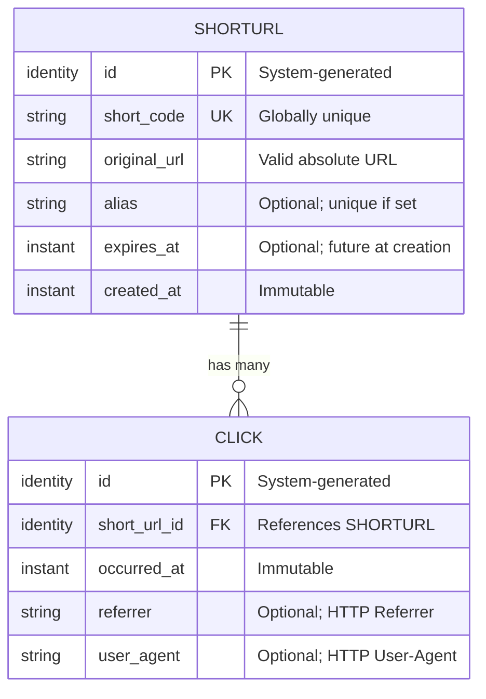

[← 03-design/](../03-design/README.md) | [← url-shortener/README.md](../README.md) | [Next >](../05-planning/README.md)

---

# Phase 4 — Data Model
## LinkSnap (URL Shortener)

> **What This Is:** Data model phase output for the LinkSnap URL Shortener. Defines entities, their attributes, relationships, invariants, and the entity-relationship diagram. Technology-agnostic.
> **How to Use:** Read after Phase 3 (Design). Phase 6 (Development) maps these entities to actual persistence structures (tables, collections).
> **Owner:** Tutorial contributor (DDD + Hexagonal AI Template)

---

## Contents

1. [Entity Definitions](#entity-definitions)
2. [Relationships](#relationships)
3. [Invariants](#invariants)
4. [Entity-Relationship Diagram](#entity-relationship-diagram)
5. [Derived Values](#derived-values)

---

## Entity Definitions

### Entity: ShortURL

The core entity and aggregate root. Represents the mapping between a short code and an original URL.

| Attribute | Type | Required | Constraints | Description |
|-----------|------|----------|------------|-------------|
| `id` | Identity | ✅ | System-generated, immutable | Opaque unique identifier |
| `short_code` | String | ✅ | Globally unique, alphanumeric + hyphens, 3–30 chars | The short path identifier |
| `original_url` | String | ✅ | Valid absolute URL (http/https) | The target URL |
| `alias` | String | ❌ | Globally unique if set; same format as short_code | User-supplied short code (alternative to generated) |
| `expires_at` | Instant | ❌ | Must be in the future at creation time | When the ShortURL stops redirecting |
| `created_at` | Instant | ✅ | Immutable, set at creation | Creation timestamp |

> When `alias` is provided, it is used as the `short_code`. The `alias` field records that the code was user-supplied (rather than generated). Both `short_code` and `alias` uniqueness constraints apply simultaneously.

---

### Entity: Click

Represents a single access of a ShortURL. Immutable once created. Child entity of ShortURL.

| Attribute | Type | Required | Constraints | Description |
|-----------|------|----------|------------|-------------|
| `id` | Identity | ✅ | System-generated, immutable | Opaque unique identifier |
| `short_url_id` | Reference | ✅ | Must reference an existing ShortURL | Parent ShortURL |
| `occurred_at` | Instant | ✅ | Recorded at redirect time | When the access happened |
| `referrer` | String | ❌ | Max 2,048 chars; URL format | HTTP Referrer header, if present |
| `user_agent` | String | ❌ | Max 512 chars | HTTP User-Agent header, if present |

> **Privacy note:** The Visitor's IP address is NOT stored. See NFR-004.

---

## Relationships

| Relationship | From | To | Cardinality | Description |
|-------------|------|-----|------------|-------------|
| `has many` | ShortURL | Click | 1 : N (0..∞) | A ShortURL accumulates Click records over its lifetime |

The relationship is owned by ShortURL (Click belongs to ShortURL). Deleting a ShortURL (if ever supported) would cascade to its Clicks.

---

## Invariants

These are hard rules enforced by the domain model. Any persistence layer must support them.

| ID | Invariant | Scope |
|----|-----------|-------|
| INV-001 | `short_code` is globally unique across all ShortURL records | ShortURL |
| INV-002 | `alias` is globally unique when set (conflicts with generated codes too) | ShortURL |
| INV-003 | `original_url` is a syntactically valid, absolute URL (http/https) | ShortURL |
| INV-004 | `expires_at`, if set, must be strictly in the future at creation time | ShortURL |
| INV-005 | A Click's `short_url_id` must reference an existing ShortURL | Click |
| INV-006 | `occurred_at` on a Click is immutable; never updated | Click |

---

## Entity-Relationship Diagram

---

## Derived Values

These values are computed from the stored data and not persisted separately in v1.0.

| Derived Value | Source | Formula | Exposed In |
|--------------|--------|---------|-----------|
| `click_count` | Click table | `COUNT(clicks WHERE short_url_id = X)` | Stats endpoint |
| `is_expired` | ShortURL.expires_at | `expires_at IS NOT NULL AND expires_at < NOW()` | Redirect service |

> **Note for Phase 6:** `click_count` may be cached for high-traffic ShortURLs. The canonical source of truth remains the Click records. Cache invalidation strategy is deferred to Phase 6 (Development).

---

[← 03-design/](../03-design/README.md) | [← url-shortener/README.md](../README.md) | [Next >](../05-planning/README.md)
