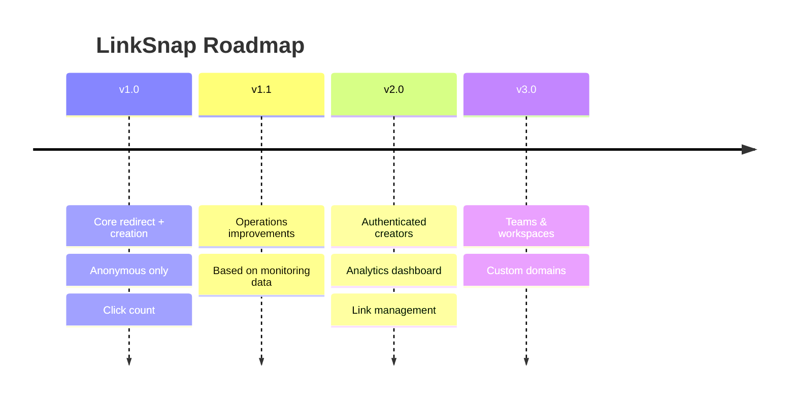
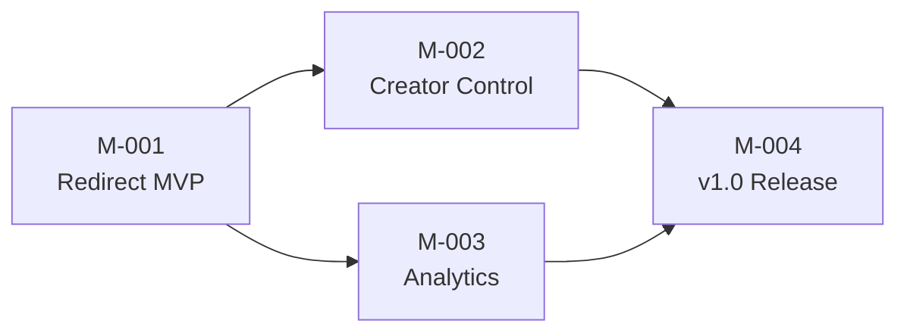

[← 04-data-model/](../04-data-model/README.md) | [← url-shortener/README.md](../README.md) | [Next >](../06-development/README.md)

---

# Phase 5 — Planning
## LinkSnap (URL Shortener)

> **What This Is:** Planning phase output for the LinkSnap URL Shortener. Defines the versioning strategy, roadmap, epics, and milestone breakdown. Technology-agnostic.
> **How to Use:** Read after Phase 4 (Data Model). Phase 6 (Development) uses the epic structure and v1.0 scope to guide implementation work.
> **Owner:** Tutorial contributor (DDD + Hexagonal AI Template)

---

## Contents

1. [Versioning Strategy](#versioning-strategy)
2. [Roadmap](#roadmap)
3. [Epics](#epics)
4. [Milestones](#milestones)
5. [Scope Chain Verification](#scope-chain-verification)

---

## Versioning Strategy

| Version | Scope | Release Criteria |
|---------|-------|-----------------|
| **v1.0** | Anonymous URL creation, redirect, click count, alias, expiry | All 5 FRs and 5 NFRs pass; system stable under load test (NFR-002) |
| **v1.1** | Bug fixes and minor improvements based on v1.0 operations feedback | No regressions; response to operations/monitoring findings |
| **v2.0** | Authenticated creators, personal analytics dashboard, link management | Identity bounded context integrated; Epic E-03 delivered |
| **v3.0** | Teams, custom domains, advanced analytics | Multi-tenancy; infrastructure changes |

---

## Roadmap

### v1.0 Constraints

- No authentication
- No link editing or deletion
- Click count only (no breakdown)
- Single deployment unit
- All 5 FRs and 5 NFRs must be satisfied before release

---

## Epics

### E-01: Core Redirect Engine

**Goal:** Enable the primary value proposition — create a short URL, redirect a visitor, record the click.

| Field | Value |
|-------|-------|
| **ID** | E-01 |
| **Version** | v1.0 |
| **Priority** | Must |
| **FRs Covered** | FR-001 (create), FR-002 (redirect) |
| **NFRs Covered** | NFR-001 (latency), NFR-002 (load), NFR-003 (availability), NFR-004 (privacy), NFR-005 (uniqueness) |
| **Success** | A Creator can shorten a URL and a Visitor can be redirected within the latency SLA |

**Stories:**
1. Create short URL (anonymous, generated code)
2. Redirect visitor via short code (302 + click record)
3. Handle unknown code (404) and expired code (410)
4. Enforce short code uniqueness at creation time

---

### E-02: Creator Enhancements

**Goal:** Give Creators control over their short links through alias and expiry options.

| Field | Value |
|-------|-------|
| **ID** | E-02 |
| **Version** | v1.0 |
| **Priority** | Should |
| **FRs Covered** | FR-004 (alias), FR-005 (expiry) |
| **NFRs Covered** | NFR-005 (uniqueness) |
| **Depends on** | E-01 must be stable |
| **Success** | A Creator can specify a custom code and/or an expiry date on creation |

**Stories:**
1. Create short URL with custom alias (validate uniqueness and format)
2. Create short URL with expiry (enforce future-only rule)
3. Redirect correctly rejects expired links (HTTP 410)
4. Handle alias conflict (409 Conflict response)

---

### E-03: Analytics

**Goal:** Allow Creators to see how many times their short URL was followed.

| Field | Value |
|-------|-------|
| **ID** | E-03 |
| **Version** | v1.0 |
| **Priority** | Must |
| **FRs Covered** | FR-003 (click count) |
| **NFRs Covered** | — |
| **Depends on** | E-01 (clicks are created by the redirect) |
| **Success** | A Creator can request and receive the click count for any short URL |

**Stories:**
1. Stats endpoint returns click count for a valid short code
2. Stats returns zero for a short URL with no clicks
3. Stats returns 404 for an unknown short code

---

### E-04: Authenticated Creators (v2.0)

**Goal:** Allow Creators to create accounts, own their links, and manage them.

| Field | Value |
|-------|-------|
| **ID** | E-04 |
| **Version** | v2.0 |
| **Priority** | Must (v2.0) |
| **FRs Covered** | (new FRs to be defined in v2.0 planning) |
| **Depends on** | Identity bounded context (new) |
| **Success** | A Creator can log in, see all their short URLs, and delete or update them |

---

## Milestones

### v1.0 Milestones

| ID | Milestone | Epics | Done When |
|----|-----------|-------|----------|
| M-001 | Redirect MVP | E-01 | FR-001 + FR-002 pass acceptance criteria; redirect latency < 100 ms in manual test |
| M-002 | Creator Control | E-02 | FR-004 + FR-005 pass acceptance criteria; no regression on E-01 |
| M-003 | Analytics | E-03 | FR-003 passes acceptance criteria; click count is accurate after load test |
| M-004 | v1.0 Release | All | All FRs and NFRs pass; load test passes; operations runbook complete (Phase 9) |

### Milestone Dependency Chain

---

## Scope Chain Verification

> `[CHECK-PHASE5-CHAIN]`: Every epic traces to requirements; every milestone traces to epics; every version traces to milestones.

| Item | Traces to |
|------|----------|
| E-01 | FR-001, FR-002 + NFR-001..005 |
| E-02 | FR-004, FR-005 + NFR-005 |
| E-03 | FR-003 |
| M-001 | E-01 |
| M-002 | E-02 |
| M-003 | E-03 |
| M-004 | E-01, E-02, E-03 |
| v1.0 | M-001, M-002, M-003, M-004 |
| v2.0 | E-04 (defined in next planning cycle) |

**Floating requirements check:**
- FR-001 → E-01 ✅
- FR-002 → E-01 ✅
- FR-003 → E-03 ✅
- FR-004 → E-02 ✅
- FR-005 → E-02 ✅
- NFR-001..005 → E-01 / E-02 ✅

**Result:** `[CHECK-PHASE5-CHAIN]` — **PASS**. No floating FRs, NFRs, or milestones.

---

[← 04-data-model/](../04-data-model/README.md) | [← url-shortener/README.md](../README.md) | [Next >](../06-development/README.md)
