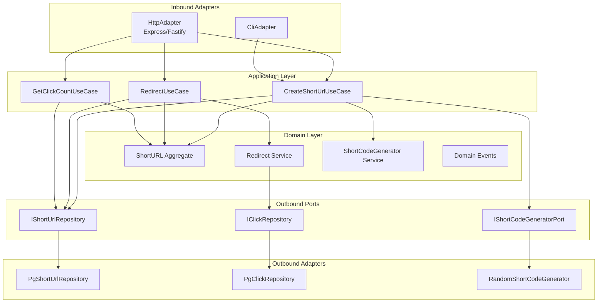

[← 05-planning/](../05-planning/README.md) | [← url-shortener/README.md](../README.md) | [Next >](../07-testing/README.md)

---

# Phase 6 — Development
## LinkSnap (URL Shortener)

> **What This Is:** Development phase output for LinkSnap. Defines the hexagonal architecture, port and adapter catalogue, REST API contract, architectural decision records, coding standards, and dev workflow conventions.
> **How to Use:** Read after Phase 5 (Planning). Phase 7 (Testing) derives test cases from the API contract and domain logic here. Phase 8 (Deployment) uses the dev workflow and environment names defined here.
> **Owner:** Tutorial contributor (DDD + Hexagonal AI Template)

---

## Contents

1. [Hexagonal Architecture](#hexagonal-architecture)
2. [Port Catalogue](#port-catalogue)
3. [Adapter Catalogue](#adapter-catalogue)
4. [REST API Contract](#rest-api-contract)
5. [Architectural Decision Records](#architectural-decision-records)
6. [Coding Standards](#coding-standards)
7. [Dev Workflow](#dev-workflow)

---

## Hexagonal Architecture

### Layer Overview

```
┌─────────────────────────────────────────────────────┐
│                  ADAPTERS (Inbound)                 │
│   HttpAdapter (Express)    ·    CliAdapter          │
└───────────────────────┬─────────────────────────────┘
                        │ calls
┌───────────────────────▼─────────────────────────────┐
│              APPLICATION LAYER                      │
│  CreateShortUrlUseCase · RedirectUseCase            │
│  GetClickCountUseCase  · (+ validators)             │
└───────┬───────────────────────────────┬─────────────┘
        │ uses                          │ uses
┌───────▼──────────────┐  ┌────────────▼──────────────┐
│    DOMAIN LAYER      │  │   PORTS (Outbound)         │
│  ShortURL aggregate  │  │  IShortUrlRepository       │
│  ShortCode VO        │  │  IClickRepository          │
│  OriginalUrl VO      │  │  IShortCodeGenerator       │
│  Alias VO            │  └────────────┬───────────────┘
│  Expiry VO           │               │ implemented by
│  Click VO            │  ┌────────────▼───────────────┐
│  Redirect service    │  │  ADAPTERS (Outbound)        │
│  ShortCodeGenerator  │  │  PgShortUrlRepository      │
│  Domain events       │  │  PgClickRepository         │
└──────────────────────┘  │  RandomShortCodeGenerator  │
                           └────────────────────────────┘
```

### Mermaid Architecture Diagram



### Package Structure

```
src/
├── domain/
│   ├── model/
│   │   ├── ShortUrl.ts          # Aggregate root
│   │   ├── ShortCode.ts         # Value object
│   │   ├── OriginalUrl.ts       # Value object
│   │   ├── Alias.ts             # Value object
│   │   ├── Expiry.ts            # Value object
│   │   └── Click.ts             # Value object
│   ├── service/
│   │   ├── RedirectService.ts
│   │   └── ShortCodeGeneratorService.ts
│   └── events/
│       ├── ShortUrlCreated.ts
│       ├── VisitorRedirected.ts
│       └── ShortUrlExpired.ts
├── application/
│   ├── port/
│   │   ├── inbound/
│   │   │   ├── ICreateShortUrlUseCase.ts
│   │   │   ├── IRedirectUseCase.ts
│   │   │   └── IGetClickCountUseCase.ts
│   │   └── outbound/
│   │       ├── IShortUrlRepository.ts
│   │       ├── IClickRepository.ts
│   │       └── IShortCodeGeneratorPort.ts
│   └── usecase/
│       ├── CreateShortUrlUseCase.ts
│       ├── RedirectUseCase.ts
│       └── GetClickCountUseCase.ts
├── adapter/
│   ├── inbound/
│   │   ├── http/
│   │   │   ├── ShortUrlController.ts
│   │   │   └── routes.ts
│   │   └── cli/
│   │       └── CliAdapter.ts
│   └── outbound/
│       ├── persistence/
│       │   ├── PgShortUrlRepository.ts
│       │   └── PgClickRepository.ts
│       └── generator/
│           └── RandomShortCodeGenerator.ts
└── main.ts
```

---

## Port Catalogue

### Inbound Ports

| Port | Interface | Implemented by |
|------|-----------|---------------|
| `ICreateShortUrlUseCase` | `execute(cmd: CreateShortUrlCommand): Promise<ShortUrl>` | `CreateShortUrlUseCase` |
| `IRedirectUseCase` | `execute(code: string): Promise<RedirectResult>` | `RedirectUseCase` |
| `IGetClickCountUseCase` | `execute(code: string): Promise<number>` | `GetClickCountUseCase` |

### Outbound Ports

| Port | Interface | Implemented by | Notes |
|------|-----------|---------------|-------|
| `IShortUrlRepository` | `findByCode(code: string)` · `findByAlias(alias: string)` · `save(url: ShortUrl)` | `PgShortUrlRepository` | ACID uniqueness via DB constraint |
| `IClickRepository` | `save(click: Click)` · `countByCode(code: string)` | `PgClickRepository` | No IP stored (NFR-004) |
| `IShortCodeGeneratorPort` | `generate(): string` | `RandomShortCodeGenerator` | 6-char alphanumeric; retry loop in use case |

---

## Adapter Catalogue

### Inbound Adapters

| Adapter | Technology | Responsibility |
|---------|-----------|---------------|
| `HttpAdapter` | Express v4 / Fastify v4 | Expose REST endpoints; map HTTP req/res to use case commands |
| `CliAdapter` | Node.js CLI (`commander`) | Allow batch URL creation from command line (used in local dev) |

### Outbound Adapters

| Adapter | Technology | Responsibility |
|---------|-----------|---------------|
| `PgShortUrlRepository` | PostgreSQL 15 + `pg` driver | Persist and query ShortURL rows; unique constraint on `short_code` and `alias` |
| `PgClickRepository` | PostgreSQL 15 + `pg` driver | Persist Click rows; `COUNT` query for click_count |
| `RandomShortCodeGenerator` | Node.js `crypto.randomBytes` | Generate 6-char base62 codes; collision-safe via retry in use case |

---

## REST API Contract

### Base URL

`https://api.linksnap.io/v1`

### Endpoints

#### `POST /urls` — Create Short URL

```http
POST /urls
Content-Type: application/json

{
  "originalUrl": "https://example.com/long/path",
  "alias": "my-link",       // optional
  "expiresAt": "2026-12-31" // optional, ISO 8601 date
}
```

**Responses:**

| Status | Body | Condition |
|--------|------|-----------|
| `201 Created` | `{ "shortCode": "abc123", "shortUrl": "https://lnk.io/abc123" }` | Success |
| `409 Conflict` | `{ "error": "alias_taken" }` | Alias already in use |
| `422 Unprocessable` | `{ "error": "invalid_url" }` | malformed `originalUrl` |
| `422 Unprocessable` | `{ "error": "expiry_in_past" }` | `expiresAt` is not a future date |

---

#### `GET /{code}` — Redirect

```http
GET /abc123
```

**Responses:**

| Status | Condition |
|--------|-----------|
| `302 Found` + `Location: <originalUrl>` | Code valid and not expired |
| `404 Not Found` | Code does not exist |
| `410 Gone` | Code exists but is expired |

---

#### `GET /urls/{code}/stats` — Click Count

```http
GET /urls/abc123/stats
```

**Response `200 OK`:**
```json
{ "shortCode": "abc123", "clickCount": 42 }
```

**Response `404 Not Found`:** code does not exist.

---

### Error Response Schema

```json
{
  "error": "string",       // machine-readable error code
  "message": "string"      // human-readable description
}
```

---

## Architectural Decision Records

### ADR-001: TypeScript + Node.js as Implementation Language

| Field | Value |
|-------|-------|
| **Status** | Accepted |
| **Date** | 2026-05-11 |
| **Deciders** | Tutorial author |
| **Context** | Phases 1–5 were technology-agnostic. Phase 6 requires a concrete stack choice. |
| **Decision** | Use **TypeScript 5** on **Node.js 20 LTS** for all application and adapter code. |
| **Rationale** | Type safety reinforces value object invariants; strong ecosystem for HTTP adapters; tutorial familiarity |
| **Consequences** | Requires `tsc` compilation step; ESM modules; test framework: Vitest |
| **Alternatives considered** | Java/Spring (heavier), Go (less tutorial familiarity), Python (weaker hexagonal ergonomics) |
| **References** | FR-001..FR-005, NFR-001 (latency target) |

---

### ADR-002: PostgreSQL 15 for Persistence

| Field | Value |
|-------|-------|
| **Status** | Accepted |
| **Date** | 2026-05-11 |
| **Deciders** | Tutorial author |
| **Context** | INV-001 and INV-002 require uniqueness guarantees for `short_code` and `alias`. Click records are append-only (no update). |
| **Decision** | Use **PostgreSQL 15** as the sole database. Uniqueness enforced by DB UNIQUE constraints. |
| **Rationale** | ACID guarantees eliminate short-code collision under concurrent creation; simple schema; familiar tooling |
| **Consequences** | Single DB dependency; no cache layer in v1.0; click count from `COUNT(*)` (may be cached in v1.1) |
| **Alternatives considered** | SQLite (no concurrent write safety), MySQL (adequate but less ergonomic for future jsonb use), Redis (volatile) |
| **References** | INV-001, INV-002, NFR-002 (load target) |

---

### ADR-003: GitHub Flow for Branch Strategy

| Field | Value |
|-------|-------|
| **Status** | Accepted |
| **Date** | 2026-05-11 |
| **Deciders** | Tutorial author |
| **Context** | Single team, continuous delivery to staging. No long-lived feature branches needed for v1.0. |
| **Decision** | Use **GitHub Flow**: `main` is always production-ready; all work in short-lived `feature/*` or `fix/*` branches merged via PR. |
| **Rationale** | Simple enough for a tutorial; maps directly to Phase 8 CI/CD triggers |
| **Consequences** | `main` triggers staging deploy; version tags `v*.*.*` trigger prod deploy |
| **Alternatives considered** | GitFlow (too complex for single team v1.0), Trunk-Based (fine but less demonstrative for tutorial) |
| **References** | Phase 8 CI/CD pipeline |

---

## Coding Standards

### General Rules

| Rule | Detail |
|------|--------|
| Language | TypeScript strict mode (`"strict": true`) |
| Module system | ESM — `"type": "module"` in `package.json` |
| Formatter | Prettier (default config) |
| Linter | ESLint with `@typescript-eslint/recommended` |
| Max function length | 30 lines (excluding comments) |
| Naming | `PascalCase` for classes/interfaces; `camelCase` for methods/vars; `UPPER_SNAKE` for constants |
| Error handling | Domain errors extend `DomainError`; never throw raw `Error` from domain layer |
| Dependency injection | Constructor injection only; no service locator |

### Domain Layer Rules

- Value objects are **immutable** — no setters, constructor validates all invariants.
- Aggregate root `ShortUrl` is the **only** entry point for mutation.
- Domain services have **no infrastructure dependencies** — they operate only on domain objects.
- Domain events are **value objects** — plain objects, no methods.

### Application Layer Rules

- Use cases receive **typed command objects** (`CreateShortUrlCommand`), not raw HTTP request objects.
- Use cases **do not log** — logging is the adapter's responsibility.
- Use cases resolve/reject with **domain error types**, not HTTP status codes.

### Adapter Rules

- HTTP adapter maps `DomainError` subtypes to HTTP status codes (single mapping table in `error-map.ts`).
- Repositories implement **exactly** the outbound port interface — no extra public methods.
- No `any` types in adapters.

---

## Dev Workflow

### Branches

| Branch | Trigger | Purpose |
|--------|---------|---------|
| `main` | Push → deploy to **staging** | Always shippable |
| `feature/*` | PR to `main` → CI | New functionality |
| `fix/*` | PR to `main` → CI | Bug fixes |
| `hotfix/*` | PR to `main` → CI + fast-track | Production incidents |

### Commit Types

| Type | When to Use |
|------|-------------|
| `feat` | New feature (maps to epic story) |
| `fix` | Bug fix |
| `refactor` | Internal restructuring, no behaviour change |
| `test` | Test additions or modifications |
| `docs` | Documentation only |
| `chore` | Build, deps, CI changes |
| `perf` | Performance improvement |

**Format:** `type(scope): description` — e.g. `feat(redirect): enforce expiry check on GET /{code}`

### Pull Request Rules

- PR title follows commit format.
- At least **1 reviewer** required before merge.
- Merge strategy: **Squash and merge** (keeps `main` history linear).
- All CI checks must pass: `lint` · `type-check` · `test:unit` · `test:integration`.
- Branch deleted after merge.

### CI/CD Environments

| Environment | Branch Trigger | Auto-deploy | Database |
|-------------|--------------|-------------|----------|
| `ci` | `pull_request` | Yes (ephemeral) | In-process test DB |
| `staging` | push to `main` | Yes | Staging PostgreSQL |
| `production` | tag `v*.*.*` | Manual approval | Production PostgreSQL |

---

[↑ Back to top](#phase-6--development)

---

[← 05-planning/](../05-planning/README.md) | [← url-shortener/README.md](../README.md) | [Next >](../07-testing/README.md)
