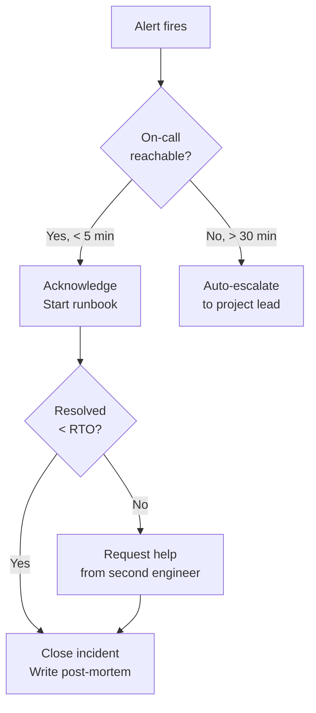

[← 08-deployment/](../08-deployment/README.md) | [← url-shortener/README.md](../README.md) | [Next >](../10-monitoring/README.md)

---

# Phase 9 — Operations
## LinkSnap (URL Shortener)

> **What This Is:** Operations phase output for LinkSnap. Defines runbooks, SLAs, incident response procedures, on-call responsibilities, and backup strategy for v1.0.
> **How to Use:** Read after Phase 8 (Deployment). Phase 10 (Monitoring) uses the SLA thresholds and incident severity matrix defined here.
> **Owner:** Tutorial contributor (DDD + Hexagonal AI Template)

---

## Contents

1. [SLA Definitions](#sla-definitions)
2. [Incident Severity Matrix](#incident-severity-matrix)
3. [On-Call](#on-call)
4. [Runbooks](#runbooks)
5. [Backup and Recovery](#backup-and-recovery)
6. [Escalation Path](#escalation-path)

---

## SLA Definitions

| Service | Metric | Target | Measurement Window |
|---------|--------|--------|------------------|
| Redirect endpoint (`GET /{code}`) | Availability | 99.5% | Rolling 30 days |
| Redirect endpoint | Latency p95 | < 100 ms | Per request (NFR-001) |
| Create URL (`POST /urls`) | Availability | 99.0% | Rolling 30 days |
| Stats endpoint (`GET /urls/{code}/stats`) | Availability | 99.0% | Rolling 30 days |
| DB (PostgreSQL) | Recovery Time Objective (RTO) | < 30 min | Per incident |
| DB | Recovery Point Objective (RPO) | < 24 h | Per incident |

---

## Incident Severity Matrix

| Severity | Condition | Response Time | Owner |
|----------|-----------|--------------|-------|
| **P1 — Critical** | Redirect endpoint down or unavailable (SLA breach) | < 15 min acknowledge | On-call engineer |
| **P1 — Critical** | Database unreachable from application | < 15 min acknowledge | On-call engineer |
| **P2 — High** | Create URL endpoint unavailable | < 1 h acknowledge | On-call engineer |
| **P2 — High** | Stats endpoint returning incorrect data | < 1 h acknowledge | On-call engineer |
| **P3 — Medium** | Redirect latency p95 > 100 ms (SLA degraded, not breached) | < 4 h investigate | Next business day if after hours |
| **P3 — Medium** | CI/CD pipeline failing (no user impact) | < 8 h investigate | Engineer |
| **P4 — Low** | Non-critical cosmetic issues, log noise | < 1 business day | Engineer |

---

## On-Call

**v1.0 arrangement:** Single on-call engineer. No rotation — project is pre-team.

| Role | Responsibility | Contact |
|------|---------------|---------|
| On-call engineer | P1 and P2 incidents | PagerDuty / Slack `#on-call` |

**Escalation:** If on-call engineer is unreachable for 30 min on a P1, the incident is auto-escalated to the project lead.

---

## Runbooks

### RB-001: Redirect Service Down (P1)

**Symptom:** Smoke test `curl https://lnk.io/healthz` returns non-200, or monitoring alert fires.

**Steps:**

1. Check GitHub Actions `deploy-prod.yml` — confirm last deploy succeeded.
2. SSH to production host (or `kubectl get pods -n linksnap-prod`).
3. Check container status: `docker ps | grep linksnap` or `kubectl get pods`.
4. If container is down: `docker start linksnap-app` or `kubectl rollout restart deployment/linksnap`.
5. Re-run smoke test: `curl -f https://lnk.io/healthz`.
6. If still failing, check application logs: `docker logs linksnap-app --tail=100`.
7. If crash loop: roll back to previous image (see RB-003).
8. Post incident update in `#incidents` Slack channel.
9. Open incident ticket; fill severity, start time, resolution time.

---

### RB-002: Database Connection Failure (P1)

**Symptom:** Application logs contain `Error: connect ECONNREFUSED` or `connection pool timeout`.

**Steps:**

1. Verify PostgreSQL is running: `systemctl status postgresql` (VM) or `kubectl get pods -n postgres`.
2. Check connection from app host: `psql "$DATABASE_URL" -c "SELECT 1;"`.
3. If PostgreSQL is down: `systemctl start postgresql` or `kubectl rollout restart statefulset/postgres`.
4. Check disk space on DB host: `df -h /var/lib/postgresql`.
5. If disk full: trigger emergency cleanup of old WAL files (consult DBA runbook).
6. Once DB is up, restart application container to re-open pool (RB-001 step 4).
7. Verify smoke test passes.
8. Document timeline in incident ticket.

---

### RB-003: Roll Back to Previous Version (P1 / P2)

**Symptom:** New deployment introduced a regression; smoke test or user reports confirm.

**Steps:**

1. Identify last stable image tag from GitHub Releases (e.g., `v1.0.0`).
2. Re-deploy previous image:
   ```bash
   docker pull ghcr.io/org/linksnap:v1.0.0
   docker stop linksnap-app
   docker run -d --name linksnap-app \
     -e DATABASE_URL="$DATABASE_URL" \
     -p 3000:3000 \
     ghcr.io/org/linksnap:v1.0.0
   ```
3. Verify smoke test passes.
4. Open revert PR on `main` with `git revert <commit>` or `git revert <merge-commit>`.
5. Tag the fix as `v1.0.{PATCH+1}` and deploy through standard pipeline.
6. Post-mortem: document root cause and prevention steps.

---

### RB-004: High Redirect Latency (P3)

**Symptom:** Monitoring alert fires for p95 > 100 ms; no outage.

**Steps:**

1. Check PostgreSQL query latency: `EXPLAIN ANALYZE SELECT * FROM short_urls WHERE short_code = $1;`
2. Verify index on `short_code` column exists: `\d short_urls` in psql.
3. Check active DB connections: `SELECT count(*) FROM pg_stat_activity;`
4. Check host CPU and memory: `top` or `htop`.
5. If query plan has seq scan: `REINDEX INDEX short_urls_short_code_idx;`
6. If connection pool exhausted: increase `DB_POOL_SIZE` env var and restart app.
7. Document findings; create `fix/*` branch if code change is needed.

---

## Backup and Recovery

| Item | Frequency | Retention | Storage |
|------|-----------|-----------|---------|
| PostgreSQL full backup | Daily (02:00 UTC) | 7 days | S3-compatible object storage |
| PostgreSQL WAL (point-in-time) | Continuous | 7 days | Same object storage |
| Application config | On every deploy | Git history | GitHub repository |
| Container image | On every release | Indefinite | GHCR |

### Recovery Procedure

1. Restore from latest daily backup:
   ```bash
   pg_restore -U postgres -d linksnap_prod latest_backup.dump
   ```
2. Apply WAL files if point-in-time recovery is needed.
3. Restart application and run smoke test.
4. Verify click counts match expected value (spot-check via stats endpoint).

---

## Escalation Path



---

[↑ Back to top](#phase-9--operations)

---

[← 08-deployment/](../08-deployment/README.md) | [← url-shortener/README.md](../README.md) | [Next >](../10-monitoring/README.md)
