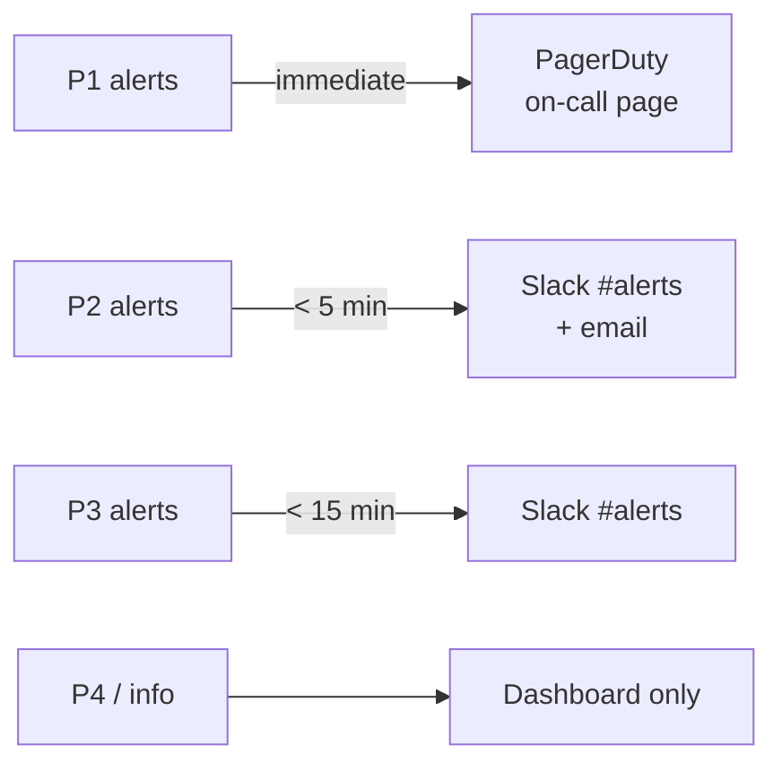

[← 09-operations/](../09-operations/README.md) | [← url-shortener/README.md](../README.md) | [Next >](../11-feedback/README.md)

---

# Phase 10 — Monitoring
## LinkSnap (URL Shortener)

> **What This Is:** Monitoring phase output for LinkSnap. Defines key metrics, alert rules, dashboard layout, logging strategy, and observability gaps for v1.0.
> **How to Use:** Read after Phase 9 (Operations). Alert thresholds align with the SLA definitions established in Phase 9.
> **Owner:** Tutorial contributor (DDD + Hexagonal AI Template)

---

## Contents

1. [Key Metrics](#key-metrics)
2. [Alert Rules](#alert-rules)
3. [Dashboard Layout](#dashboard-layout)
4. [Logging Strategy](#logging-strategy)
5. [Observability Gaps](#observability-gaps)

---

## Key Metrics

### Service Metrics

| Metric | Description | Source | Unit | SLA Threshold |
|--------|-------------|--------|------|--------------|
| `redirect_latency_p95` | 95th percentile duration of `GET /{code}` | Application (histogram) | ms | Alert if > 100 ms |
| `redirect_latency_p99` | 99th percentile duration of `GET /{code}` | Application (histogram) | ms | Inform only |
| `redirect_error_rate` | Rate of non-2xx/3xx on redirect endpoint | Application (counter) | % | Alert if > 1% |
| `create_url_error_rate` | Rate of 4xx/5xx on `POST /urls` | Application (counter) | % | Alert if > 5% |
| `http_requests_per_min` | Total incoming HTTP requests per minute | Application (counter) | req/min | Inform only |
| `active_short_urls` | Total non-expired ShortURL records | Database (gauge) | count | Inform only |
| `new_urls_per_hour` | ShortURLs created in last 60 min | Database (counter) | count/h | Inform only |

### Infrastructure Metrics

| Metric | Description | Alert Threshold |
|--------|-------------|----------------|
| `db_connection_pool_usage` | % of pool slots in use | Alert if > 80% |
| `host_cpu_usage` | CPU utilization (1-min avg) | Alert if > 85% |
| `host_memory_usage` | RAM utilization | Alert if > 90% |
| `host_disk_usage` | Disk usage on DB host | Alert if > 80% |

### Business Metrics (Informational)

| Metric | Description | Refresh |
|--------|-------------|---------|
| `total_redirects_today` | Click events recorded since midnight UTC | Hourly |
| `unique_short_urls_created_today` | New ShortURLs since midnight UTC | Hourly |
| `top_short_codes_by_clicks` | Top 10 most-clicked short URLs | Daily |

---

## Alert Rules

> Tool: Any compatible alerting system (Prometheus Alertmanager, Grafana alerting, Datadog, etc.)

| Alert Name | Condition | Severity | Action |
|-----------|-----------|----------|--------|
| `RedirectLatencyHigh` | `redirect_latency_p95 > 100ms` for 2 consecutive minutes | P3 | Page on-call; link to RB-004 |
| `RedirectEndpointDown` | `redirect_error_rate > 50%` for 1 minute | P1 | Page on-call immediately; link to RB-001 |
| `DatabaseConnectionFailing` | `db_connection_pool_usage > 99%` for 1 minute | P1 | Page on-call immediately; link to RB-002 |
| `HighErrorRateOnCreate` | `create_url_error_rate > 5%` for 5 minutes | P2 | Notify on-call |
| `DiskUsageHigh` | `host_disk_usage > 80%` | P3 | Notify on-call; investigate WAL accumulation |
| `MemoryUsageHigh` | `host_memory_usage > 90%` for 5 minutes | P2 | Notify on-call |

### Alert Routing



---

## Dashboard Layout

### Dashboard: LinkSnap — Service Health

> One dashboard per environment (staging, production). URL: `grafana.internal/d/linksnap-{env}`

```
┌──────────────────────────────────────────────────────────────────┐
│  ROW 1: Availability                                             │
│  [Redirect uptime %] [Create uptime %] [Stats uptime %]         │
├──────────────────────────────────────────────────────────────────┤
│  ROW 2: Latency                                                  │
│  [redirect_latency_p50 timeseries] [redirect_latency_p95 gauge] │
│  [redirect_latency_p99 timeseries]                               │
├──────────────────────────────────────────────────────────────────┤
│  ROW 3: Error Rates                                              │
│  [redirect_error_rate %] [create_url_error_rate %]              │
├──────────────────────────────────────────────────────────────────┤
│  ROW 4: Traffic                                                  │
│  [http_requests_per_min timeseries] [new_urls_per_hour bar]     │
├──────────────────────────────────────────────────────────────────┤
│  ROW 5: Infrastructure                                           │
│  [cpu_usage %] [memory_usage %] [db_pool_usage %] [disk_usage] │
└──────────────────────────────────────────────────────────────────┘
```

### SLA Summary Panel

A single panel at the top of the production dashboard shows the rolling 30-day availability for each endpoint against the SLA target, with green/amber/red status indicators.

---

## Logging Strategy

### Log Format

All logs are emitted as structured JSON on `stdout`:

```json
{
  "timestamp": "2026-05-11T10:00:00.000Z",
  "level": "info",
  "requestId": "req-abc123",
  "service": "linksnap",
  "event": "redirect.resolved",
  "shortCode": "abc123",
  "durationMs": 12
}
```

### Log Levels per Environment

| Level | `ci` | `staging` | `production` |
|-------|------|-----------|-------------|
| `error` | ✅ | ✅ | ✅ |
| `warn` | ✅ | ✅ | ✅ |
| `info` | ✅ | ✅ | ⬜ (off by default) |
| `debug` | ⬜ | ✅ | ⬜ |

### Key Log Events

| Event | Level | When |
|-------|-------|------|
| `redirect.resolved` | `info` | Successful redirect |
| `redirect.not_found` | `warn` | Unknown code requested |
| `redirect.expired` | `warn` | Expired code requested |
| `url.created` | `info` | ShortURL created |
| `url.alias_conflict` | `warn` | Alias already taken |
| `db.query_slow` | `warn` | Query exceeds 50 ms |
| `db.connection_error` | `error` | DB unreachable |

### Privacy Constraint

No Visitor IP is logged at any level. No PII is logged at any level. This aligns with NFR-004.

---

## Observability Gaps

> Known gaps in v1.0 observability. Each is a candidate for v1.1 or v2.0 work.

| Gap | Impact | Planned Resolution |
|-----|--------|--------------------|
| No distributed tracing (no request spans) | Cannot pinpoint latency source between DB and app | Add OpenTelemetry tracing in v1.1 |
| Click count served by `COUNT(*)` — no cache | Under load, stats endpoint adds DB pressure | Cache count in Redis (or materialized view) in v1.1 |
| No per-code latency breakdown | Cannot tell if one short URL causes disproportionate load | Needs tracing (v1.1) |
| No uptime external check | Internal metrics only — cannot detect DNS/CDN-level outages | Add external uptime check (e.g., Better Uptime) in v1.1 |

---

[↑ Back to top](#phase-10--monitoring)

---

[← 09-operations/](../09-operations/README.md) | [← url-shortener/README.md](../README.md) | [Next >](../11-feedback/README.md)
