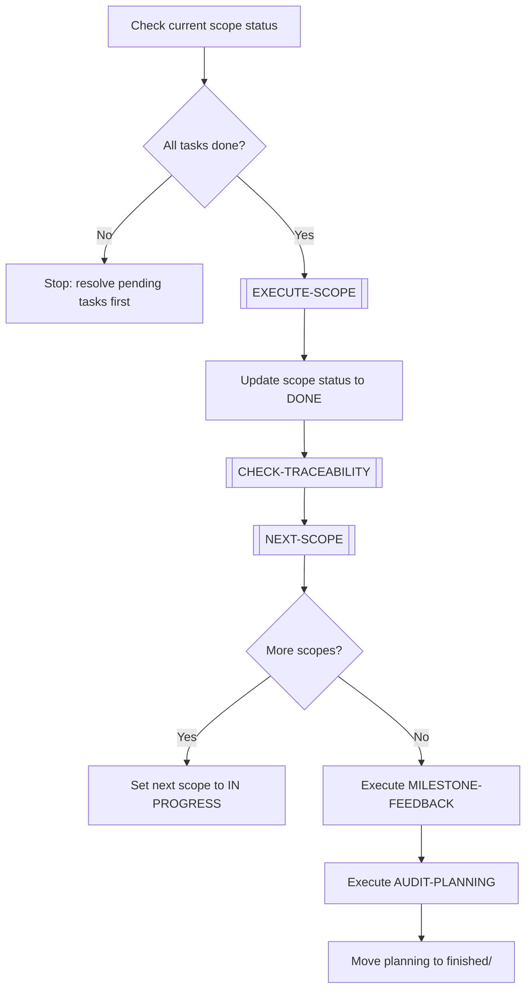
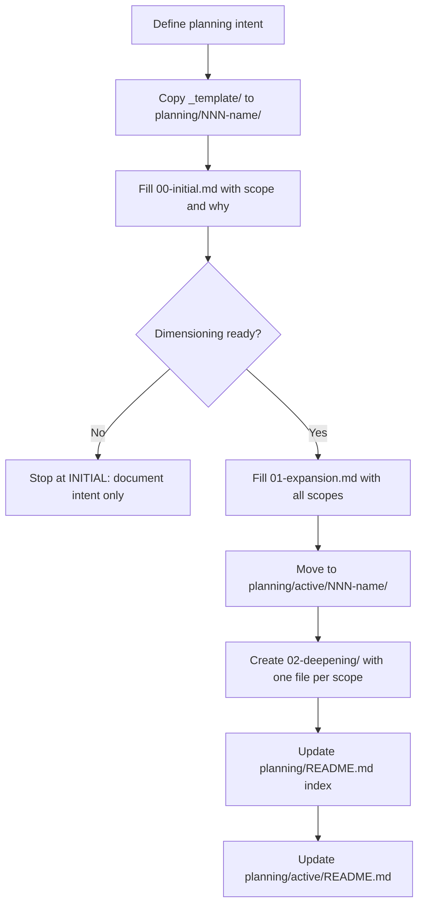

# 📋 Planning Workflows

> [← WORKFLOWS/README.md](README.md)

Core workflows for managing the planning system lifecycle itself.

---

## ADVANCE-PLANNING

Advances a planning from its current scope to the next. Used when the current scope in DEEPENING is complete and the next scope must begin.

### Steps

1. Verify all tasks in the current scope are completed (outputs exist, criteria met).
2. Execute `[EXECUTE-SCOPE]` sub-workflow to validate done criteria.
3. Mark current scope as `DONE` in its file.
4. Execute `[CHECK-TRACEABILITY]` — ensure all new terms/decisions are recorded.
5. Execute `[NEXT-SCOPE]` sub-workflow to identify the next pending scope.
6. If more scopes remain: set next scope to `IN PROGRESS`, proceed.
7. If no more scopes: execute `MILESTONE-FEEDBACK` → `AUDIT-PLANNING` → archive.

---

## CREATE-PLANNING

Creates a new planning from scratch. Used when a new body of work needs to be tracked that is not covered by any existing active planning.

### Steps

1. Define the intent of the planning in a short statement (what + why).
2. Copy `planning/_template/` to `planning/NNN-name/`.
3. Fill `00-initial.md` — captures purpose, approximate scope, and initiator.
4. If there is enough clarity:
   - Fill `01-expansion.md` — list all transversal scopes and dependencies.
   - Move folder to `planning/active/NNN-name/`.
   - Create `02-deepening/scope-NN-name.md` for each scope.
5. If not enough clarity: stop at INITIAL. Return to CREATE-PLANNING later.
6. Update `planning/README.md` (INITIAL table or active link).
7. Update `planning/active/README.md` index.

---

> [← WORKFLOWS/README.md](README.md)
