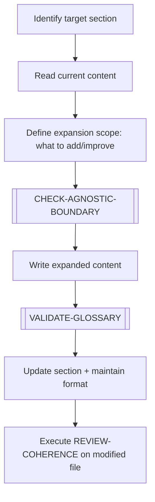

# EXPAND-ELEMENT

> [← README](README.md)

Deepens an existing document section or template — adding content, examples, sub-sections, or additional context. Does not create a new document.

---

---

## Steps

1. Identify the exact section or element to expand.
2. Read current content to understand what exists.
3. Define what will be added, improved, or deepened.
4. Execute `[CHECK-AGNOSTIC-BOUNDARY]` if applicable.
5. Write the expanded content.
6. Execute `[VALIDATE-GLOSSARY]` — check new terminology.
7. Apply `DOCUMENT-STRUCTURE-STANDARD.md` format to new sections.
8. Trigger `REVIEW-COHERENCE` on the modified file.

---

**Sub-workflows used:** [`[CHECK-AGNOSTIC-BOUNDARY]`](../04-SUB-WORKFLOWS/CHECK-AGNOSTIC-BOUNDARY.md) · [`[VALIDATE-GLOSSARY]`](../04-SUB-WORKFLOWS/VALIDATE-GLOSSARY.md)

**Leads to:** [`REVIEW-COHERENCE`](REVIEW-COHERENCE.md)

---

> [← README](README.md)
