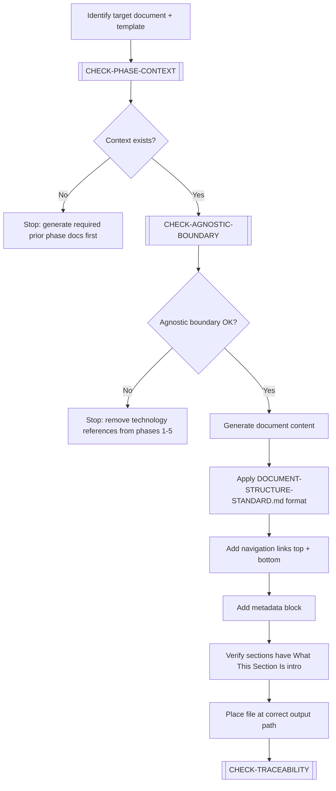

# GENERATE-DOCUMENT

> [← README](README.md)

Creates a new document — either from scratch or by instantiating an existing template. The primary workflow for producing phase outputs.

---

---

## Steps

1. Identify the target document and the template to use as reference.
2. Execute `[CHECK-PHASE-CONTEXT]` — verify previous phase outputs exist.
3. Execute `[CHECK-AGNOSTIC-BOUNDARY]` for phases 1–5 documents.
4. Generate document content following the template structure.
5. Apply `DOCUMENT-STRUCTURE-STANDARD.md` formatting:
   - Navigation links (`[← Index]` / `[Next >]`) at top and bottom.
   - Metadata block (What This Is, How to Use, Why It Matters, When to Use, Owner).
   - Every H2 section starts with "What This Section Is" (one sentence) + explanatory paragraph.
6. Place the file at the correct `data-output/` path.
7. Execute `[CHECK-TRACEABILITY]` — register new terms/concepts.

> **Phase-specific guidance**: For detailed per-phase inputs, boundary rules, chain requirements, and done criteria, consult [`05-SDLC-PHASE-GUIDANCE/`](../05-SDLC-PHASE-GUIDANCE/README.md) before executing this workflow.

---

**Sub-workflows used:** [`[CHECK-PHASE-CONTEXT]`](../04-SUB-WORKFLOWS/CHECK-PHASE-CONTEXT.md) · [`[CHECK-AGNOSTIC-BOUNDARY]`](../04-SUB-WORKFLOWS/CHECK-AGNOSTIC-BOUNDARY.md) · [`[CHECK-TRACEABILITY]`](../04-SUB-WORKFLOWS/CHECK-TRACEABILITY.md)

---

> [← README](README.md)
