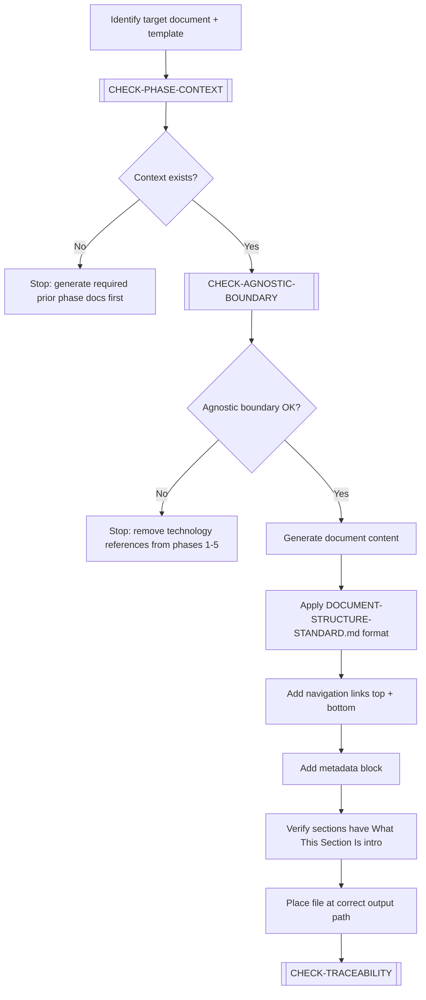
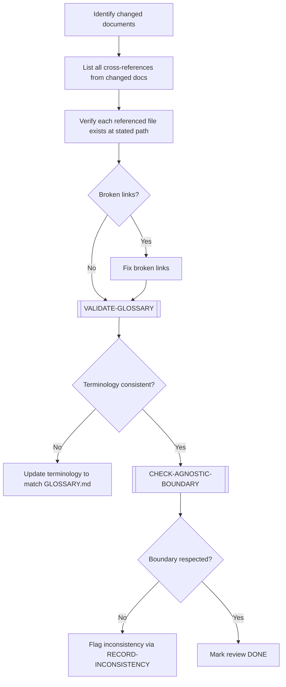
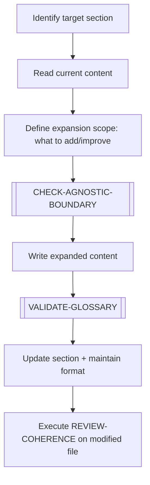
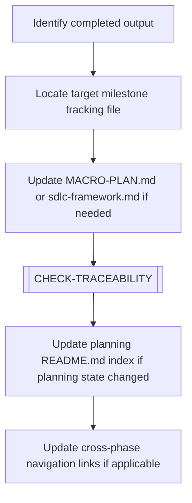

# ⚙️ Execution Workflows

> [← WORKFLOWS/README.md](README.md)

Workflows for producing, reviewing, and integrating documentation content.

---

## GENERATE-DOCUMENT

Creates a new document — either from scratch or by instantiating an existing template. The primary workflow for producing phase outputs.

### Steps

1. Identify the target document and the template to use as reference.
2. Execute `[CHECK-PHASE-CONTEXT]` — verify previous phase outputs exist.
3. Execute `[CHECK-AGNOSTIC-BOUNDARY]` for phases 1–5 documents.
4. Generate document content following the template structure.
5. Apply `DOCUMENT-STRUCTURE-STANDARD.md` formatting:
   - Navigation links (`[← Index]` / `[Next >]`) at top and bottom.
   - Metadata block (What This Is, How to Use, Why It Matters, When to Use, Owner).
   - Every H2 section starts with "What This Section Is" (one sentence) + explanatory paragraph.
6. Place the file at the correct `data-output/` path.
7. Execute `[CHECK-TRACEABILITY]` — register new terms/concepts.

> **Phase-specific guidance**: For detailed per-phase inputs, boundary rules, chain requirements, and done criteria, consult [05-sdlc-phase-guidance.md](05-sdlc-phase-guidance.md) before executing this workflow.

---

## REVIEW-COHERENCE

Validates cross-references, links, and terminology consistency after a document has been modified.

### Steps

1. List all documents modified in the current scope.
2. For each modified document: extract all links and cross-references.
3. Verify each link resolves to an existing file at the expected path.
4. Execute `[VALIDATE-GLOSSARY]` — check terminology matches the project glossary.
5. Execute `[CHECK-AGNOSTIC-BOUNDARY]` if any of the modified docs are in phases 1–5.
6. If inconsistencies are found: trigger `RECORD-INCONSISTENCY` workflow.

---

## EXPAND-ELEMENT

Deepens an existing document section or template — adding content, examples, sub-sections, or additional context. Does not create a new document.

### Steps

1. Identify the exact section or element to expand.
2. Read current content to understand what exists.
3. Define what will be added, improved, or deepened.
4. Execute `[CHECK-AGNOSTIC-BOUNDARY]` if applicable.
5. Write the expanded content.
6. Execute `[VALIDATE-GLOSSARY]` — check new terminology.
7. Apply `DOCUMENT-STRUCTURE-STANDARD.md` format to new sections.
8. Trigger `REVIEW-COHERENCE` on the modified file.

---

## INTEGRATE-MILESTONE

Connects the output of a completed scope or planning to the broader SDLC phase outputs and milestone tracking files.

### Steps

1. Identify what was just completed (a document, a template, a guide section).
2. Locate the appropriate milestone tracking file:
   - `01-templates/00-documentation-planning/macro-plan.md` (progress status)
   - `01-templates/00-documentation-planning/sdlc-framework.md` (phase mapping)
3. Update tracking entries for the completed deliverable.
4. Execute `[CHECK-TRACEABILITY]` — ensure new terms are recorded.
5. Update cross-phase navigation links in README files if the new document is part of a chain.

---

> [← WORKFLOWS/README.md](README.md)
