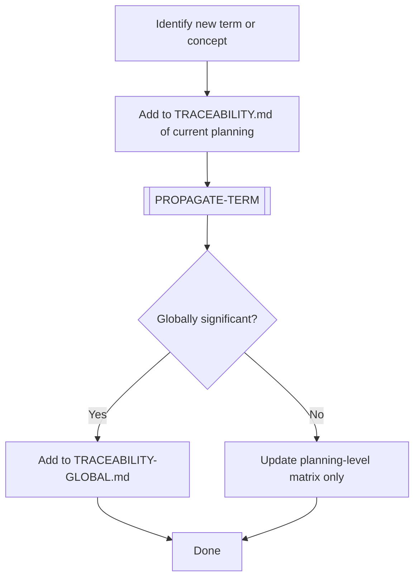
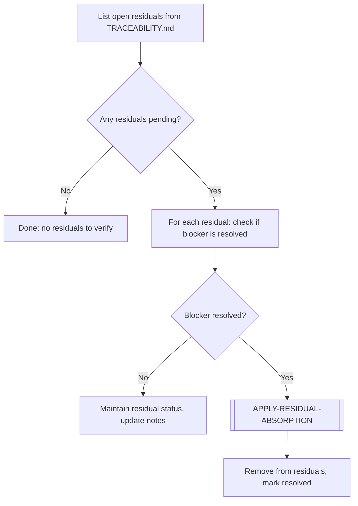
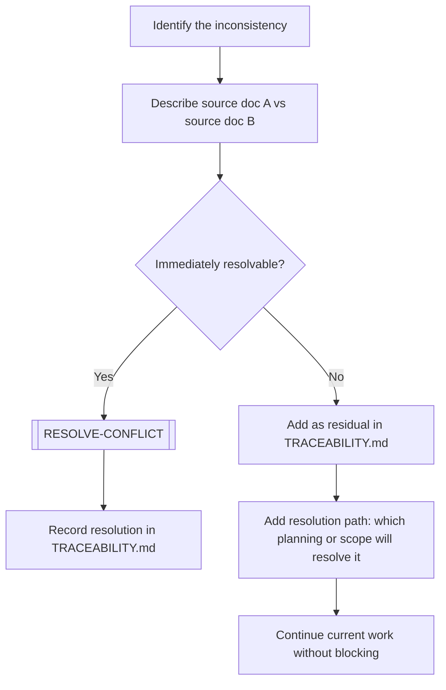
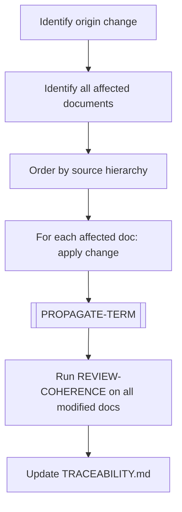
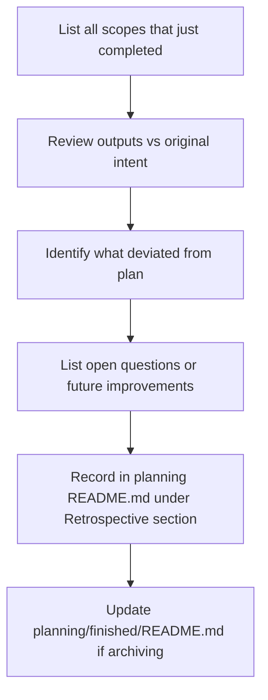
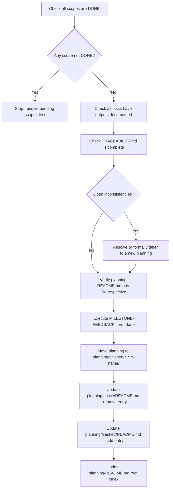

# 🔧 Maintenance Workflows

> [← WORKFLOWS/README.md](README.md)

Workflows for traceability, consistency, and planning integrity management.

---

## UPDATE-TRACEABILITY

Registers a new term, concept, or decision in the traceability matrix and maps it across all relevant SDLC phases.

### Steps

1. Identify the term, concept, or decision that needs to be tracked.
2. Add a row to the local `TRACEABILITY.md` of the active planning.
3. Execute `[PROPAGATE-TERM]` to evaluate which SDLC phase codes are affected.
4. Mark cells: `✅` if present/consistent, `⚠️` if present but needs review, `❌` if missing, `N/A` if not applicable.
5. If the term is globally relevant (affects multiple plannings): add to `TRACEABILITY-GLOBAL.md`.

---

## RESIDUAL-VERIFICATION

Checks if a previously deferred residual can now be resolved, given new work completed in subsequent scopes or plannings.

### Steps

1. Open `TRACEABILITY.md` and list all rows with residual status.
2. For each residual: check if the blocker condition mentioned in the notes has been resolved by recent work.
3. If still blocked: update notes with current status and move on.
4. If unblocked: execute `[APPLY-RESIDUAL-ABSORPTION]` sub-workflow.
5. Update `TRACEABILITY.md` — remove from residual section, mark as resolved.

---

## RECORD-INCONSISTENCY

Documents a detected contradiction, gap, or ambiguity between two or more documents. Does not resolve it — only records it properly.

### Steps

1. Clearly describe the inconsistency: what contradicts what, in which files.
2. Determine if it can be resolved immediately (within this scope).
3. If yes: execute `[RESOLVE-CONFLICT]` and record the resolution.
4. If no: add as a **residual** in `TRACEABILITY.md`:
   - Note source doc A vs source doc B.
   - Note the expected resolution path (future planning, scope, PDR).
5. Continue current work — residuals do not block progress.

---

## CASCADE-CHANGE

Executes a change that originated in one document but must be propagated to many other documents to maintain consistency.

### Steps

1. Identify the original change (e.g., a term was renamed, a section was restructured).
2. Use grep to find all documents referencing the changed element.
3. Order affected documents by **source hierarchy** (see `GUIDE.md`) — most authoritative first.
4. Apply the change to each document in order.
5. Execute `[PROPAGATE-TERM]` if a term was renamed or redefined.
6. Execute `REVIEW-COHERENCE` on all modified files.
7. Update `TRACEABILITY.md` to document the cascade scope.

---

## MILESTONE-FEEDBACK

Reviews a completed scope or planning milestone to capture what went well, what didn't, and what should carry forward to the next planning.

### Steps

1. List all scopes that reached `DONE` in this milestone.
2. Compare outputs against the original intent in `00-initial.md` and `01-expansion.md`.
3. Identify deviations: scope creep, unsolved residuals, decisions made on-the-fly.
4. Document: what worked well, what didn't, open improvements.
5. Add a `## Retrospective` section to the planning's `README.md`.
6. If archiving: update `planning/finished/README.md` with the key outputs.

---

## AUDIT-PLANNING

Verifies all completeness conditions before a planning can be archived to `finished/`.

### Steps

1. Verify all scopes in `02-deepening/` have status `DONE`.
2. Verify all tasks in each scope have their documented output.
3. Verify `TRACEABILITY.md` is fully populated (no empty cells for evaluated terms).
4. Verify no open inconsistencies remain unaddressed.
5. Verify `README.md` has a `## Retrospective` section.
6. Execute `MILESTONE-FEEDBACK` if not already done.
7. Move planning folder to `planning/finished/`.
8. Update `planning/active/README.md` — remove entry.
9. Update `planning/finished/README.md` — add entry with key outputs.
10. Update `planning/README.md` root index.

---

> [← WORKFLOWS/README.md](README.md)
