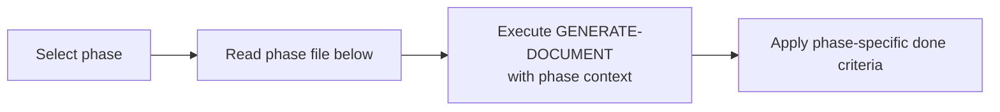

# 📘 SDLC Phase Guidance for GENERATE-DOCUMENT

> [← WORKFLOWS/README.md](../README.md)

Per-phase reference for executing the `GENERATE-DOCUMENT` workflow. Each file specifies required inputs, boundary rules, done criteria, and key checks for that SDLC phase.

---

## Overview

`GENERATE-DOCUMENT` is the generic workflow for producing any phase output. This group extends it with phase-specific knowledge so that AI agents know exactly what to check, enforce, and produce for each of the 12 SDLC phases.

---

## How to Use

1. Identify which phase you are generating a document for.
2. Open the corresponding phase file below.
3. Execute `GENERATE-DOCUMENT` with the inputs, constraints, and done criteria specified there.
4. Run the sub-workflows listed in the "Key Checks" field.

---

## Phase Quick Reference

| Phase | Code | Boundary | File |
|-------|------|----------|------|
| 0 — Documentation Planning | W | Agnostic | [PHASE-00-DOCUMENTATION-PLANNING.md](PHASE-00-DOCUMENTATION-PLANNING.md) |
| 1 — Discovery | D | **Agnostic** | [PHASE-01-DISCOVERY.md](PHASE-01-DISCOVERY.md) |
| 2 — Requirements | R | **Agnostic** | [PHASE-02-REQUIREMENTS.md](PHASE-02-REQUIREMENTS.md) |
| 3 — Design | S | **Agnostic** | [PHASE-03-DESIGN.md](PHASE-03-DESIGN.md) |
| 4 — Data Model | M | **Agnostic** | [PHASE-04-DATA-MODEL.md](PHASE-04-DATA-MODEL.md) |
| 5 — Planning | P | **Agnostic** | [PHASE-05-PLANNING.md](PHASE-05-PLANNING.md) |
| 6 — Development | V | **Specific** | [PHASE-06-DEVELOPMENT.md](PHASE-06-DEVELOPMENT.md) |
| 7 — Testing | T | Specific | [PHASE-07-TESTING.md](PHASE-07-TESTING.md) |
| 8 — Deployment | B | Specific | [PHASE-08-DEPLOYMENT.md](PHASE-08-DEPLOYMENT.md) |
| 9 — Operations | O | Specific | [PHASE-09-OPERATIONS.md](PHASE-09-OPERATIONS.md) |
| 10 — Monitoring | N | Specific | [PHASE-10-MONITORING.md](PHASE-10-MONITORING.md) |
| 11 — Feedback | F | Specific | [PHASE-11-FEEDBACK.md](PHASE-11-FEEDBACK.md) |

---

> [← WORKFLOWS/README.md](../README.md)
