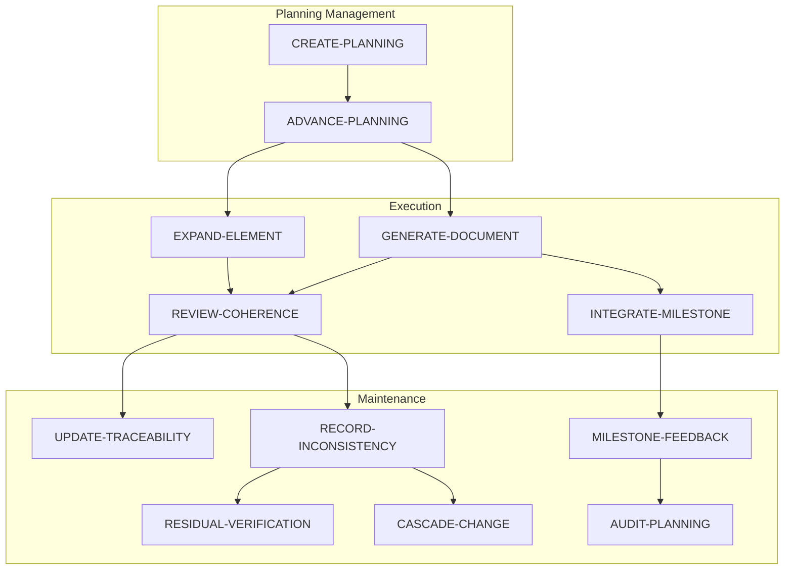

# 🔄 Workflows — Catalog

> [← planning/README.md](../README.md)

All workflows and sub-workflows for the planning system. Every task in every scope must reference one of these.

---

## When to Use Which Workflow

| Workflow | When to use |
|---------|-------------|
| [ADVANCE-PLANNING](01-planning-workflows.md#advance-planning) | You have a scope in DEEPENING to advance to the next task |
| [CREATE-PLANNING](01-planning-workflows.md#create-planning) | You need to start a brand new planning |
| [GENERATE-DOCUMENT](02-execution-workflows.md#generate-document) | Creating a new document from scratch or from a template |
| [REVIEW-COHERENCE](02-execution-workflows.md#review-coherence) | Validating cross-references and consistency after changes |
| [EXPAND-ELEMENT](02-execution-workflows.md#expand-element) | Deepening an existing document section or template |
| [INTEGRATE-MILESTONE](02-execution-workflows.md#integrate-milestone) | Connecting completed work to the SDLC phase outputs |
| [UPDATE-TRACEABILITY](03-maintenance-workflows.md#update-traceability) | A new term, concept, or decision was introduced |
| [RESIDUAL-VERIFICATION](03-maintenance-workflows.md#residual-verification) | Checking if a deferred residual can now be resolved |
| [RECORD-INCONSISTENCY](03-maintenance-workflows.md#record-inconsistency) | You detected a contradiction or gap between documents |
| [CASCADE-CHANGE](03-maintenance-workflows.md#cascade-change) | A change in one document requires updates across many others |
| [MILESTONE-FEEDBACK](03-maintenance-workflows.md#milestone-feedback) | Closing a scope or planning with a review summary |
| [AUDIT-PLANNING](03-maintenance-workflows.md#audit-planning) | Verifying completeness before archiving a planning |

> For per-phase guidance when executing `GENERATE-DOCUMENT`, see [05-sdlc-phase-guidance.md](05-sdlc-phase-guidance.md).

---

## Master Diagram

---

## Sub-Workflow Index

Sub-workflows are reusable steps invoked within the main workflows above.

| Sub-workflow | Used by |
|-------------|---------|
| [[NEXT-SCOPE]](04-sub-workflows.md#next-scope) | ADVANCE-PLANNING |
| [[EXECUTE-SCOPE]](04-sub-workflows.md#execute-scope) | ADVANCE-PLANNING |
| [[RESOLVE-CONFLICT]](04-sub-workflows.md#resolve-conflict) | RECORD-INCONSISTENCY, CASCADE-CHANGE |
| [[APPLY-RESIDUAL-ABSORPTION]](04-sub-workflows.md#apply-residual-absorption) | RESIDUAL-VERIFICATION |
| [[PROPAGATE-TERM]](04-sub-workflows.md#propagate-term) | UPDATE-TRACEABILITY, CASCADE-CHANGE |
| [[CHECK-AGNOSTIC-BOUNDARY]](04-sub-workflows.md#check-agnostic-boundary) | GENERATE-DOCUMENT, REVIEW-COHERENCE |
| [[CHECK-PHASE-CONTEXT]](04-sub-workflows.md#check-phase-context) | GENERATE-DOCUMENT |
| [[CHECK-TRACEABILITY]](04-sub-workflows.md#check-traceability) | INTEGRATE-MILESTONE, UPDATE-TRACEABILITY |
| [[VALIDATE-GLOSSARY]](04-sub-workflows.md#validate-glossary) | REVIEW-COHERENCE, EXPAND-ELEMENT |
| [[CHECK-PHASE5-CHAIN]](04-sub-workflows.md#check-phase5-chain) | GENERATE-DOCUMENT (Phase 5), REVIEW-COHERENCE |
| [[CHECK-DEVWORKFLOW-CONSISTENCY]](04-sub-workflows.md#check-devworkflow-consistency) | GENERATE-DOCUMENT (Phase 6 workflow), REVIEW-COHERENCE |
| [[CHECK-VERSIONING-ALIGNMENT]](04-sub-workflows.md#check-versioning-alignment) | GENERATE-DOCUMENT (Phase 8), REVIEW-COHERENCE |

---

> [← planning/README.md](../README.md)
