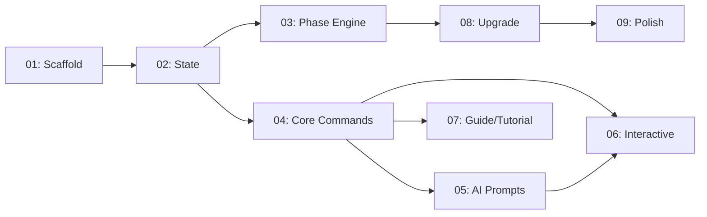

# 🚀 EXPANSION: 006 — Archon CLI

> **Status:** EXPANSION
> [← planning/README.md](../README.md)

---

## Scope Summary

| # | Scope | SDLC Phase(s) | Depends On | Status |
|---|-------|--------------|------------|--------|
| 01 | CLI project scaffold | G | — | PENDING |
| 02 | State management + mode detection | G | 01 | PENDING |
| 03 | Phase engine + validator | G | 02 | PENDING |
| 04 | Core commands (init, status, check, next) | G | 02 | PENDING |
| 05 | AI prompt generation + prompts management | G | 04 | PENDING |
| 06 | Interactive mode + config defaults | G | 04 | PENDING |
| 07 | Guide + tutorial + doctor commands | G | 04 | PENDING |
| 08 | Upgrade + migration system | G | 03 | PENDING |
| 09 | Documentation, polish, examples | G | 08 | PENDING |

---

## Dependency Map

---

## Impact per SDLC Phase

| Phase Code | Affected? | What changes |
|------------|----------|-------------|
| D | ☐ | No changes |
| R | ☐ | No changes |
| S | ☐ | No changes |
| M | ☐ | No changes |
| P | ☐ | No changes |
| V | ☐ | No changes |
| T | ☐ | No changes |
| B | ☐ | No changes |
| O | ☐ | No changes |
| N | ☐ | No changes |
| F | ☐ | No changes |
| G | ✅ | New `archon/` CLI tool under `00-guides-and-instructions/` |
| W | ☐ | No workflow changes |

---

## Notes

- Archon reads from `01-templates/` but never modifies template structure
- All state is stored in `.archon/` folder (inside project sibling directory)
- Prompts accumulate in `.archon/prompts/` with management commands
- Template versioning uses semantic versioning; upgrade/migration system handles upgrades
- Rollback support ensures safety during migrations
- opencode is the primary AI agent target; other agents are supported via config

---

> [← planning/README.md](../README.md)