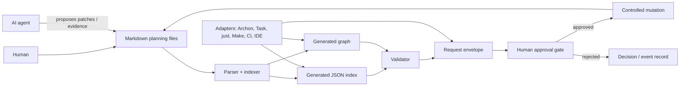

# 🌿 EXPANSION: Local Planning API & Automation Contract (017)

> **Status:** DEEPENING
> [← 00-initial.md](./00-initial.md) | [← planning/README.md](../../README.md)

---

## Context

The repository already uses a Markdown-based planning system to coordinate work. The system is intentionally human-readable and can be operated manually, but it is also expected to support AI-assisted execution and external automation.

The next step is to make that planning system consumable by tools without making those tools the source of truth.

This planning defines the neutral integration contract for that goal.

---

## Problem

Automation tools currently need to infer planning state from Markdown structure, tables, links and prose. That creates several risks:

- Brittle parsing of human-oriented Markdown.
- Accidental coupling to one CLI, runtime or implementation language.
- Duplicate sources of truth if YAML/JSON starts replacing Markdown.
- Hidden state if a tool stores planning truth in its own runtime directory.
- Unsafe automation if agents can advance or archive planning work without explicit human approval.
- Documentation drift between active indexes, planning files and generated artifacts.

---

## Goal

Define a local, filesystem-first, serverless and tool-agnostic planning contract that allows humans, AI agents and automation tools to share the same planning state safely.

The contract must support:

- Querying planning, scope, task, workflow and traceability state.
- Validating task outputs and generated artifacts.
- Producing indexes, manifests and dependency graphs.
- Requesting state transitions through explicit approval gates.
- Supporting multiple adapters without changing the planning core.

---

## Non-Goals

- Do not implement the Archon CLI here. Archon is a consumer/adaptor, handled by 018.
- Do not require a server, daemon, database or background process.
- Do not make YAML/JSON the canonical authoring format.
- Do not couple the contract to TypeScript, Node, Python, Java or any specific implementation stack.
- Do not store canonical planning state inside adapter-specific runtime folders.
- Do not allow tools to bypass human-controlled lifecycle transitions.

---

## Core Architectural Decision

Markdown remains canonical. Structured machine artifacts are derived from it.



---

## Layered Architecture

| Layer | Responsibility | Canonical? | Notes |
|---|---|---:|---|
| Human authoring layer | Markdown files under `planning/` | Yes | Must remain readable and editable without tooling |
| Embedded metadata layer | Structured blocks inside Markdown | Yes, when present | Used to avoid fragile parsing of tables/prose |
| Contract layer | Schemas, command envelopes and event shapes | Yes | Versioned under `planning/contracts/v1/` |
| Generated index layer | Machine-readable planning snapshots | No | Rebuildable from Markdown |
| Generated graph layer | Dependency and traceability graph | No | Rebuildable from Markdown |
| Validation layer | Structural and semantic checks | No | Can be implemented by any stack |
| Approval layer | Human-gated transition records | Yes | Required for sensitive state changes |
| Adapter layer | Archon, Task, just, Make, CI, IDE, HTTP wrappers | No | Must not redefine the core model |

---

## Contract Style

The base contract is command-oriented and transport-neutral.

Preferred invocation shape:

```text
stdin JSON request → tool/core implementation → stdout JSON response
```

Optional adapters may expose the same contract through:

- CLI commands.
- Local scripts.
- Task/just/Make targets.
- CI jobs.
- IDE commands.
- Local HTTP or IPC wrappers.

The transport is not part of the core contract. The payload shape is.

---

## Command Semantics

Commands must be separated into three categories:

| Category | Meaning | Examples | Human approval |
|---|---|---|---|
| Query | Read planning state | `planning.list`, `planning.get`, `scope.get`, `workflow.list` | Not required |
| Validate | Check state or artifacts | `planning.validate`, `task.validate`, `graph.validate` | Not required to run; may be required before transition |
| Request | Propose a state-changing action | `scope.advance.request`, `task.done.request`, `planning.archive.request` | Required when policy says so |

State-changing commands should use `request` semantics. A tool may propose the mutation and provide evidence, but the approval policy decides whether the mutation can be applied.

---

## File Targets

| Path | Description | Canonical? |
|------|-------------|---:|
| `planning/contracts/v1/*.schema.json` | Versioned JSON schemas for planning entities, envelopes, reports and approvals | Yes |
| `planning/API.md` | Human-readable reference for the local contract | Yes |
| `planning/METALANGUAGE.md` | Metadata and optional import/export conventions | Yes |
| `planning/WORKFLOWS/API.md` | Tool-facing workflow catalog extensions | Yes |
| `.planning/index/v1/*.json` | Generated planning snapshots and manifests | No |
| `.planning/graph/v1/*.json` | Generated dependency and traceability graph files | No |
| `.planning/reports/*.json` | Generated validation reports | No |
| `planning/approvals/` | Human approval records or approval log | Yes |
| `automation/adapters/examples/` | Optional examples for consuming the contract | No |

---

## Scopes

| # | Scope | Depends On | Description |
|---|-------|------------|-------------|
| 01 | [Contract Surface & JSON Schemas](02-deepening/scope-01-api-surface.md) | — | Define versioned schemas and request/response envelopes for a local planning contract |
| 02 | [Markdown Metadata & Metalanguage](02-deepening/scope-02-metalanguage-dsl.md) | S01 | Define metadata conventions embedded in Markdown; optional import/export, not canonical replacement |
| 03 | [Validation Engine & Human Gates](02-deepening/scope-03-validation-engine.md) | S01, S02 | Define validation rules, reports and approval-gated transitions |
| 04 | [Workflow Catalog Extensions](02-deepening/scope-04-workflow-extensions.md) | S01, S03 | Define query, validate and request workflows for tools |
| 05 | [Index, Manifest & Interdependency Graph](02-deepening/scope-05-interdependency-graph.md) | S01, S02 | Define generated indexes, manifests, source hashes and dependency graph artifacts |
| 06 | [Verify, Document & Archive](02-deepening/scope-06-verify-archive.md) | S01–S05 | Validate the contract, update docs and archive the planning |

---

## Decisions

| ID | Decision | Consequence |
|---|---|---|
| D017-01 | Markdown remains canonical | Tooling must derive from Markdown, not replace it |
| D017-02 | Generated JSON is rebuildable | Indexes/graphs are convenient artifacts, not independent truth |
| D017-03 | Mutations use request semantics | Agents/tools cannot silently advance lifecycle state |
| D017-04 | Archon is an adapter | 017 stays reusable by other CLIs and systems |
| D017-05 | The contract is transport-neutral | CLI, stdin/stdout, HTTP or IDE integrations can coexist |
| D017-06 | Schemas are versioned | Future breaking changes require a new contract version |
| D017-07 | Implementation language is unspecified | Reference implementations are allowed, but not normative |

---

## Trade-offs

| Trade-off | Benefit | Cost |
|---|---|---|
| Keep Markdown canonical | Human-readable and Git-friendly | Requires parser/indexer tooling for machines |
| Embed metadata in Markdown | Reduces brittle table parsing | Adds invisible structured blocks that must be documented |
| Use generated JSON indexes | Fast and stable for tools | Requires regeneration and drift detection |
| Require human approval for transitions | Preserves governance and trust | Adds friction to full automation |
| Avoid a mandatory daemon | Simple local usage | No always-on API unless an adapter provides it |
| Avoid CLI-specific design | Long-term portability | More upfront contract design work |

---

## Risks

| Risk | Impact | Mitigation |
|---|---|---|
| Markdown and generated indexes drift | Tools act on stale state | Store source hash/commit in generated artifacts and validate before use |
| Adapter-specific concepts leak into core | Contract becomes non-agnostic | Keep Archon, Task, just, Make and CI details in adapter docs |
| Metadata becomes too complex | Human authoring suffers | Keep required metadata minimal; allow optional `x-*` extensions |
| YAML/JSON becomes a second source of truth | Conflicting planning states | Treat YAML/JSON as import/export only unless explicitly promoted later |
| Approval flow is skipped by tools | Loss of human control | Define request envelopes and approval records as required artifacts |
| Schema design becomes over-engineered | Harder adoption | Prefer simple JSON Schema usage and semantic checks outside schema when needed |

---

## Roadmap

1. **Contract baseline:** define entities, envelopes, versioning and compatibility rules.
2. **Metadata baseline:** define minimal Markdown metadata blocks for planning, scope, task and approval semantics.
3. **Generated index:** define index/manifest artifacts and drift detection rules.
4. **Validation:** define rule catalog and validation report format.
5. **Human gate:** define transition requests, approval records and controlled mutation rules.
6. **Workflow catalog:** document query, validate and request workflows.
7. **Adapter examples:** document how Archon, Task, just, Make or CI could consume the same contract without owning it.
8. **Verification:** validate the 017 planning itself using the new rules and update planning documentation.

---

## Acceptance Criteria

- [ ] 017 no longer defines Archon-specific commands as core requirements.
- [ ] 017 no longer requires YAML/JSON to compile into Markdown as the canonical workflow.
- [ ] The contract can be consumed through files/stdin/stdout without a server.
- [ ] Query, validate and request command categories are documented.
- [ ] Human approval gates are explicitly modeled.
- [ ] Generated indexes and graphs are clearly marked as derived artifacts.
- [ ] Adapter-specific runtime state is excluded from the canonical planning model.
- [ ] 018 can implement Archon support by consuming the 017 contract instead of redefining it.

---

> [← 00-initial.md](./00-initial.md) | [← planning/README.md](../../README.md)
