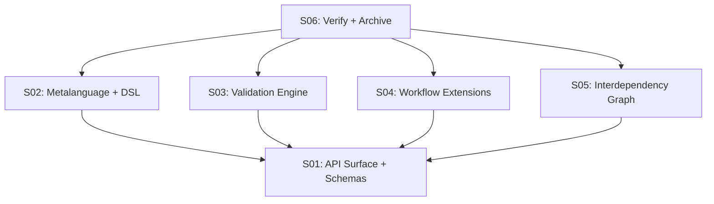

# 017 — Planning API & Metalanguage

> **Status:** EXPANSION → DEEPENING
> [← active/README.md](../README.md) | [← planning/README.md](../../README.md)

---

## Intent

Define a machine-readable API surface and metalanguage so external tools can query planning state, advance scopes, validate outputs, and build dependency graphs — while humans continue using markdown for manual authoring.

---

## Source

Derived from: original request — Carlos Martínez (2026-05-14)

---

## Scopes

| # | Scope | Depends On | State |
|---|-------|------------|-------|
| 01 | [API Surface & JSON Schemas](02-deepening/scope-01-api-surface.md) | — | PENDING |
| 02 | [Metalanguage & DSL](02-deepening/scope-02-metalanguage-dsl.md) | S01 | PENDING |
| 03 | [Validation Engine](02-deepening/scope-03-validation-engine.md) | S01 | PENDING |
| 04 | [Workflow Catalog Extensions](02-deepening/scope-04-workflow-extensions.md) | S01 | PENDING |
| 05 | [Interdependency Graph](02-deepening/scope-05-interdependency-graph.md) | S01 | PENDING |
| 06 | [Verify + Archive](02-deepening/scope-06-verify-archive.md) | S01–S05 | PENDING |

---

## Dependency Map

---

> [← active/README.md](../README.md) | [← planning/README.md](../../README.md)