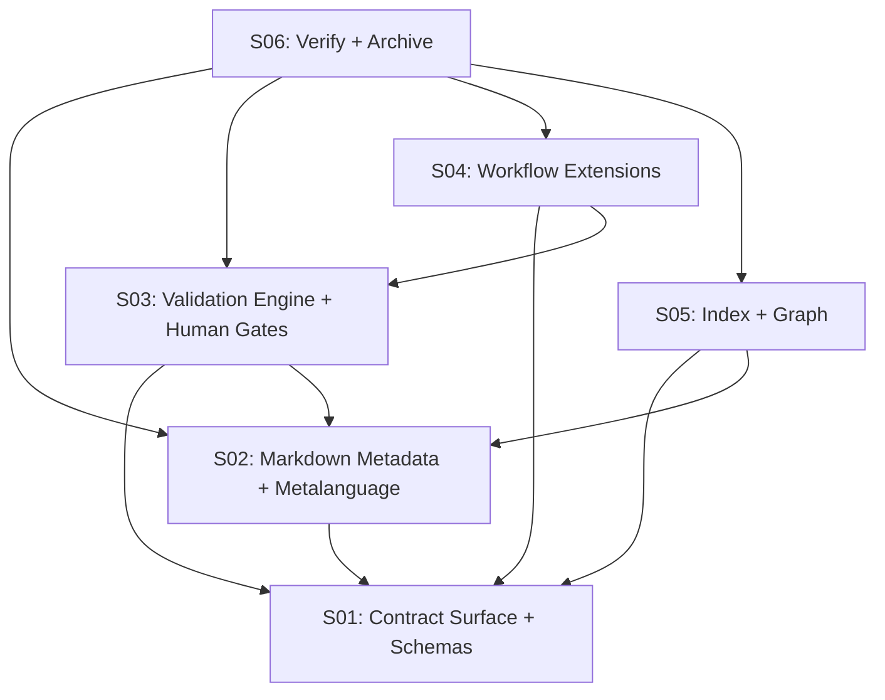

# 017 — Local Planning API & Automation Contract

> **Status:** DEEPENING
> [← active/README.md](../README.md) | [← planning/README.md](../../README.md)

---

## Intent

Define a local, filesystem-first and tool-agnostic integration contract for the planning system.

The contract must allow humans, AI agents and automation tools to collaborate over Markdown-based planning artifacts without requiring a server, daemon, database, specific CLI, or runtime such as Archon.

---

## Core Decision

Markdown remains the canonical human authoring layer. Machine-readable artifacts are either:

1. **Structured metadata embedded in Markdown**, used to avoid brittle parsing of tables and prose.
2. **Generated JSON indexes, manifests and graphs**, derived from the Markdown source.
3. **Request/response envelopes**, used by tools to query, validate, propose and request transitions.

No external tool owns the planning state. Tools are adapters over the same contract.

---

## Architectural Principles

- **Local-first:** all core operations must work from the repository filesystem.
- **No mandatory server:** HTTP, daemon or MCP-like transport may exist only as adapters.
- **Tool-agnostic:** Archon, Task, just, Make, CI jobs, IDEs and AI agents must consume the same neutral contract.
- **Human-governed:** tools may request transitions, but advancing scopes, closing tasks or archiving plannings requires explicit human approval when policy says so.
- **Derived machine state:** generated indexes and graphs must be reproducible from canonical Markdown.
- **Adapter isolation:** runtime-specific state such as `.archon/` belongs to the adapter layer, not the planning core.

---

## Scopes

| # | Scope | Depends On | State |
|---|-------|------------|-------|
| 01 | [Contract Surface & JSON Schemas](02-deepening/scope-01-api-surface.md) | — | PENDING |
| 02 | [Markdown Metadata & Metalanguage](02-deepening/scope-02-metalanguage-dsl.md) | S01 | PENDING |
| 03 | [Validation Engine & Human Gates](02-deepening/scope-03-validation-engine.md) | S01, S02 | PENDING |
| 04 | [Workflow Catalog Extensions](02-deepening/scope-04-workflow-extensions.md) | S01, S03 | PENDING |
| 05 | [Index, Manifest & Interdependency Graph](02-deepening/scope-05-interdependency-graph.md) | S01, S02 | PENDING |
| 06 | [Verify, Document & Archive](02-deepening/scope-06-verify-archive.md) | S01–S05 | PENDING |

---

## Dependency Map

---

## Expected Result

At the end of 017, the repository must have a documented local contract that lets any adapter:

- List active and finished plannings.
- Read planning, scope, task and workflow state.
- Validate task outputs and generated artifacts.
- Build dependency and traceability graphs.
- Request state transitions without bypassing human governance.
- Ignore adapter-specific extensions it does not understand.

---

## Out of Scope

- Implementing the Archon command group. That belongs to 018.
- Choosing a definitive implementation language for parser/validator tooling.
- Replacing Markdown with YAML/JSON as the canonical planning source.
- Running a mandatory background service.
- Storing planning truth in a CLI-specific runtime directory.

---

## Source

Derived from: original request — Carlos Martínez (2026-05-14), later refined to emphasize human-governed, serverless and CLI-agnostic automation.

---

> [← active/README.md](../README.md) | [← planning/README.md](../../README.md)
