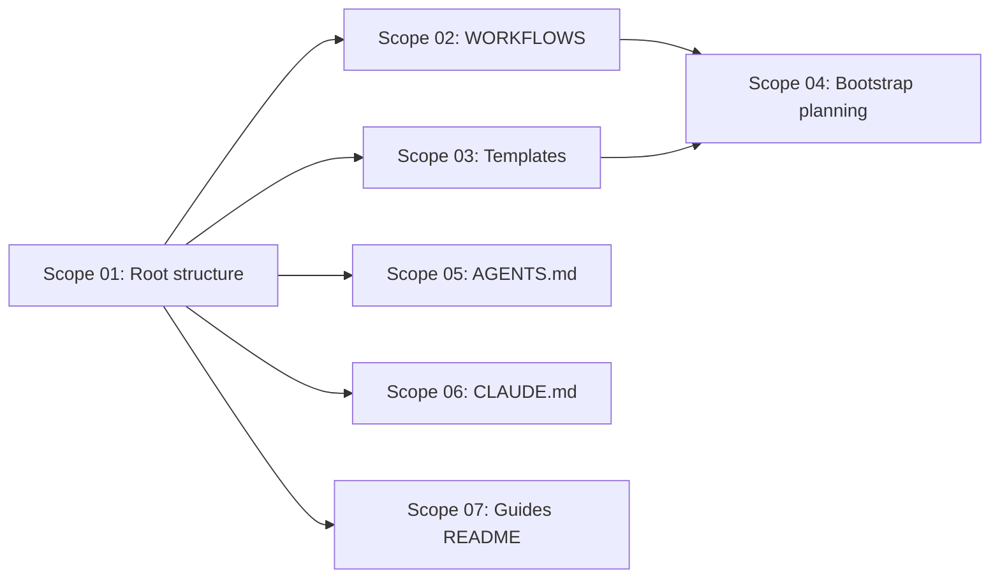

# 🚀 EXPANSION: Planning System Bootstrap

> **Status:** Completed (archived)
> [← README.md](README.md)

---

## Scope Summary

| # | Scope | SDLC Phase(s) | Depends On | Status |
|---|-------|--------------|------------|--------|
| 01 | Create planning/ root structure | W | — | DONE |
| 02 | Create planning/WORKFLOWS/ catalog | W | 01 | DONE |
| 03 | Create planning/_template/ files | W | 01 | DONE |
| 04 | Create bootstrap planning (this) | W | 02, 03 | DONE |
| 05 | Modify AGENTS.md | G | 01 | DONE |
| 06 | Modify CLAUDE.md | G | 01 | DONE |
| 07 | Modify 00-guides-and-instructions/README.md | G | 01 | DONE |

---

## Dependency Map

---

## Impact per SDLC Phase

| Phase Code | Affected? | What changes |
|-----------|----------|-------------|
| D | ☐ | No changes |
| R | ☐ | No changes |
| S | ☐ | No changes |
| M | ☐ | No changes |
| P | ☐ | No changes |
| V | ☐ | No changes |
| T | ☐ | No changes |
| B | ☐ | No changes |
| O | ☐ | No changes |
| N | ☐ | No changes |
| F | ☐ | No changes |
| G | ✅ | AGENTS.md, CLAUDE.md, 00-guides/README.md updated |
| W | ✅ | Entire planning/ directory created |

---

> [← README.md](README.md)
