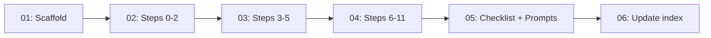

# 🚀 EXPANSION: Tutorial — Interactive Step-by-Step

> **Status:** Completed
> [← planning/README.md](../../README.md)

---

## Scope Summary

| # | Scope | SDLC Phase(s) | Depends On | Status |
|---|-------|--------------|------------|--------|
| 01 | Tutorial folder scaffold + entry README | G | — | PENDING |
| 02 | Step files: phases 0–2 (setup, discovery, requirements) | G, D, R | 01 | PENDING |
| 03 | Step files: phases 3–5 (design, data model, planning) | G, S, M, P | 02 | PENDING |
| 04 | Step files: phases 6–11 (development through feedback) | G, V, T, B, O, N, F | 03 | PENDING |
| 05 | Validation checklist + AI prompt appendix | G | 04 | PENDING |
| 06 | Update `00-guides-and-instructions/README.md` with tutorial link | G | 05 | PENDING |

---

## Dependency Map

---

## Impact per SDLC Phase

| Phase Code | Affected? | What changes |
|-----------|----------|-------------|
| D | ☐ | Referenced but not modified |
| R | ☐ | Referenced but not modified |
| S | ☐ | Referenced but not modified |
| M | ☐ | Referenced but not modified |
| P | ☐ | Referenced but not modified |
| V | ☐ | Referenced but not modified |
| T | ☐ | Referenced but not modified |
| B | ☐ | Referenced but not modified |
| O | ☐ | Referenced but not modified |
| N | ☐ | Referenced but not modified |
| F | ☐ | Referenced but not modified |
| G | ✅ | New `tutorial/` subfolder + README link |
| W | ☐ | No workflow changes |

---

## Notes

- Each step file follows: **goal → prerequisites → instructions → AI prompt → done-check**.
- The tutorial is project-agnostic: the user brings their own project case. Optionally, the URL Shortener (from 003) can be used as the default reference case.
- Step files reference the relevant template files (`TEMPLATE-*.md`) and the INSTRUCTIONS-FOR-AI.md prompts for that phase.
- The validation checklist mirrors the agnostic-boundary rule, navigation link standards, and glossary consistency checks.
- Dependency on 003: if 003 is executed first, step files can link to its `data-output/` examples as illustrations.

---

> [← planning/README.md](../../README.md)
