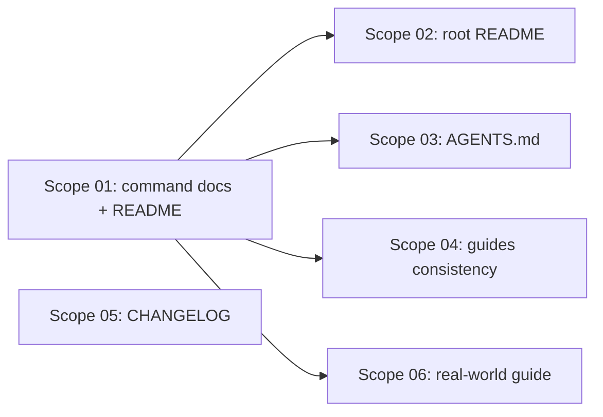

# 🚀 EXPANSION: 007 — Documentation Update

> **Status:** Expansion
> [← planning/README.md](../README.md)

---

## Scope Summary

| # | Scope | SDLC Phase(s) | Depends On | Status |
|---|-------|--------------|------------|--------|
| 01 | archon-cli: 16 command docs + cross-navigation + README | W | — | PENDING |
| 02 | root README — add Archon as recommended workflow | W | 01 | PENDING |
| 03 | AGENTS.md — add Archon section | W | 01 | PENDING |
| 04 | 00-guides-and-instructions/ — CLI consistency review | G | 01 | PENDING |
| 05 | archon-cli CHANGELOG.md — create initial changelog | W | — | PENDING |
| 06 | archon-cli: guía de caso real con DDD-hexagonal template | W, G | 01 | PENDING |

---

## Dependency Map

---

## Impact per SDLC Phase

| Phase Code | Affected? | What changes |
|-----------|----------|-------------|
| D | ☐ | — |
| R | ☐ | — |
| S | ☐ | — |
| M | ☐ | — |
| P | ☐ | — |
| V | ☐ | — |
| T | ☐ | — |
| B | ☐ | — |
| O | ☐ | — |
| N | ☐ | — |
| F | ☐ | — |
| G | ☑ | 00-guides-and-instructions/ (scope 04) + guía real en archon-cli/docs/guides/ (scope 06) |
| W | ☑ | packages/archon-cli/docs/commands/ (16 archivos), README, root README, AGENTS.md, CHANGELOG.md |

---

## Notes

Scope 01 es la base de referencia: establece la estructura `docs/commands/` y el README actualizado. Los scopes 02, 03, 04 y 06 dependen de él porque todos apuntan o referencian la misma documentación CLI. Scope 05 (CHANGELOG) y scope 06 (guía real) son independientes entre sí y pueden ejecutarse en paralelo una vez completado scope 01.

---

> [← planning/README.md](../README.md)
