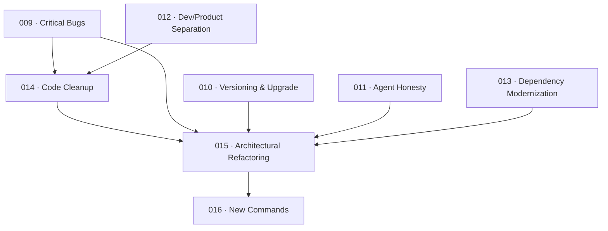

# 🚀 EXPANSION: Archon Improvement Master Plan

> **Status:** Deepening
> [← planning/README.md](../../README.md)

---

## Scope Summary

Each scope is a separate planning. Activate a planning by moving it from `planning/NNN-name/` → `planning/active/NNN-name/` and filling its `01-expansion.md`.

| # | Planning | Name | Depends On | Category |
|---|----------|------|------------|----------|
| 01 | [009](../../009-archon-critical-bugs/00-initial.md) | Archon Critical Bugs | — | Bug fix |
| 02 | [010](../../010-archon-versioning-and-upgrade/00-initial.md) | Archon Versioning & Upgrade Fix | — | Bug fix |
| 03 | [011](../../011-archon-agent-support-honesty/00-initial.md) | Archon Agent Support Honesty | — | Correctness |
| 04 | [012](../../012-archon-dev-product-separation/00-initial.md) | Archon Dev/Product Mode Separation | — | Correctness |
| 05 | [013](../../013-archon-dependency-modernization/00-initial.md) | Archon Dependency Modernization | — | Modernization |
| 06 | [014](../../014-archon-code-cleanup/00-initial.md) | Archon Code Cleanup | 009, 012 | Cleanup |
| 07 | [015](../../015-archon-architectural-refactoring/00-initial.md) | Archon Architectural Refactoring | 009–014 | Refactoring |
| 08 | [016](../../016-archon-new-commands/00-initial.md) | Archon New Commands | 015 | Extension |

---

## Dependency Map

---

## Recommended Execution Order

### Wave 1 — Independent (can be done in parallel or any order)
- 009 · Critical Bugs
- 010 · Versioning & Upgrade Fix
- 011 · Agent Support Honesty
- 012 · Dev/Product Mode Separation
- 013 · Dependency Modernization

### Wave 2 — After Wave 1 completes
- 014 · Code Cleanup *(requires 009 + 012)*

### Wave 3 — After all Wave 1 + 014
- 015 · Architectural Refactoring *(requires everything clean)*

### Wave 4 — After 015
- 016 · New Commands *(requires clean architecture)*

---

## Impact per SDLC Phase

| Phase Code | Affected? | What changes |
|-----------|----------|-------------|
| D | ☐ | — |
| R | ☐ | — |
| S | ☐ | — |
| M | ☐ | — |
| P | ☐ | — |
| V | ☑ | All changes live in `packages/archon-cli/src/` |
| T | ☑ | Bug fixes and refactoring require test coverage |
| B | ☐ | — |
| O | ☐ | — |
| N | ☐ | — |
| F | ☐ | — |
| G | ☑ | README and guides updated to match real behavior after each plan |
| W | ☑ | 8 new planning stubs created and tracked |

---

## Notes

- Plans 009–013 are fully independent and can be started in any order.
- Plan 014 should wait until 009 (checksum) and 012 (template fallback) are done; otherwise the cleanup touches in-flight areas.
- Plan 015 (refactoring) benefits from all bugs being fixed first — avoids carrying known issues into the new structure.
- Plan 016 requires the clean DDD architecture from 015 to be worth building on.

---

> [← planning/README.md](../../README.md)
