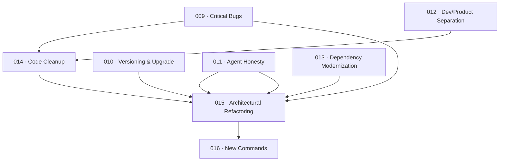

# 008 — Archon Improvement Master Plan

> **Status:** DEEPENING
> [← active/README.md](../README.md) | [← planning/README.md](../../README.md)

---

## Intent

Stabilize, clean up, and extend Archon CLI so it can operate as a reliable global product — fixing critical bugs, aligning documentation with real behavior, modernizing dependencies, and ultimately enabling new lifecycle orchestration commands.

---

## Source

Derived from: [`research/planes-de-mejora.md`](../../../research/planes-de-mejora.md)

---

## Individual Plans

| ID | Name | Depends On | State |
|----|------|------------|-------|
| [009](../../../planning/finished/009-archon-critical-bugs/00-initial.md) | Archon Critical Bugs | — | ✅ COMPLETED |
| [010](../../../planning/finished/010-archon-versioning-and-upgrade/00-initial.md) | Archon Versioning & Upgrade Fix | — | ✅ COMPLETED |
| [011](../../../planning/finished/011-archon-agent-support-honesty/00-initial.md) | Archon Agent Support Honesty | — | ✅ COMPLETED |
| [012](../../../planning/finished/012-archon-dev-product-separation/00-initial.md) | Archon Dev/Product Mode Separation | — | ✅ COMPLETED |
| [013](../../../planning/finished/013-archon-dependency-modernization/00-initial.md) | Archon Dependency Modernization | — | ✅ COMPLETED |
| [014](../../../planning/finished/014-archon-code-cleanup/00-initial.md) | Archon Code Cleanup | 009, 012 | ✅ COMPLETED |
| [015](../../finished/015-archon-architectural-refactoring/README.md) | Archon Architectural Refactoring | 009–014 | ✅ COMPLETED |
| [016](../finished/016-archon-new-commands/README.md) | Archon New Commands | 015 | ✅ COMPLETED |

---

## Dependency Map

---

> [← active/README.md](../README.md) | [← planning/README.md](../../README.md)
