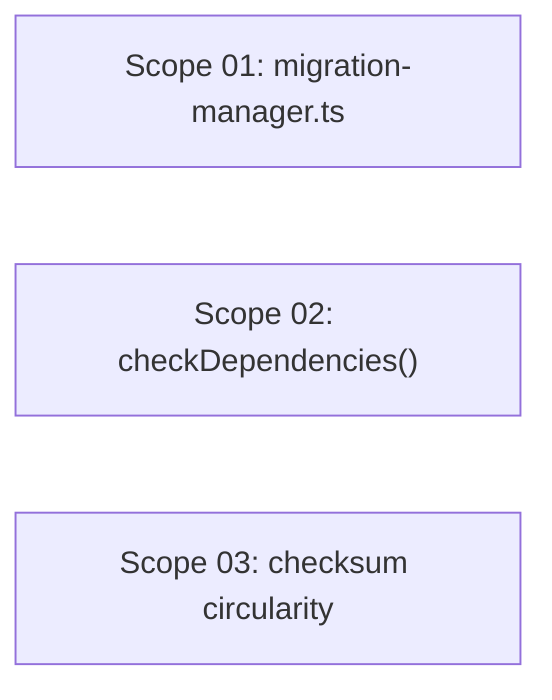

# 🚀 EXPANSION: Archon Critical Bugs

> **Status:** Deepening
> [← planning/README.md](../../README.md)

---

## Scope Summary

| # | Scope | SDLC Phase(s) | Depends On | Status |
|---|-------|--------------|------------|--------|
| 01 | Fix `migration-manager.ts` parameter naming + RegExp | V | — | IN PROGRESS |
| 02 | Fix `Validator.checkDependencies()` path logic | V | — | IN PROGRESS |
| 03 | Fix `StateManager` checksum circularity | V | — | IN PROGRESS |

---

## Dependency Map

All three scopes are independent. They can be executed in any order or in parallel.

---

## Impact per SDLC Phase

| Phase Code | Affected? | What changes |
|-----------|----------|-------------|
| D | ☐ | — |
| R | ☐ | — |
| S | ☐ | — |
| M | ☐ | — |
| P | ☐ | — |
| V | ☑ | `src/migration-manager.ts`, `src/validator.ts`, `src/state-manager.ts`, `src/types.ts` |
| T | ☑ | Build must pass under strict TypeScript after fixes |
| B | ☐ | — |
| O | ☐ | — |
| N | ☐ | — |
| F | ☐ | — |
| G | ☐ | — |
| W | ☑ | Planning 009 promoted, deepening files created |

---

## Notes

- All three are compilation/runtime bugs in core infrastructure files.
- Scope 03 (checksum fix) removes `checksum` from `ArchonState` — any type references must be cleaned up in the same scope.
- After all three are done: `npm run typecheck && npm run build` must exit 0 as the final gate.

---

> [← planning/README.md](../../README.md)
