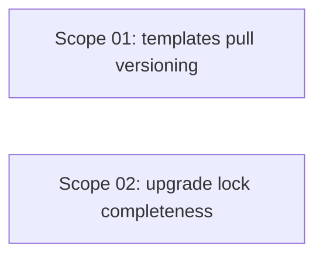

# 🚀 EXPANSION: Archon Versioning & Upgrade Fix

> **Status:** Deepening
> [← planning/README.md](../../README.md)

---

## Scope Summary

| # | Scope | SDLC Phase(s) | Depends On | Status |
|---|-------|--------------|------------|--------|
| 01 | Fix `templates pull` to parse `id@version` and checkout tag | V | — | IN PROGRESS |
| 02 | Fix `upgrade` to write full `TemplateLock` | V | — | IN PROGRESS |

---

## Dependency Map

Both scopes are independent. They can be executed in any order.

---

## Impact per SDLC Phase

| Phase Code | Affected? | What changes |
|-----------|----------|-------------|
| V | ☑ | `src/` templates command, global-cache, migration-manager, types |
| T | ☑ | Build must pass; version resolution must be verifiable |
| G | ☐ | — |
| W | ☑ | Planning 010 promoted, deepening files created |

---

## Notes

- Scope 01 and Scope 02 both touch `TemplateLock` — ensure the type definition (`types.ts`) makes all lock fields required after Scope 02.
- Scope 01 requires access to a real git tag to test tag-checkout logic; verify with a local fixture or mock if needed.

---

> [← planning/README.md](../../README.md)
