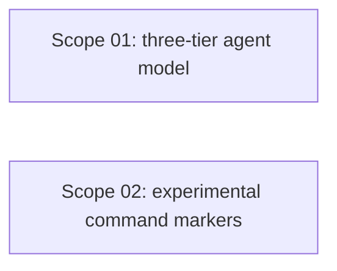

# 🚀 EXPANSION: Archon Agent Support Honesty

> **Status:** Deepening
> [← planning/README.md](../../README.md)

---

## Scope Summary

| # | Scope | SDLC Phase(s) | Depends On | Status |
|---|-------|--------------|------------|--------|
| 01 | Implement three-tier agent support model | V | — | IN PROGRESS |
| 02 | Mark experimental/unimplemented commands in help + README | V, G | — | IN PROGRESS |

---

## Dependency Map

Both scopes are independent. Scope 02 can proceed in parallel or after Scope 01.

---

## Impact per SDLC Phase

| Phase Code | Affected? | What changes |
|-----------|----------|-------------|
| V | ☑ | `AgentAdapterFactory`, agent command, run command, templates/check commands |
| G | ☑ | `packages/archon-cli/README.md` updated to reflect tiers and experimental markers |
| W | ☑ | Planning 011 promoted, deepening files created |

---

> [← planning/README.md](../../README.md)
