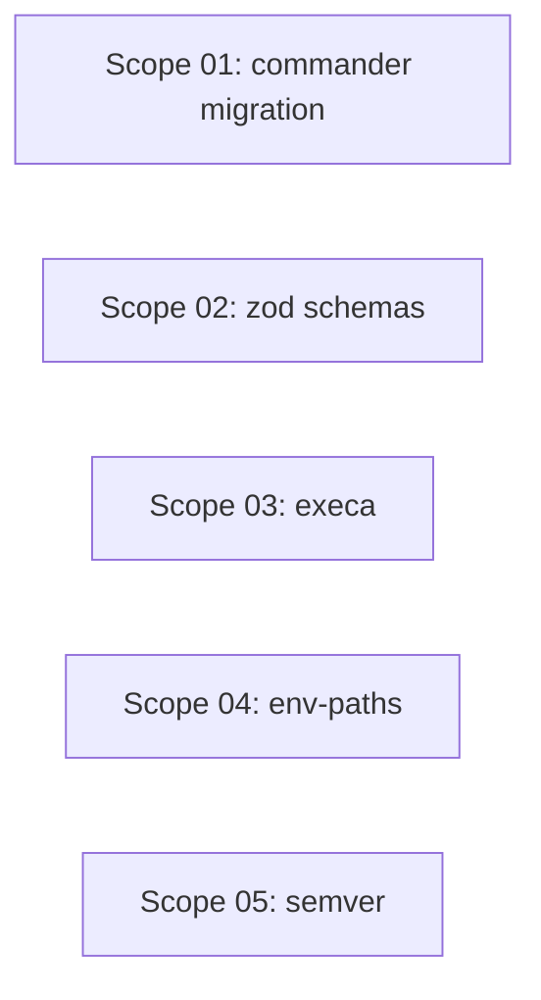

# 🚀 EXPANSION: Archon Dependency Modernization

> **Status:** Deepening
> [← planning/README.md](../../README.md)

---

## Scope Summary

| # | Scope | SDLC Phase(s) | Depends On | Status |
|---|-------|--------------|------------|--------|
| 01 | Migrate all flag parsing to `commander` | V | — | IN PROGRESS |
| 02 | Add `zod` schema validation for state/config/lock/registry | V | — | IN PROGRESS |
| 03 | Replace shell string interpolations with `execa` | V | — | IN PROGRESS |
| 04 | Replace hardcoded `~/.archon` with `env-paths` | V | — | IN PROGRESS |
| 05 | Replace manual `split('.')` version compare with `semver` | V | — | IN PROGRESS |

---

## Dependency Map

All five scopes are independent. They touch different files and libraries.

---

## Impact per SDLC Phase

| Phase Code | Affected? | What changes |
|-----------|----------|-------------|
| V | ☑ | `src/archon.ts`/`bin.ts`, all command files, `global-cache.ts`, `state-manager.ts`, subprocess calls |
| T | ☑ | Build must pass; `package.json` updated with new deps |
| W | ☑ | Planning 013 promoted, deepening files created |

---

## Notes

- Scope 01 (commander) and Scope 02 (zod) are the highest-impact changes — do them first if not doing all in parallel.
- Scope 02 depends on Scope 01 from 009 being done (checksum removed from `ArchonState`) to avoid writing a schema that includes the removed field.
- Add new dependencies to `package.json` as part of each scope that introduces them.

---

> [← planning/README.md](../../README.md)
