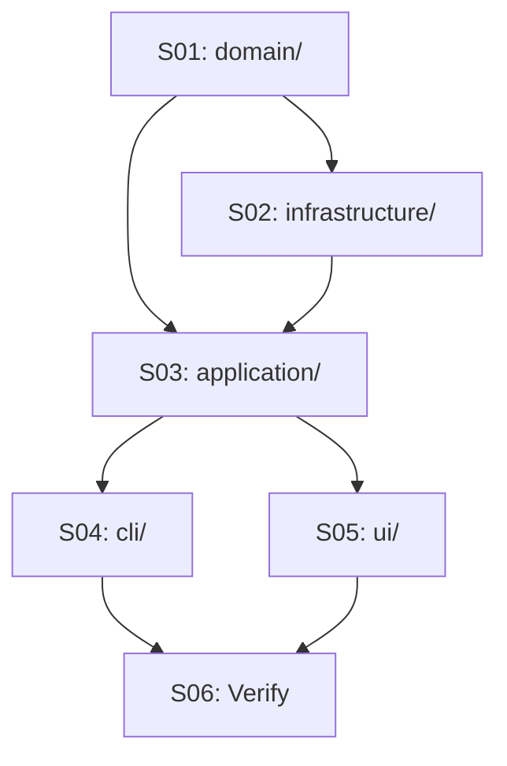

# 🚀 EXPANSION: Archon Architectural Refactoring

> **Status:** Deepening
> [← planning/README.md](../../README.md)

---

## Scope Summary

| # | Scope | SDLC Phase(s) | Depends On | Status |
|---|-------|--------------|------------|--------|
| 01 | Extract `domain/` layer — phase, template, project-state, validation types | V | — | PENDING |
| 02 | Extract `infrastructure/` layer — state, cache, git, agents, registry | V | S01 | PENDING |
| 03 | Create `application/` use cases — one per command | V | S01, S02 | PENDING |
| 04 | Refactor `cli/` layer — thin commands delegating to use cases | V | S03 | PENDING |
| 05 | Organize `ui/` layer — renderers and prompts in subdirs | V | S03 | PENDING |
| 06 | Verify: typecheck + build pass; archive 015 | V, W | S04, S05 | PENDING |

---

## Dependency Map

---

## Layer Mapping (current → target)

### domain/
| Target | Current source |
|--------|---------------|
| `domain/phase/phase-engine.ts` | `core/phase-engine.ts` |
| `domain/phase/phase.types.ts` | phase types from `core/types.ts` |
| `domain/template/template-lock.types.ts` | TemplateLock from `core/types.ts` |
| `domain/project-state/archon-state.types.ts` | ArchonState from `core/types.ts` |
| `domain/validation/validation-result.types.ts` | validation types from `core/types.ts` |

### infrastructure/
| Target | Current source |
|--------|---------------|
| `infrastructure/state/state-manager.ts` | `core/state-manager.ts` |
| `infrastructure/cache/global-cache.ts` | `core/global-cache/global-cache.ts` |
| `infrastructure/cache/template-resolver.ts` | `core/global-cache/template-resolver.ts` |
| `infrastructure/template-registry/migration-manager.ts` | `core/migration-manager.ts` |
| `infrastructure/agents/opencode.adapter.ts` | `core/agent-adapter.ts` (opencode portion) |
| `infrastructure/agents/claude.adapter.ts` | `core/agent-adapter.ts` (claude portion) |
| `infrastructure/fs/run-tracker.ts` | `core/run-tracker.ts` |
| `infrastructure/fs/config-manager.ts` | `core/config-manager.ts` |
| `infrastructure/git/git.adapter.ts` | execa calls scattered in `commands/templates.ts` |

### application/
| Target | Extracted from |
|--------|---------------|
| `application/init-project.usecase.ts` | `commands/init.ts` |
| `application/generate-prompt.usecase.ts` | `commands/run.ts` + `core/ai-prompt-builder.ts` + `core/context-scanner.ts` |
| `application/run-agent.usecase.ts` | `commands/run.ts` |
| `application/check-phase.usecase.ts` | `commands/check.ts` + `core/validator.ts` |
| `application/next-phase.usecase.ts` | `commands/next.ts` |
| `application/upgrade-project.usecase.ts` | `commands/upgrade.ts` |

### cli/
| Target | Current source |
|--------|---------------|
| `cli/program.ts` | `bin/archon.ts` (commander root) |
| `cli/commands/init.command.ts` | `commands/init.ts` (thin wrapper only) |
| `cli/commands/run.command.ts` | `commands/run.ts` (thin wrapper only) |
| `cli/commands/check.command.ts` | `commands/check.ts` |
| `cli/commands/next.command.ts` | `commands/next.ts` |
| `cli/commands/upgrade.command.ts` | `commands/upgrade.ts` |
| *(remaining commands moved as-is)* | `commands/*.ts` |

### ui/
| Target | Current source |
|--------|---------------|
| `ui/renderers/render-status.ts` | `ui/render-status.ts` |
| `ui/renderers/render-warnings.ts` | `ui/render-warnings.ts` |
| `ui/prompts/` | interactive prompt code extracted from commands |

---

## Impact per SDLC Phase

| Phase Code | Affected? | What changes |
|-----------|----------|-------------|
| D | ☐ | — |
| R | ☐ | — |
| S | ☐ | — |
| M | ☐ | — |
| P | ☐ | — |
| V | ☑ | Full `src/` restructure — all files move and imports update |
| T | ☑ | Use cases in `application/` must be independently testable |
| B | ☐ | — |
| O | ☐ | — |
| N | ☐ | — |
| F | ☐ | — |
| G | ☑ | README updated to reflect new structure |
| W | ☑ | Planning 015 promoted, deepening files created |

---

## Notes

- Scopes 01–02 are largely moves/renames with import path updates — low risk.
- Scope 03 is the highest-risk scope: extracting business logic from commands requires careful reading of each command to avoid regressions.
- Scope 04 must be done after 03 — commands can only be thinned once use cases exist.
- Build verification must be run after each scope to catch broken imports early.

---

> [← planning/README.md](../../README.md)
