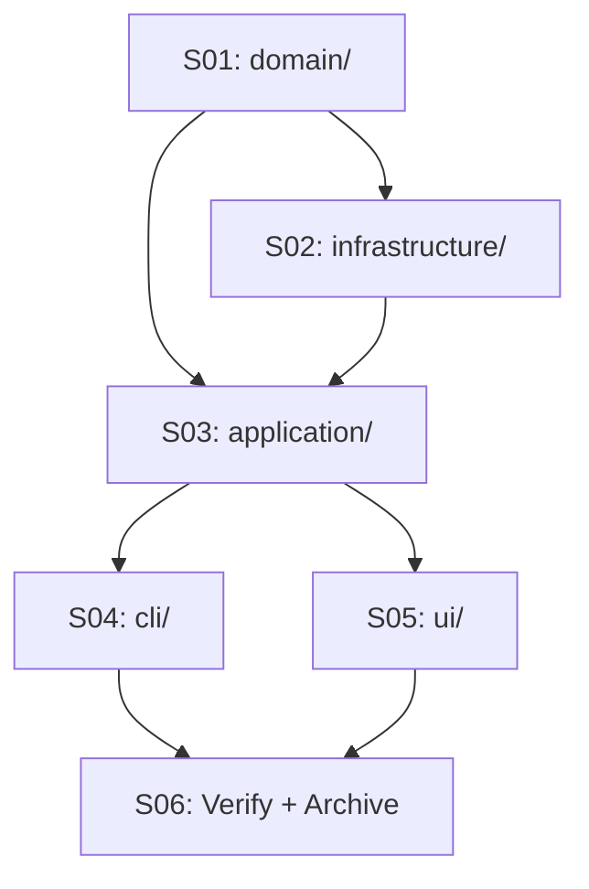

# 015 — Archon Architectural Refactoring

> **Status:** COMPLETED — 2026-05-14
> [← finished/README.md](../README.md) | [← planning/README.md](../../README.md)

---

## Intent

Restructure `packages/archon-cli/src/` to a DDD/hexagonal layout where commands contain zero business logic — they only parse input and delegate to use cases.

---

## Source

Derived from: [`008 — Archon Improvement Master Plan`](../../active/008-archon-improvement-master/README.md)

---

## Scopes

| # | Scope | Depends On | State |
|---|-------|------------|-------|
| 01 | [Extract `domain/` layer](02-deepening/scope-01-domain-layer.md) | — | ✅ DONE |
| 02 | [Extract `infrastructure/` layer](02-deepening/scope-02-infrastructure-layer.md) | S01 | ✅ DONE |
| 03 | [Create `application/` use cases](02-deepening/scope-03-application-layer.md) | S01, S02 | ✅ DONE |
| 04 | [Refactor `cli/` layer](02-deepening/scope-04-cli-layer.md) | S03 | ✅ DONE |
| 05 | [Organize `ui/` layer](02-deepening/scope-05-ui-layer.md) | S03 | ✅ DONE |
| 06 | [Verify build + archive](02-deepening/scope-06-verify-and-archive.md) | S04, S05 | ✅ DONE |

---

## Dependency Map

---

> [← active/README.md](../README.md) | [← planning/README.md](../../README.md)
