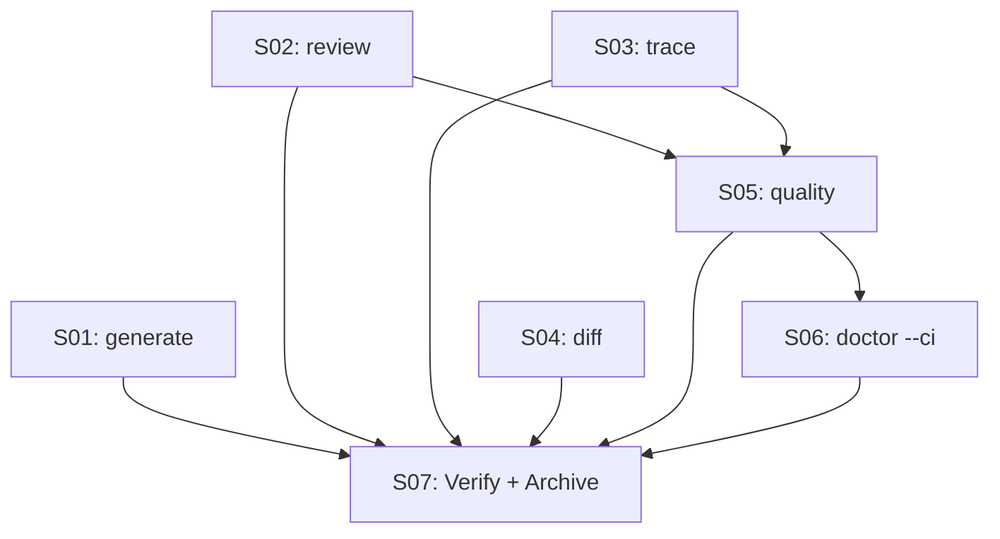

# 016 — Archon New Commands

> **Status:** DEEPENING
> [← active/README.md](../README.md) | [← planning/README.md](../../README.md)

---

## Intent

Extend Archon CLI with six high-value commands that automate quality assessment, traceability, diff analysis, and CI-friendly diagnostics. Each command follows the DDD/hexagonal pattern from planning 015.

---

## Source

Derived from: [`008 — Archon Improvement Master Plan`](../008-archon-improvement-master/README.md)

---

## Scopes

| # | Scope | Depends On | State |
|---|-------|------------|-------|
| 01 | [`archon generate`](02-deepening/scope-01-generate-command.md) | — | PENDING |
| 02 | [`archon review`](02-deepening/scope-02-review-command.md) | — | PENDING |
| 03 | [`archon trace`](02-deepening/scope-03-trace-command.md) | — | PENDING |
| 04 | [`archon diff`](02-deepening/scope-04-diff-command.md) | — | PENDING |
| 05 | [`archon quality`](02-deepening/scope-05-quality-command.md) | S02, S03 | PENDING |
| 06 | [`archon doctor --ci`](02-deepening/scope-06-doctor-ci.md) | — | PENDING |
| 07 | [Verify + archive](02-deepening/scope-07-verify-and-archive.md) | S01–S06 | PENDING |

---

## Dependency Map

---

> [← active/README.md](../README.md) | [← planning/README.md](../../README.md)
