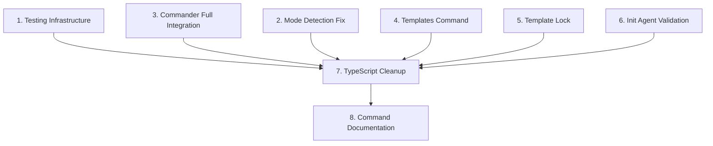

# 📐 EXPANSION: Archon-CLI Improvement Implementation

> **Status:** Expansion
> [← planning/README.md](../../README.md)
> [← 00-initial.md](./00-initial.md)

---

## Scope Overview

| # | Scope | Priority | Workflow Type |
|---|-------|----------|---------------|
| 1 | Testing Infrastructure Setup | CRÍTICA | INFRASTRUCTURE-SETUP |
| 2 | Mode Detection Fix | Alta | BUG-FIX |
| 3 | Commander Full Integration | Alta | REFACTORING |
| 4 | Templates Command Implementation | Media | FEATURE-IMPLEMENTATION |
| 5 | Template Lock Enhancement | Media | FEATURE-IMPLEMENTATION |
| 6 | Init Agent Validation | Media | FEATURE-IMPLEMENTATION |
| 7 | TypeScript Cleanup | Media | REFACTORING |
| 8 | Command Stability Documentation | Baja | DOCUMENTATION |

---

## Scope Dependencies



**Critical Path:** Scope 1 (Testing) → Scope 7 (TypeScript) → Scope 8 (Documentation)

---

## Scope Details

### Scope 1: Testing Infrastructure Setup

**Priority:** CRÍTICA  
**Workflow:** INFRASTRUCTURE-SETUP  
**Description:** Agregar Vitest y configurar tests reales para los módulos principales.

**Affected Files:**
- `packages/archon-cli/package.json`
- `packages/archon-cli/vitest.config.ts` (new)
- `packages/archon-cli/tests/` (new directory)

**Deliverables:**
- [ ] Tests para StateManager
- [ ] Tests para TemplateResolver
- [ ] Tests para TemplatesCommand
- [ ] Tests para Validator
- [ ] Tests para GeneratePhaseUseCase
- [ ] Tests para RunAgentUseCase

---

### Scope 2: Mode Detection Fix

**Priority:** Alta  
**Workflow:** BUG-FIX  
**Description:** Corregir detectMode para que detecte proyecto primero y use ARCHON_DEV_TEMPLATE_PATH como override, no como modo excluyente.

**Affected Files:**
- `packages/archon-cli/src/core/mode-detector.ts`

**Current Problem:**
```
ARCHON_DEV_TEMPLATE_PATH=../template archon status
```
Retorna `mode: 'dev'` antes de verificar si está dentro de un proyecto Archon.

**Correct Logic Order:**
1. Si existe `.archon/state.json` → `project`
2. Si comando es `templates` → `template-cache`
3. Si existe `ARCHON_DEV_TEMPLATE_PATH` fuera de proyecto → `dev/user` con template override
4. Si no hay nada → `user`

---

### Scope 3: Commander Full Integration

**Priority:** Alta  
**Workflow:** REFACTORING  
**Description:** Completar la implementación de Commander para que sea el parser único, eliminando parseOpts() y getArg().

**Affected Files:**
- `packages/archon-cli/src/application/program.ts`
- `packages/archon-cli/src/application/commands/*.ts`

**Current State:**
- Commander usado pero con `.allowUnknownOption()` y `.passThroughOptions()`
- Tres fuentes de verdad: Commander + parseOpts() + getArg()

**Target State:**
```typescript
program
  .command('init')
  .option('--name <name>')
  .option('--agent <agent>')
  .action(async (opts) => {
    await new InitCommand().run(opts);
  });
```

**Dependencies:** Scope 1 (tests para validar cambios)

---

### Scope 4: Templates Command Implementation

**Priority:** Media  
**Workflow:** FEATURE-IMPLEMENTATION  
**Description:** Implementar o esconder los comandos `templates remove` y `templates update`.

**Affected Files:**
- `packages/archon-cli/src/application/commands/templates-command.ts`

**Options:**
- **Remove:** Implementar eliminación real del cache o esconder del listing
- **Update:** Renombrar a `status` o implementar consulta de tags remotos

---

### Scope 5: Template Lock Enhancement

**Priority:** Media  
**Workflow:** FEATURE-IMPLEMENTATION  
**Description:** Mejorar createTemplateLock() para que use source real del registry, ref completa (v<version>), y commit SHA.

**Affected Files:**
- `packages/archon-cli/src/domain/template/lock-manager.ts`

**Current Problem:**
```javascript
source: 'ddd-hexagonal-ai-template'
ref: 'v' + version
```

**Target:** Leer registry y dejar lock inicial completo.

---

### Scope 6: Init Agent Validation

**Priority:** Media  
**Workflow:** FEATURE-IMPLEMENTATION  
**Description:** Validar en InitCommand que el agente seleccionado sea ejecutable (supported o prompt-only), no planned.

**Affected Files:**
- `packages/archon-cli/src/application/commands/init-command.ts`
- `packages/archon-cli/src/domain/agents/types.ts`

**UX Requirement:**
```
✅ opencode — supported
✅ claude — supported
📝 manual — prompt-only
⏳ cursor — planned, not executable yet
⏳ gemini — planned, not executable yet
```

---

### Scope 7: TypeScript Cleanup

**Priority:** Media  
**Workflow:** REFACTORING  
**Description:** Ejecutar npm run typecheck y corregir todos los errores de TypeScript.

**Affected Files:**
- `packages/archon-cli/src/**/*.ts`

**Command:** `npm run typecheck`

---

### Scope 8: Command Stability Documentation

**Priority:** Baja  
**Workflow:** DOCUMENTATION  
**Description:** Documentar qué comandos son stable, experimental y planned.

**Affected Files:**
- `packages/archon-cli/README.md`
- `packages/archon-cli/docs/commands/` (existing)

**Categories:**
- **Stable:** init, status, check, next, run, generate
- **Experimental:** review, trace, diff, quality
- **Planned:** templates remove, templates update

---

## SDLC Phase Impact

| Phase | Impact | Notes |
|-------|--------|-------|
| G (Guides) | Low | May update SKILLS-AND-PLUGINS-GUIDE.md |
| V (Development) | High | Core improvements to archon-cli |
| T (Testing) | High | New test infrastructure |

---

## Next Step

- [ ] When dimensioned → create `02-deepening/` with scope-NN-name.md files
- [ ] Move to `planning/active/019-archon-cli-improvement/`

---

> [← planning/README.md](../../README.md)
> [← 00-initial.md](./00-initial.md)