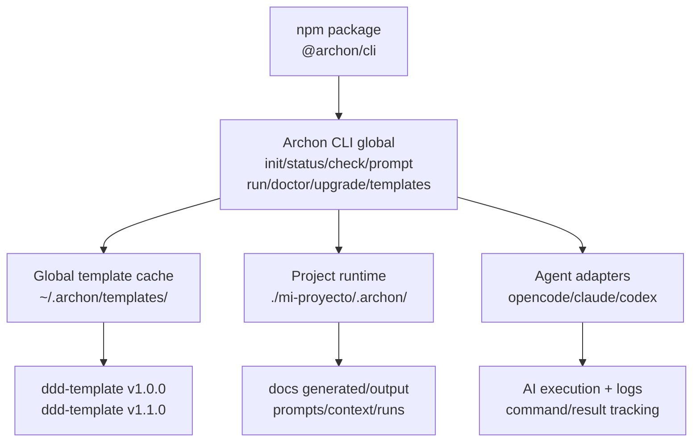

# Análisis actualizado — Archon CLI v1.0.0 con instalación global y template desacoplado del repo

## Contexto actualizado

Este análisis corrige la lectura anterior bajo una nueva premisa clave:

> Archon no debe diseñarse como una herramienta que el usuario ejecuta desde el repositorio `ddd-hexagonal-ai-template`.  
> Archon debe ser una CLI instalable globalmente, orientada a uso real, donde el usuario no necesita clonar el repo del template.

La nueva intención es más clara:

```bash
npm install -g @archon/cli
# o el nombre final equivalente

archon init --name "Mi Proyecto"
```

Resultado esperado:

```txt
./mi-proyecto/
  .archon/
    state.json
    config.json
    template.lock.json
    prompts/
    context/
    runs/
    logs/

  docs/ o 01-templates/outputs/
    ... documentación generada/gestionada del proyecto ...
```

Y el template base `ddd-hexagonal-ai-template` no debería depender de una copia local del repo del desarrollador. Debe resolverse desde una fuente instalada, cacheada o descargada por la CLI.

---

# Veredicto actualizado

Con la nueva aclaración, mi conclusión cambia bastante.

La propuesta ya no debe verse como:

```txt
Un CLI interno para operar el repo del template.
```

Debe verse como:

```txt
Un producto CLI global que usa el template como motor documental/arquitectónico versionado.
```

Eso implica que varias partes de la planificación actual siguen siendo válidas, pero deben ajustarse en su supuesto base:

| Aspecto | Antes en la spec | Recomendación actual |
|---|---|---|
| Punto de ejecución | Desde el repo del template | Desde cualquier directorio del usuario |
| Proyecto nuevo | Carpeta hermana del repo | Carpeta hija del directorio actual |
| Template source | Copia local del repo | Template cache global/versionado |
| Mode detection | Template vs project desde carpetas del repo | User mode / project mode / dev mode |
| `.template/` | Copia dentro del proyecto o carpeta hermana | Cache global por defecto; snapshot local opcional |
| CLI code location | Dentro de `00-guides-and-instructions/archon/` | Paquete CLI real, idealmente separado de docs |
| Usuario final | Tiene el repo | No tiene ni necesita el repo |
| Desarrollador de Archon | Trabaja con repo local | Usa modo dev/link-template |

---

# Lo bueno

## 1. La necesidad de v1.0.0 está justificada

Ahora tiene mucho más sentido que no sea un MVP pequeño.

Si el modelo del template ya maduró, el problema no es probar si la idea funciona. El problema real es operativo:

```txt
El humano no puede seguir manualmente el ritmo, reglas, fases, trazabilidad y prompts que el template exige.
```

Entonces Archon v1.0.0 debe cubrir un flujo real:

```bash
archon init --name "Mi Proyecto"
cd mi-proyecto
archon status
archon guide
archon prompt --phase 0
archon run --agent opencode --phase 0
archon check
archon next
```

Bajo esta premisa, sí se justifica que v1 incluya:

```txt
state management
phase engine
core commands
AI integration
doctor
prompt/run tracking
upgrade/migration inicial
documentación seria
```

La ambición deja de ser “scope creep” y pasa a ser “producto operacional”.

---

## 2. La instalación global es el enfoque correcto

Una CLI real no debe exigir:

```txt
git clone ddd-hexagonal-ai-template
cd ddd-hexagonal-ai-template
node ./00-guides-and-instructions/archon/bin/archon.ts
```

Debe funcionar como producto:

```bash
npm install -g @archon/cli
archon init --name "Mi Proyecto"
```

Esto mejora:

```txt
UX
distribución
actualización
uso docente/profesional
automatización
adopción por terceros
```

También te separa mentalmente en dos roles:

```txt
User de Archon:
  instala CLI, crea proyectos, genera documentación, usa agentes.

Developer de Archon:
  mantiene CLI, mantiene template, publica releases.
```

Esa separación es clave.

---

## 3. El template global/cacheado es mejor que copiar desde el repo local

La idea de tener el template disponible globalmente con Archon es correcta.

Pero conviene pensar en él como un cache versionado, no como una carpeta mágica única.

Recomendación:

```txt
~/.archon/
  templates/
    ddd-hexagonal-ai-template/
      1.0.0/
      1.1.0/
      latest/
  registry.json
  cache/
  logs/
```

En Windows, Linux y macOS sería mejor usar una librería tipo `env-paths` para respetar carpetas estándar del sistema operativo, pero conceptualmente puede documentarse como `~/.archon/`.

Ventajas:

```txt
no duplica template en cada proyecto
permite offline después del primer uso
permite versionar templates
permite proyectos bloqueados a una versión
permite upgrade controlado
```

---

## 4. `.archon/` por proyecto sigue siendo una excelente decisión

El estado del proyecto debe vivir dentro del proyecto, no en el template global.

Ejemplo recomendado:

```txt
mi-proyecto/
  .archon/
    state.json
    config.json
    template.lock.json

    context/
      project-context.md
      project-map.json

    prompts/
      phase-0-2026-05-12.md
      phase-1-2026-05-12.md
      metadata/

    runs/
      2026-05-12T15-40-00Z-opencode/
        run.json
        command.txt
        stdout.log
        stderr.log
        prompt.md
        context.md
        validation-report.md

    issues/
      latest-check.json
      latest-check.md
```

Esto conserva lo mejor de la propuesta original:

```txt
auditabilidad
reproducibilidad
trazabilidad
historial de ejecución
configuración por proyecto
```

---

## 5. El diseño agent-agnostic sigue siendo correcto

La nueva arquitectura no cambia esta decisión.

Archon debe seguir siendo:

```txt
orquestador arquitectónico
```

No:

```txt
wrapper de opencode
```

Modelo correcto:

```txt
Archon
  ├─ resuelve template
  ├─ crea proyecto
  ├─ mantiene estado
  ├─ genera contexto
  ├─ genera prompts
  ├─ ejecuta agentes vía adapters
  ├─ valida resultados
  └─ registra trazabilidad
```

Adaptadores:

```txt
opencode
claude
codex
manual
custom
```

---

# Lo malo

## 1. La spec actual de `init` debe reescribirse

La spec actual de `archon init` asume que se ejecuta desde el template y crea un proyecto en carpeta hermana.

Ese flujo ya no calza.

Debe cambiar desde:

```txt
Run from template directory.
Create sibling directory ../<projectName>/.
Copy template structure from local repo.
```

A:

```txt
Run from any directory.
Create ./<project-slug>/.
Resolve template from global cache or remote source.
Initialize .archon/.
Create initial project documentation workspace.
Store template lock.
```

Flujo recomendado:

```bash
archon init --name "Mi Proyecto" --agent opencode
```

Pasos internos:

```txt
1. Normalizar nombre visible:
   "Mi Proyecto"

2. Generar slug:
   "mi-proyecto"

3. Crear carpeta:
   ./mi-proyecto/

4. Resolver template:
   - buscar en cache global
   - si no existe, descargar desde GitHub/npm/template registry
   - validar versión y checksum

5. Crear runtime local:
   ./mi-proyecto/.archon/

6. Crear archivos base:
   .archon/state.json
   .archon/config.json
   .archon/template.lock.json

7. Crear workspace documental:
   docs/ o estructura de outputs elegida

8. Mostrar siguiente acción:
   cd mi-proyecto
   archon status
```

---

## 2. La detección de modo debe cambiar

La spec actual habla de condiciones como:

```txt
Running from 00-guides-and-instructions/archon/
../.archon/state.json exists
Running from template folder
```

Eso tiene sentido para desarrollo local, pero no para usuario final.

Nueva clasificación recomendada:

```txt
user mode:
  ejecución normal desde CLI global

project mode:
  se detecta .archon/state.json en cwd o en algún ancestor

dev mode:
  ejecución con ARCHON_DEV_TEMPLATE_PATH, --template-path o repo local vinculado

template cache mode:
  operaciones internas sobre el cache global de templates
```

Reglas recomendadas:

| Condición | Modo |
|---|---|
| `cwd` o ancestor contiene `.archon/state.json` | `project` |
| comando es `archon init` y no hay `.archon/` | `user` |
| existe `ARCHON_DEV_TEMPLATE_PATH` | `dev` |
| comando usa `--template-path <path>` | `dev` |
| comando opera sobre `archon templates ...` | `template-cache` |
| no hay proyecto y comando requiere proyecto | error guiado |

Ejemplo de error guiado:

```txt
No Archon project found.

Run one of:
  archon init --name "My Project"
  cd <existing-project>
```

---

## 3. `.template/` dentro del proyecto debe ser opcional, no default

Primero planteaste:

```txt
mi-proyecto/
  .template/
  .archon/
```

Luego ajustaste:

```txt
Pensándolo bien .template debería estar instalado de forma global con Archon.
```

La segunda opción es mejor como default.

Recomendación:

```txt
Global template cache:
  source of truth para templates descargados/versionados

Project .archon/template.lock.json:
  referencia exacta al template usado

Project .template/:
  opcional, solo para snapshot embebido o modo offline estricto
```

Comandos posibles:

```bash
archon init --name "Mi Proyecto"
# usa cache global

archon init --name "Mi Proyecto" --embed-template
# copia snapshot local en .template/

archon template embed
# agrega snapshot al proyecto existente

archon template detach
# remueve snapshot local y vuelve a cache global
```

Esto evita duplicar mucho contenido en todos los proyectos, pero permite reproducibilidad fuerte cuando sea necesario.

---

## 4. Falta una distinción fuerte entre template source y project outputs

Este es el punto conceptual más delicado.

Un template no debería confundirse con los documentos reales del proyecto.

Evitar esto:

```txt
mi-proyecto/
  01-templates/
    01-discovery/
      TEMPLATE-001-context.md  ← el usuario modifica esto directamente
```

Mejor separar:

```txt
Template source:
  ~/.archon/templates/ddd-hexagonal-ai-template/1.0.0/01-templates/

Project outputs:
  mi-proyecto/docs/
    01-discovery/
    02-requirements/
    03-design/
```

O, si quieres mantener la nomenclatura del template en el proyecto:

```txt
mi-proyecto/
  01-discovery/
  02-requirements/
  03-design/
```

Pero no mezclar `TEMPLATE-*` con outputs finales.

Recomendación concreta:

```txt
.template/ o global cache:
  contiene plantillas y guías base

docs/:
  contiene documentos reales del proyecto generados desde esas plantillas

.archon/:
  contiene estado, config, prompts, runs, logs, locks
```

---

## 5. El upgrade debe dividirse en dos conceptos

Con template global, `archon upgrade` ya no es una sola cosa.

Hay dos upgrades distintos:

## A. Actualizar templates disponibles globalmente

```bash
archon templates update
archon templates pull ddd-hexagonal-ai-template@1.1.0
archon templates ls
```

Esto afecta el cache global.

## B. Migrar un proyecto existente a otra versión del template

```bash
archon upgrade --target 1.1.0
archon upgrade --dry-run --target 1.1.0
```

Esto afecta el proyecto actual.

No deberían mezclarse.

Flujo correcto:

```bash
archon templates update
cd mi-proyecto
archon upgrade --dry-run --target 1.1.0
archon upgrade --target 1.1.0
```

El proyecto debe tener un lock:

```json
{
  "template": {
    "id": "ddd-hexagonal-ai-template",
    "version": "1.0.0",
    "source": "github:cmartinezs/ddd-hexagonal-ai-template",
    "ref": "v1.0.0",
    "commitSha": "abc123",
    "resolvedAt": "2026-05-12T15:30:00Z",
    "cachePath": "~/.archon/templates/ddd-hexagonal-ai-template/1.0.0"
  }
}
```

---

# Lo feo

## 1. La ubicación del código dentro del template queda más problemática

Antes era discutible. Con esta nueva arquitectura, ya es claramente incorrecto como producto final.

Si Archon se instala globalmente vía npm, el código del CLI no debería vivir como si fuera un documento dentro de:

```txt
00-guides-and-instructions/archon/
```

Ese lugar puede contener documentación de Archon, pero no debería ser el package principal.

Mejor:

```txt
packages/archon-cli/
  package.json
  src/
  bin/
  tests/

00-guides-and-instructions/archon/
  README.md
  quickstart.md
  agent-integration.md
  troubleshooting.md
```

O incluso repos separados:

```txt
archon-cli/
ddd-hexagonal-ai-template/
```

Si mantienes monorepo:

```txt
ddd-hexagonal-ai-template/
  packages/
    archon-cli/
  00-guides-and-instructions/
  01-templates/
  planning/
```

---

## 2. El comando de instalación debe ser válido para npm

La idea:

```bash
npm install -g anchon/cli
```

No es la forma estándar de publicar un paquete npm.

Opciones usuales:

```bash
npm install -g @archon/cli
```

o:

```bash
npm install -g archon-cli
```

Si fuera GitHub directo:

```bash
npm install -g github:cmartinezs/archon-cli
```

Para un producto comercial/OSS serio, recomiendo paquete npm:

```bash
npm install -g @archon/cli
```

Y comando:

```bash
archon
```

Tema pendiente: verificar disponibilidad real del nombre en npm/GitHub antes de comprometer branding.

---

## 3. Si el template vive globalmente, los proyectos pueden “derivar” sin control

Riesgo:

```txt
Proyecto creado con template 1.0.0
Luego Archon actualiza cache global a 1.1.0
El proyecto ejecuta archon prompt
¿Qué template usa?
```

Respuesta obligatoria:

```txt
Debe usar el templateVersion bloqueado en .archon/template.lock.json, no latest.
```

Para usar una versión nueva:

```bash
archon upgrade --target 1.1.0
```

Nunca usar `latest` silenciosamente dentro de un proyecto ya creado.

---

## 4. Descargar templates desde GitHub introduce riesgos de supply chain

Si Archon baja templates desde GitHub, debes resolver:

```txt
¿Desde qué repo?
¿Desde qué tag?
¿Desde qué commit?
¿Cómo validas integridad?
¿Qué pasa si cambia main?
¿Qué pasa si no hay internet?
¿Qué pasa si falla descarga?
¿Qué pasa si el template trae scripts maliciosos?
```

Reglas recomendadas:

```txt
- Nunca usar main como base de proyecto sin confirmación.
- Preferir tags versionados: v1.0.0, v1.1.0.
- Guardar commitSha resuelto.
- Guardar checksum/manifest del template.
- No ejecutar scripts del template automáticamente.
- Mostrar source/ref/version en archon status.
```

---

## 5. `rollback` se vuelve más complejo

Antes rollback podía entenderse como restaurar carpetas copiadas.

Con template global, rollback debe ser project-level, no global.

No debería hacer esto:

```txt
revertir el cache global completo
```

Debe hacer esto:

```txt
restaurar el proyecto a la versión de template anterior
restaurar state/config/output mappings
registrar migración inversa
mantener templates globales disponibles
```

Por eso `rollback` debe depender de:

```txt
.archon/migrations/
.archon/backups/
.archon/template.lock.json
.archon/migration-log.md
```

---

# Arquitectura recomendada

## Vista general



---

# Estructura global recomendada

Conceptual:

```txt
~/.archon/
  config.json
  registry.json

  templates/
    ddd-hexagonal-ai-template/
      1.0.0/
        manifest.json
        00-guides-and-instructions/
        01-templates/
        VERSION
        CHANGELOG.md
        UPGRADE/

      1.1.0/
        manifest.json
        ...

  cache/
    downloads/

  logs/
```

`registry.json` podría tener:

```json
{
  "templates": {
    "ddd-hexagonal-ai-template": {
      "defaultVersion": "1.0.0",
      "source": "github:cmartinezs/ddd-hexagonal-ai-template",
      "versions": {
        "1.0.0": {
          "ref": "v1.0.0",
          "commitSha": "abc123",
          "installedAt": "2026-05-12T15:30:00Z",
          "path": "~/.archon/templates/ddd-hexagonal-ai-template/1.0.0"
        }
      }
    }
  }
}
```

---

# Estructura por proyecto recomendada

```txt
mi-proyecto/
  .archon/
    state.json
    config.json
    template.lock.json

    context/
      project-context.md
      project-map.json
      snapshots/

    prompts/
      phase-0-2026-05-12.md
      metadata/

    runs/
      2026-05-12T15-40-00Z-opencode/
        run.json
        command.txt
        stdout.log
        stderr.log
        prompt.md
        context.md
        validation-report.md

    migrations/
      migration-log.md
      backups/

  docs/
    00-documentation-planning/
    01-discovery/
    02-requirements/
    03-design/
    04-data-model/
    05-planning/
    06-development/
    07-testing/
    08-deployment/
    09-operations/
    10-monitoring/
    11-feedback/

  README.md
```

Alternativa si quieres mantener nombres tipo template:

```txt
mi-proyecto/
  00-documentation-planning/
  01-discovery/
  02-requirements/
  ...
  .archon/
```

Pero mi preferencia es `docs/` porque separa la documentación del eventual código fuente del proyecto.

---

# Nuevo flujo de `archon init`

## Comando

```bash
archon init --name "Mi Proyecto"
```

## Resultado

```txt
./mi-proyecto/
```

## Flujo interno recomendado

```txt
1. Validar que no exista ./mi-proyecto/
2. Resolver nombre visible: "Mi Proyecto"
3. Resolver slug: "mi-proyecto"
4. Resolver template:
   - default: ddd-hexagonal-ai-template
   - version: latest estable o versión configurada
5. Verificar cache global:
   - si existe: usar
   - si no existe: descargar
6. Crear proyecto:
   - ./mi-proyecto/
   - ./mi-proyecto/.archon/
   - ./mi-proyecto/docs/
7. Escribir:
   - .archon/state.json
   - .archon/config.json
   - .archon/template.lock.json
8. Generar README inicial del proyecto
9. Ejecutar doctor básico
10. Mostrar siguiente acción
```

## Output recomendado

```txt
✅ Archon project created

Project:
  Name: Mi Proyecto
  Path: ./mi-proyecto

Template:
  ddd-hexagonal-ai-template
  Version: 1.0.0
  Source: github:cmartinezs/ddd-hexagonal-ai-template
  Cache: ~/.archon/templates/ddd-hexagonal-ai-template/1.0.0

Next:
  cd mi-proyecto
  archon status
  archon guide
  archon prompt --phase 0
```

---

# Nuevos comandos recomendados

## Project commands

```bash
archon init --name "Mi Proyecto"
archon status
archon guide
archon check
archon next
archon doctor
```

## AI commands

```bash
archon context scan
archon prompt --phase 0 --context full
archon run --agent opencode --phase 0
archon run --agent opencode --phase 0 --dry-run
archon agent doctor opencode
```

## Template cache commands

```bash
archon templates ls
archon templates pull ddd-hexagonal-ai-template@1.0.0
archon templates update
archon templates doctor
archon templates remove ddd-hexagonal-ai-template@1.0.0
```

## Upgrade commands

```bash
archon upgrade --dry-run --target 1.1.0
archon upgrade --target 1.1.0
archon upgrade --rollback 1.0.0
```

## Dev commands

```bash
archon dev link-template ../ddd-hexagonal-ai-template
archon dev unlink-template
archon dev status
```

O mediante variable:

```bash
ARCHON_DEV_TEMPLATE_PATH=../ddd-hexagonal-ai-template archon init --name "Test Project"
```

---

# Cambios concretos que haría en tus scopes

## Scope 01 — Scaffold

Cambiar objetivo desde:

```txt
Crear CLI dentro de 00-guides-and-instructions/archon/
```

A:

```txt
Crear paquete CLI distribuible globalmente.
```

Nueva salida:

```txt
packages/archon-cli/
  package.json
  tsconfig.json
  bin/archon.ts
  src/
  tests/
```

Mantener documentación en:

```txt
00-guides-and-instructions/archon/
```

---

## Scope 02 — State + Mode Detection

Cambiar mode detection a:

```txt
user
project
dev
template-cache
```

Agregar `template.lock.json`.

Nuevo state recomendado:

```ts
interface ArchonState {
  projectName: string;
  projectSlug: string;
  createdAt: string;
  archonVersion: string;

  mode: 'project';
  currentPhase: number;

  template: {
    id: string;
    version: string;
    source: string;
    ref: string;
    commitSha?: string;
    cachePath: string;
    embeddedSnapshot: boolean;
  };

  agent: 'opencode' | 'claude' | 'codex' | 'cursor' | 'manual';

  phases: Record<string, PhaseStatus>;
  warnings: Warning[];
}
```

Evitar guardar `checksum` dentro del mismo objeto si el checksum se calcula sobre el archivo completo. Mejor:

```txt
state.json
state.checksum
```

Y que `state.json` no contenga su propio checksum para evitar inconsistencias circulares.

---

## Scope 04 — Core Commands

Reescribir `archon init`.

Eliminar:

```txt
Run from template directory.
Create sibling directory.
Copy template from local repo.
Switch prompt.
```

Nuevo comportamiento:

```txt
Run from any directory.
Create child directory using slug.
Resolve template from global cache or remote.
Initialize .archon.
Create docs workspace.
Print cd command.
```

El switch prompt no debería intentar cambiar el directorio, porque un proceso hijo no puede cambiar el cwd del shell padre de forma persistente. Mejor imprimir:

```bash
cd mi-proyecto
```

---

## Scope 05 — AI Integration

Se mantiene casi igual.

Solo ajustaría paths:

```txt
template files:
  global cache

project context:
  ./mi-proyecto/.archon/context/

project outputs:
  ./mi-proyecto/docs/
```

Y agregaría al run metadata:

```json
{
  "template": {
    "id": "ddd-hexagonal-ai-template",
    "version": "1.0.0",
    "commitSha": "abc123"
  }
}
```

---

## Scope 08 — Upgrade

Separar en dos subdominios:

```txt
Template cache management:
  archon templates pull/update/ls/doctor

Project migration:
  archon upgrade/dry-run/rollback
```

`archon upgrade` no debería actualizar automáticamente el cache global sin declarar qué hace.

---

## Scope 09 — Polish

Actualizar documentación para usuario real:

```bash
npm install -g @archon/cli
archon init --name "Mi Proyecto"
cd mi-proyecto
archon status
```

Y agregar sección:

```txt
For Archon contributors
```

Con:

```bash
git clone ...
npm install
pnpm dev
archon dev link-template ...
```

---

# Propuesta de versión 1.0.0 realista

Dado que esta será v1.0.0 y no MVP, propongo organizarla en bloques de entrega internos.

## v1.0.0-alpha — CLI instalable y proyecto inicializable

```txt
- package CLI global
- archon init
- global template cache
- template.lock.json
- .archon/state.json
- .archon/config.json
- archon status
- archon doctor básico
```

## v1.0.0-beta — Flujo documental y fases

```txt
- phase engine
- archon guide
- archon check básico
- archon next
- validaciones estructurales
```

## v1.0.0-rc — AI operacional

```txt
- context scan
- prompt generation
- opencode adapter
- dry-run
- run tracking
- agent doctor
```

## v1.0.0 — Producto usable

```txt
- templates commands
- upgrade dry-run
- docs completas
- ejemplos
- tests e2e
- instalación npm
```

## v1.1.0

```txt
- rollback maduro
- prompts compress/rank/merge/expand
- más adapters
- validaciones semánticas avanzadas
```

Aunque llames al primer release estable v1.0.0, internamente te conviene trabajar con `alpha/beta/rc`.

---

# Decisión recomendada sobre `.template/`

Mi recomendación final:

## Default

No crear `.template/` dentro del proyecto.

Usar:

```txt
Global template cache
+
.archon/template.lock.json
```

## Opción avanzada

Permitir:

```bash
archon init --name "Mi Proyecto" --embed-template
```

Eso sí crea:

```txt
mi-proyecto/
  .template/
```

Uso recomendado de `.template/`:

```txt
- proyectos que deben ser 100% reproducibles sin cache global
- entornos sin internet
- demos
- auditoría
- congelar template exacto junto al proyecto
```

Pero no lo usaría como default.

---

# Decisión recomendada sobre outputs

No recomiendo que el usuario edite directamente plantillas.

Recomiendo:

```txt
Template:
  ~/.archon/templates/...

Outputs:
  mi-proyecto/docs/...
```

Archon debe generar documentos desde templates hacia `docs/`.

Ejemplo:

```bash
archon generate phase 1
```

o implícitamente:

```bash
archon prompt --phase 1
archon run --agent opencode --phase 1
```

Resultado:

```txt
docs/01-discovery/context-motivation.md
docs/01-discovery/system-vision.md
docs/01-discovery/actors.md
```

---

# Conclusión

Con la nueva aclaración, Archon queda mucho más interesante como producto.

La arquitectura correcta ya no es:

```txt
CLI dentro del template que copia carpetas vecinas.
```

La arquitectura correcta es:

```txt
CLI global instalable que administra proyectos Archon, usa un template cacheado/versionado, genera outputs documentales, orquesta agentes AI y mantiene trazabilidad por proyecto.
```

La planificación actual es buena, pero necesita una reorientación importante:

```txt
1. Cambiar init para crear proyecto en cwd.
2. Sacar la dependencia de ejecutar desde el repo del template.
3. Introducir global template cache.
4. Agregar template.lock.json por proyecto.
5. Separar template source de project outputs.
6. Separar template cache update de project upgrade.
7. Mover el código CLI fuera de 00-guides-and-instructions.
8. Normalizar naming: Archon/archon/.archon.
```

La idea tiene más fuerza ahora, no menos.

Archon puede venderse como:

```txt
AI-native architecture orchestration CLI
for disciplined DDD + Hexagonal project documentation and execution.
```

O más directo:

```txt
Archon turns an architectural template into an executable development workflow.
```
