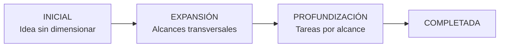
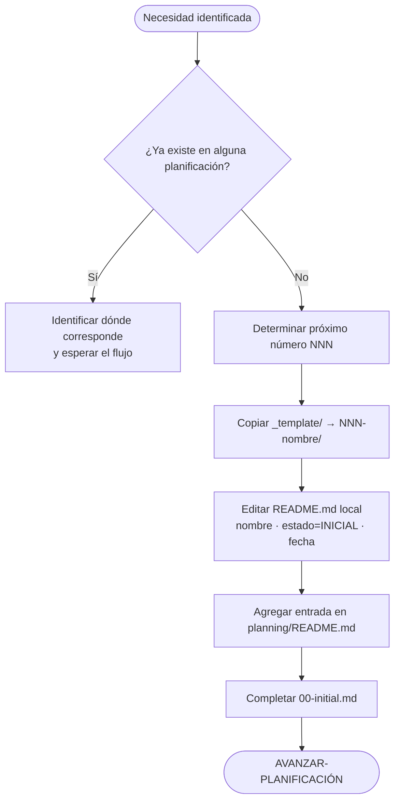
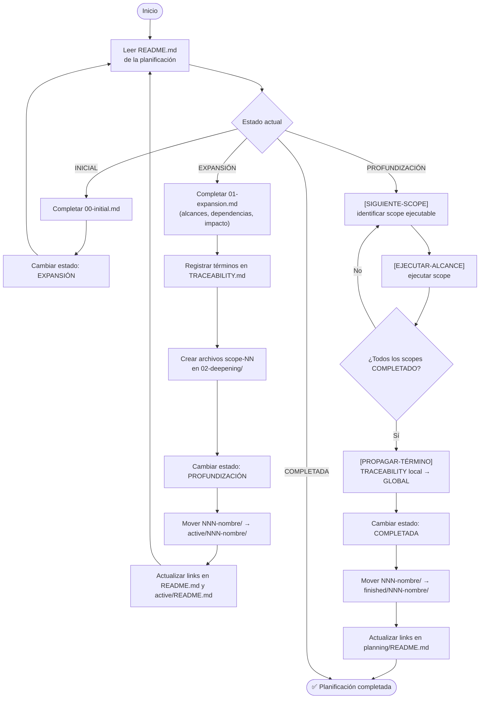
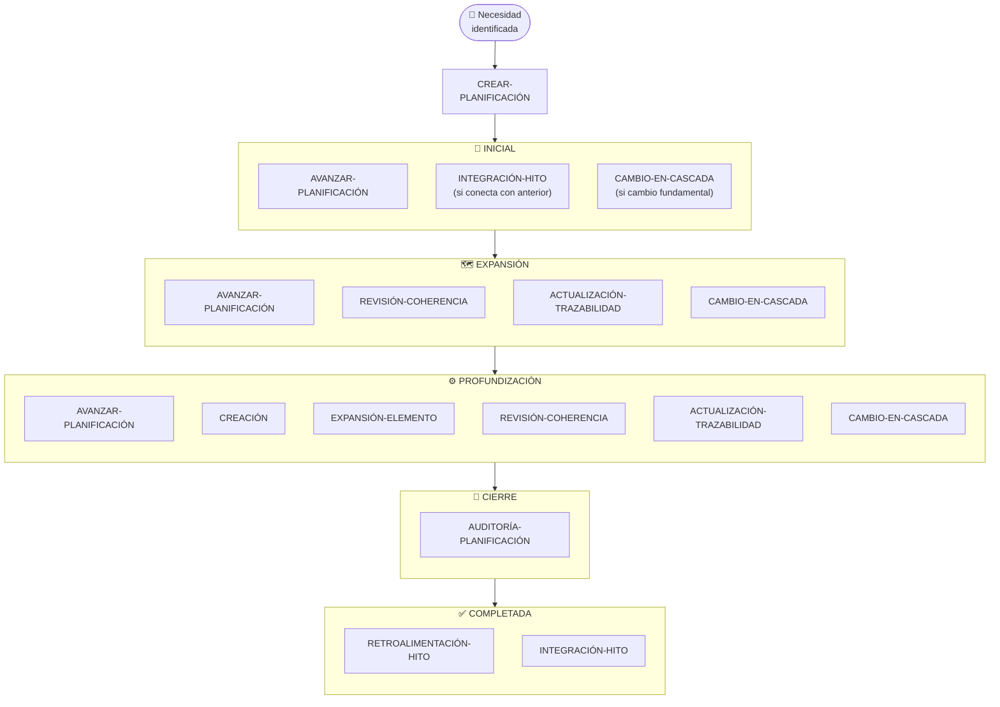
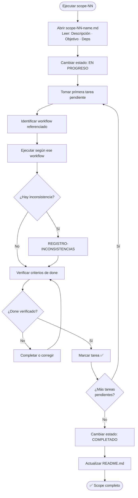
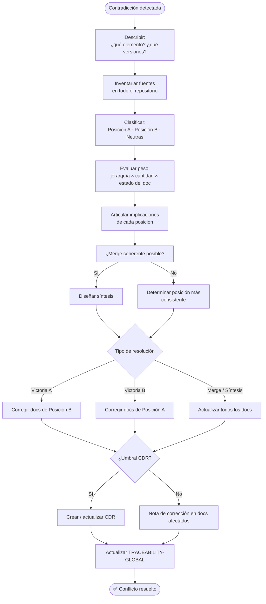

# Planning Workflow System — Extracción de Buenas Prácticas

> **Fuente de análisis:** `manga-ai-research/planning/`  
> **Propósito:** Documentar en profundidad el mecanismo de planificación progresiva con IA para su adaptación independiente en cualquier repositorio documental o de desarrollo.

---

## Contenido

1. [Principio Fundamental](#1-principio-fundamental)
2. [Ciclo de Vida de una Planificación](#2-ciclo-de-vida-de-una-planificación)
3. [Estructura de Carpetas](#3-estructura-de-carpetas)
4. [Templates por Fase](#4-templates-por-fase)
5. [Catálogo de Workflows](#5-catálogo-de-workflows)
6. [Sub-workflows Reutilizables](#6-sub-workflows-reutilizables)
7. [Sistema de Trazabilidad](#7-sistema-de-trazabilidad)
8. [Gestión de Inconsistencias y Conflictos](#8-gestión-de-inconsistencias-y-conflictos)
9. [Registro de Decisiones (CDR)](#9-registro-de-decisiones-cdr)
10. [Criterios de Done](#10-criterios-de-done)
11. [Estado de Documentos](#11-estado-de-documentos)
12. [Nomenclatura y Convenciones](#12-nomenclatura-y-convenciones)
13. [Mecanismo de Bypass](#13-mecanismo-de-bypass)
14. [Auditoría de Planificación](#14-auditoría-de-planificación)
15. [Guidelines de Prompting para IA](#15-guidelines-de-prompting-para-ia)
16. [Glosario Operacional](#16-glosario-operacional)
17. [Diagramas de Referencia](#17-diagramas-de-referencia)
18. [Buenas Prácticas Destiladas](#18-buenas-prácticas-destiladas)

---

## 1. Principio Fundamental

> **Nada se ejecuta sin estar dentro de una planificación.**

Esta es la regla más importante del sistema. Antes de realizar cualquier acción — crear un archivo, modificar contenido, agregar una función, generar un artefacto — debe existir una tarea dentro de un alcance de una planificación activa que la contemple.

Si se solicita algo que no está en ninguna planificación (y no se usa el mecanismo de bypass):

1. Detener la ejecución.
2. Preguntar: ¿es parte de una planificación existente o es una planificación nueva?
3. Si es parte de una existente → identificar en qué alcance y tarea corresponde, y esperar a que el flujo llegue ahí.
4. Si es nueva → crear la planificación (al menos la fase Inicial) antes de ejecutar.

Este principio garantiza que todo trabajo sea **trazable, deliberado y con contexto documentado**.

---

## 2. Ciclo de Vida de una Planificación

Toda planificación pasa por tres fases activas y un estado final:



| Fase | Archivo(s) | Descripción |
|------|-----------|-------------|
| **INICIAL** | `00-initial.md` | Captura la idea en bruto. Qué se quiere lograr, por qué, contexto aproximado. No se espera exhaustividad — se espera claridad de intención. |
| **EXPANSIÓN** | `01-expansion.md` | Se identifican y listan todos los alcances transversales. Se mapean dependencias entre ellos e impacto por sección del proyecto. |
| **PROFUNDIZACIÓN** | `02-deepening/` | Un archivo `.md` por alcance. Cada uno detalla sus tareas específicas con workflows asignados. |
| **COMPLETADA** | — | Estado final. La planificación se archiva, se capturan lecciones aprendidas y sus entregables se integran al sistema. |

### Ciclo de movimiento de carpetas

| Transición de estado | Acción |
|----------------------|--------|
| Nueva planificación | Crear en raíz `planning/NNN-nombre/` |
| `INICIAL` → `EXPANSIÓN` | Mover `planning/NNN-nombre/` → `planning/active/NNN-nombre/` |
| `PROFUNDIZACIÓN` → `COMPLETADA` | Mover `planning/active/NNN-nombre/` → `planning/finished/NNN-nombre/` |

---

## 3. Estructura de Carpetas

```
planning/
├── README.md                        # Índice general + planificaciones en INICIAL
├── GUIDE.md                         # Guía detallada del sistema
├── GLOSSARY.md                      # Glosario de términos operacionales
├── PROMPTING.md                     # Guidelines de prompting por tipo de tarea
├── TRACEABILITY-GLOBAL.md           # Matriz global consolidada de términos
│
├── WORKFLOWS/                       # Catálogo completo de workflows
│   ├── README.md                    # Índice + tabla de "cuándo usar cada workflow"
│   ├── 01-PLANNING-WORKFLOWS/       # ADVANCE-PLANNING · CREATE-PLANNING
│   ├── 02-EXECUTION-WORKFLOWS/      # GENERATE-DOCUMENT · REVIEW-COHERENCE · EXPAND-ELEMENT · INTEGRATE-MILESTONE
│   ├── 03-MAINTENANCE-WORKFLOWS/    # UPDATE-TRACEABILITY · RESIDUAL-VERIFICATION · RECORD-INCONSISTENCY · CASCADE-CHANGE · MILESTONE-FEEDBACK · AUDIT-PLANNING
│   ├── 04-SUB-WORKFLOWS/            # Sub-workflows atómicos reutilizables (12 archivos)
│   └── 05-SDLC-PHASE-GUIDANCE/      # Guía GENERATE-DOCUMENT por fase SDLC (PHASE-00 a PHASE-11)
│
├── _template/                       # Plantilla para nuevas planificaciones
│   ├── README.md                    # Template del README por planificación
│   ├── 00-initial.md                # Template de fase inicial
│   ├── 01-expansion.md              # Template de fase de expansión
│   ├── 02-deepening/
│   │   └── scope-NN-name.md        # Template de alcance
│   ├── TRACEABILITY.md              # Template de trazabilidad local
│   └── cdr-NNN-title.md             # Template de CDR
│
├── NNN-nombre/                      # Planificaciones en estado INICIAL
│
├── active/                          # Planificaciones en EXPANSIÓN o PROFUNDIZACIÓN
│   ├── README.md                    # Índice de planificaciones en progreso
│   └── NNN-nombre/
│       ├── README.md                # Estado, progreso visual, alcances
│       ├── 00-initial.md
│       ├── 01-expansion.md
│       ├── 02-deepening/
│       │   ├── scope-01-[name].md
│       │   └── scope-NN-[name].md
│       └── TRACEABILITY.md
│
└── finished/                        # Planificaciones COMPLETADAS (solo lectura)
    ├── README.md
    └── NNN-nombre/
```

---

## 4. Templates por Fase

### 4.1 README de Planificación

```markdown
# [NNN] – [Nombre de la Planificación]

> **Estado:** `INICIAL` | `EXPANSIÓN` | `PROFUNDIZACIÓN` | `COMPLETADA`
> **Fase actual:** [Fase]
> **Creada:** [Fecha]
> **Última actualización:** [Fecha]

[Volver al índice de planificaciones](../README.md)

---

## 📍 Progreso en el Workflow

\`\`\`mermaid
flowchart LR
    A[INICIAL] --> B[EXPANSIÓN] --> C[PROFUNDIZACIÓN] --> D[COMPLETADA]
    class A current
    classDef current fill:#f90,color:#000
\`\`\`

*(Actualizar el nodo marcado con `current` cada vez que se avance una fase o scope)*

---

## 📌 Resumen

[Una o dos frases que describen de qué trata esta planificación.]

---

## 🔁 Estado por Fase

| Fase | Archivo | Estado |
|------|---------|--------|
| Inicial | [00-initial.md](00-initial.md) | ✅ / 🚧 / 🔲 |
| Expansión | [01-expansion.md](01-expansion.md) | ✅ / 🚧 / 🔲 |
| Profundización | [02-deepening/](02-deepening/) | ✅ / 🚧 / 🔲 |

---

## 🗺️ Alcances Identificados

*(Se completa durante la fase de Expansión)*

| # | Alcance | Archivo | Estado |
|---|---------|---------|--------|
| 1 | [Nombre] | [scope-01-name.md](02-deepening/scope-01-name.md) | 🔲 |

---

## 🔗 Referencias Cruzadas

| Documento del proyecto | Relación |
|------------------------|---------|
| [Ruta al doc] | [Por qué es relevante] |

---

[Volver al índice de planificaciones](../README.md)
```

> **Nota clave:** El diagrama de progreso visual en el README se actualiza en cada transición de fase. En PROFUNDIZACIÓN, los scopes se representan como nodos en el diagrama y el scope activo se marca con `class SN current`. Al completar, el último scope debe converger en el nodo `D[COMPLETADA]`.

### 4.2 Fase Inicial (`00-initial.md`)

```markdown
# Fase Inicial: [Nombre de la Planificación]

> **Propósito de esta fase:** Capturar la idea en bruto antes de dimensionar sus alcances.
> No se espera exhaustividad — se espera claridad de intención.

---

## 💡 Idea Central
[¿Qué se quiere lograr? Descripción libre de la intención.]

## 🎯 Objetivo General
[Una frase concisa que define el resultado esperado.]

## 📍 Contexto
[¿Por qué ahora? ¿Qué parte del proyecto lo motiva?]

## 🧩 Alcances Preliminares
*(Lista tentativa — se formalizará en la Fase de Expansión)*
- [ ] [Alcance posible 1]
- [ ] [Alcance posible 2]

## ⚠️ Supuestos e Incertidumbres
[¿Qué se asume como cierto? ¿Qué requiere validación?]

## 📝 Notas Libres
[Cualquier observación que no encaje en los campos anteriores.]
```

### 4.3 Fase de Expansión (`01-expansion.md`)

```markdown
# Fase de Expansión: [Nombre de la Planificación]

> **Propósito:** Dimensionar todos los alcances transversales que implica esta planificación.

---

## 🗺️ Alcances Transversales

| # | Alcance | Descripción breve | Impacto en proyecto | Archivo |
|---|---------|-------------------|---------------------|---------|
| 1 | [Nombre] | [Qué cubre] | [Secciones afectadas] | [scope-01-name.md] |

---

## 🔗 Dependencias entre Alcances

[Descripción de dependencias]

\`\`\`mermaid
flowchart LR
    S1[Scope 1] --> S2[Scope 2] --> S4[Scope 4]
    S2 --> S3[Scope 3]
\`\`\`

---

## 📊 Impacto por Sección del Proyecto

| Sección | Alcances que la impactan |
|---------|--------------------------|
| `seccion-1/` | [#1, #2, ...] |
| `seccion-2/` | [...] |

---

## 🔑 Términos Clave Identificados
*(Se trasladarán a `TRACEABILITY.md` con su mapeo)*
- [Término 1]
- [Término 2]

---

## ✅ Criterios de Completitud
[¿Cómo saber que esta planificación está terminada?]
```

### 4.4 Template de Alcance (`scope-NN-name.md`)

```markdown
# Alcance [NN] – [Nombre del Alcance]

> **Planificación:** [NNN - Nombre]
> **Fase:** Profundización
> **Estado:** `PENDIENTE` | `EN PROGRESO` | `COMPLETADO`

[← Volver al resumen](../README.md) | [← Ver expansión](../01-expansion.md)

---

## 📌 Descripción
[¿Qué cubre este alcance? ¿Cuál es su límite? ¿Qué NO incluye?]

---

## 🎯 Objetivo de este Alcance
[Resultado concreto que debe producir cuando esté completado.]

---

## 📋 Tareas

> El campo **Workflow** debe referenciar un workflow o sub-workflow del catálogo.
> Si ninguno aplica exactamente, usar el más cercano y documentarlo en Notas.

| # | Tarea | Workflow | Estado | Notas |
|---|-------|----------|--------|-------|
| 1 | [Descripción concreta] | `CREACIÓN` | 🔲 | |
| 2 | [Descripción concreta] | `REVISIÓN-COHERENCIA` | 🔲 | |

**Estado:** 🔲 Pendiente · 🚧 En progreso · ✅ Completado · ⛔ Bloqueado

---

## 🔗 Dependencias
- **Requiere:** [Alcance o documento previo necesario]
- **Habilita:** [Qué se puede hacer una vez completado esto]

---

## 📂 Impacto en el Repositorio

| Acción | Ruta | Notas |
|--------|------|-------|
| Crear | [ruta] | |
| Modificar | [ruta] | |
| Revisar | [ruta] | |

---

## 📝 Notas y Decisiones
[Decisiones tomadas, alternativas descartadas, razonamiento relevante.]
```

---

## 5. Catálogo de Workflows

Los workflows se organizan en cuatro categorías. Todo workflow se ejecuta **dentro del marco de una planificación activa**.

### 5.1 Tabla de "Cuándo usar cada workflow"

| Estado de la planificación | Qué está pasando | Workflows que corresponden |
|---------------------------|-----------------|----------------------------|
| **Antes de comenzar** | Necesidad no cubierta | `CREAR-PLANIFICACIÓN` |
| **INICIAL** | Definición de idea, objetivo, contexto | `AVANZAR-PLANIFICACIÓN`, `INTEGRACIÓN-HITO`, `VERIFICACIÓN-RESIDUAL`, `REGISTRO-INCONSISTENCIAS`, `CAMBIO-EN-CASCADA` |
| **EXPANSIÓN** | Formalización de alcances, dependencias, términos | `AVANZAR-PLANIFICACIÓN`, `REVISIÓN-COHERENCIA`, `ACTUALIZACIÓN-TRAZABILIDAD`, `VERIFICACIÓN-RESIDUAL`, `REGISTRO-INCONSISTENCIAS`, `CAMBIO-EN-CASCADA` |
| **PROFUNDIZACIÓN** | Ejecución de scopes y tareas concretas | `AVANZAR-PLANIFICACIÓN`, `CREACIÓN`, `EXPANSIÓN-ELEMENTO`, `REVISIÓN-COHERENCIA`, `ACTUALIZACIÓN-TRAZABILIDAD`, `VERIFICACIÓN-RESIDUAL`, `REGISTRO-INCONSISTENCIAS`, `CAMBIO-EN-CASCADA` |
| **Cierre de PROFUNDIZACIÓN** | Verificación antes de completar | `AUDITORÍA-PLANIFICACIÓN`, `REGISTRO-INCONSISTENCIAS` |
| **COMPLETADA** | Captura de aprendizaje y entrega | `RETROALIMENTACIÓN-HITO`, `INTEGRACIÓN-HITO`, `VERIFICACIÓN-RESIDUAL`, `REGISTRO-INCONSISTENCIAS` |

### 5.2 `CREAR-PLANIFICACIÓN`

Iniciar una planificación nueva desde cero.

```
1. Confirmar que la necesidad no está ya cubierta (consultar índice de planificaciones)
2. Determinar el próximo número secuencial (NNN)
3. Copiar _template/ → NNN-nombre-en-ingles/
4. Editar README.md local: nombre, estado=INICIAL, fecha de creación
5. Agregar entrada en el índice de planificaciones (README.md raíz del planning)
6. Completar 00-initial.md con la idea inicial
7. Continuar con AVANZAR-PLANIFICACIÓN
```



### 5.3 `AVANZAR-PLANIFICACIÓN`

Workflow maestro de ejecución — se invoca en cualquier fase para determinar qué hacer a continuación.

```
1. Abrir el README.md de la planificación y leer el estado actual.

   Si estado = INICIAL:
     → Completar 00-initial.md (idea, objetivo, contexto, alcances preliminares, supuestos)
     → Cambiar estado en README.md a EXPANSIÓN
     → Continuar con AVANZAR-PLANIFICACIÓN

   Si estado = EXPANSIÓN:
     → Completar 01-expansion.md (alcances formales, dependencias, impacto por sección, términos clave)
     → Agregar términos emergentes a TRACEABILITY.md local
     → Crear archivos scope-NN en 02-deepening/ (uno por alcance, basarse en _template/)
     → Cambiar estado en README.md a PROFUNDIZACIÓN
     → Mover carpeta NNN-nombre/ → active/NNN-nombre/ (si aún está en la raíz)
     → Actualizar links en planning/README.md y active/README.md
     → Continuar con AVANZAR-PLANIFICACIÓN

   Si estado = PROFUNDIZACIÓN:
     → Identificar el próximo scope ejecutable (sin dependencias pendientes) usando [SIGUIENTE-SCOPE]
     → Ejecutar ese scope con [EJECUTAR-ALCANCE]
     → Repetir hasta que todos los scopes estén COMPLETADO
     → Propagar términos de TRACEABILITY.md → TRACEABILITY-GLOBAL.md usando [PROPAGAR-TÉRMINO]
     → Cambiar estado en README.md a COMPLETADA
     → Mover carpeta NNN-nombre/ → finished/NNN-nombre/
     → Actualizar links en planning/README.md hacia la nueva ruta
```



### 5.4 `CREACIÓN`

Producir contenido nuevo en cualquier sección del repositorio.

```
1. Definir objetivo del contenido
2. Revisar documentos de referencia relevantes
3. Redactar borrador
4. Revisar coherencia con secciones relacionadas
5. Actualizar trazabilidad (términos nuevos → TRACEABILITY.md local → global)
6. Publicar (crear/editar archivo en su ubicación final)
```

### 5.5 `REVISIÓN-COHERENCIA`

Verificar que un cambio o adición no rompe lo ya establecido.

```
1. Identificar el elemento que cambió o se agregó
2. Consultar TRACEABILITY-GLOBAL.md para ver secciones impactadas
3. Verificar cada sección marcada con X o →
4. Si hay inconsistencias, registrarlas con REGISTRO-INCONSISTENCIAS
5. Si la inconsistencia es STOP, pausar y decidir; si no, aplicar correcciones o dejar warning documentado
6. Actualizar marcas → a X en la matriz una vez resueltas
```

### 5.6 `EXPANSIÓN-ELEMENTO`

Cuando un concepto o elemento existente necesita crecer o añadir dimensiones.

```
1. Definir qué se expande y por qué
2. Mapear impacto transversal (qué secciones se ven afectadas)
3. Actualizar secciones en orden de dependencia (respetando la jerarquía establecida)
4. Registrar términos nuevos emergentes
5. Actualizar trazabilidad
```

### 5.7 `INTEGRACIÓN-HITO`

Conectar los entregables de una planificación o hito completado como input del siguiente.

```
1. Verificar completitud del hito/planificación origen
2. Identificar documentos de salida del origen
3. Mapear cómo alimentan cada sección del destino
4. Crear o actualizar referencias cruzadas en los documentos afectados
5. Documentar gaps si el origen tiene elementos incompletos
```

### 5.8 `ACTUALIZACIÓN-TRAZABILIDAD`

Registrar un término nuevo y propagarlo correctamente.

```
1. Detectar término nuevo (durante cualquier otro workflow)
2. Escribir definición breve
3. Marcarlo en TRACEABILITY.md local de la planificación
4. Identificar secciones del proyecto donde aparece (X) o donde hay acción pendiente (→)
5. Propagar a TRACEABILITY-GLOBAL.md
```

### 5.9 `VERIFICACIÓN-RESIDUAL`

Determinar si un documento, carpeta o artefacto todavía contiene valor no absorbido antes de eliminarlo, moverlo, consolidarlo o declararlo obsoleto.

```
1. Identificar el artefacto a evaluar
2. Describir cuál era su propósito original
3. Determinar qué valor potencial podría seguir conteniendo:
   a. decisiones no formalizadas
   b. contenido canónico no absorbido
   c. tablas, matrices o referencias activas reutilizables
   d. solo valor histórico
4. Verificar en los documentos vivos si ese valor ya fue absorbido
5. Clasificar el resultado: ABSORBIDO · PARCIALMENTE ABSORBIDO · NO ABSORBIDO · ACTIVO OPERACIONAL
6. Si PARCIALMENTE ABSORBIDO o NO ABSORBIDO: ejecutar [APLICAR-INCORPORACIÓN-RESIDUAL]
7. Decidir destino recomendado: eliminar · conservar · mover · consolidar · formalizar como CDR
8. Si hay duda: registrar warning con REGISTRO-INCONSISTENCIAS y no eliminar todavía
9. Documentar la conclusión en el archivo local compatible con el trabajo en curso
```

### 5.10 `REGISTRO-INCONSISTENCIAS`

Registrar y consolidar inconsistencias detectadas durante la ejecución de cualquier tarea.

```
1. Describir la inconsistencia con precisión
2. Clasificar su criticidad: CRÍTICA (STOP) · MEDIA · BAJA (warning)
3. Registrar el hallazgo en un archivo local compatible con el trabajo en curso
4. Revisar el registro central de inconsistencias:
   a. Si ya existe y afecta los mismos documentos → no duplicar
   b. Si ya existe pero afecta documentos adicionales → ampliar la entrada existente
   c. Si no existe → crear nueva entrada
5. Si pertenece a una planificación existente, agregar/actualizar la referencia
6. Si criticidad = CRÍTICA (STOP): informar y consultar antes de continuar
7. Si criticidad = MEDIA o BAJA: continuar con warning documentado
```

### 5.11 `RETROALIMENTACIÓN-HITO`

Al terminar una planificación, documentar lecciones aprendidas.

```
1. Revisar decisiones tomadas durante la planificación
2. Documentar qué cambió respecto al plan inicial
3. Actualizar metodología si corresponde
4. Crear resumen con formato RESUMEN-[HITO]-[AÑO].md
5. Actualizar estado en índice raíz
```

### 5.12 `CAMBIO-EN-CASCADA`

Gestionar un cambio fundamental en el proyecto, propagándolo en orden a todas las secciones afectadas.

```
1. Verificar criterio de "cambio fundamental"
   → Si es "ajuste menor", corregir directamente sin este workflow
2. Documentar el cambio en un CDR
3. Identificar la fuente de origen del cambio
4. Propagar en orden jerárquico (solo las secciones que correspondan)
5. En cada sección modificada:
   a. Aplicar el cambio
   b. Verificar que no genera nuevas contradicciones → [RESOLVE-CONFLICT] si las hay
   c. Actualizar estado del documento si corresponde
6. Actualizar la matriz de trazabilidad global con los términos afectados
7. Si el CDR reemplaza otro CDR, marcar el anterior como "Reemplazado" con link
```

---

## 6. Sub-workflows Reutilizables

Los sub-workflows son piezas atómicas invocadas desde dentro de un workflow. Se referencian entre corchetes: `[NOMBRE]`.

### Tabla resumen

| Sub-workflow | Qué hace |
|---|---|
| `[SIGUIENTE-SCOPE]` | Identifica el próximo scope ejecutable: sin dependencias pendientes y con estado PENDIENTE |
| `[EJECUTAR-ALCANCE]` | Trabaja un scope de principio a fin: leer descripción → ejecutar tareas en orden → verificar done → marcar COMPLETADO |
| `[RESOLVE-CONFLICT]` | Resuelve una contradicción entre documentos mediante análisis deliberativo; la resolución puede ser victoria, merge o síntesis |
| `[APLICAR-INCORPORACIÓN-RESIDUAL]` | Incorpora contenido aún no absorbido en documentos vivos |
| `[PROPAGAR-TÉRMINO]` | Mueve un término de TRACEABILITY local a TRACEABILITY-GLOBAL |

### `[SIGUIENTE-SCOPE]`

```
1. Abrir 01-expansion.md → sección "Dependencias entre Alcances"
2. Listar todos los scopes con estado PENDIENTE en README.md
3. Filtrar: descartar los que tienen dependencias cuyo scope aún no está COMPLETADO
4. Elegir el primer scope disponible (menor número si hay varios)
5. Reportar: "El próximo scope a ejecutar es scope-NN: [nombre]"
```

### `[EJECUTAR-ALCANCE]`

```
1. Abrir el archivo scope-NN-name.md del alcance
2. Leer: Descripción, Objetivo y Dependencias
3. Cambiar Estado del scope a EN PROGRESO
4. Para cada tarea en la tabla (en orden):
   a. Leer la descripción de la tarea
   b. Identificar el workflow o sub-workflow referenciado
   c. Ejecutar según ese workflow
   d. Si aparece una inconsistencia, usar REGISTRO-INCONSISTENCIAS
      → si es STOP, pausar y consultar
      → si no es STOP, continuar con warning documentado
   e. Verificar criterios de done para el tipo de tarea
   f. Cambiar estado de la tarea a ✅
5. Al completar todas las tareas: cambiar Estado del scope a COMPLETADO
6. Actualizar estado del scope en README.md de la planificación
```

### `[RESOLVE-CONFLICT]`

Resolver una contradicción entre documentos. La jerarquía es una señal de peso, no una regla absoluta.

```
1. Describir la contradicción con precisión
2. Inventariar TODAS las fuentes que mencionan el elemento en disputa
3. Clasificar las fuentes por posición: A · B · Neutras
4. Evaluar el peso relativo (señales, no reglas absolutas):
   → Jerarquía de secciones
   → Cantidad: muchas fuentes menores pueden superar una sola fuente mayor
   → Estado del documento: Finalizado > En revisión > Borrador
   → Un CDR activo supera a cualquier documento de contenido
5. Proceso de discusión:
   a. Articular Posición A completa con implicaciones para el proyecto
   b. Articular Posición B completa con implicaciones
   c. Evaluar: ¿alguna posición genera contradicciones adicionales al aplicarse?
   d. Evaluar: ¿es posible un merge coherente que preserve lo mejor de ambas?
   e. Decidir el tipo de resolución:
      → VICTORIA A: A es más consistente; B es un error o está desactualizada
      → VICTORIA B: B es más consistente; A está desactualizada
      → MERGE: ambas tienen elementos válidos que coexisten coherentemente
      → SÍNTESIS: ninguna es perfecta; crear una tercera posición superadora
6. Documentar la decisión (nota de corrección o CDR si supera el umbral)
7. Aplicar la resolución a todos los documentos identificados
8. Actualizar la matriz de trazabilidad global
```

### `[APLICAR-INCORPORACIÓN-RESIDUAL]`

```
1. Enumerar con precisión qué contenido falta absorber
2. Identificar el o los documentos vivos de destino
3. Determinar el tipo de incorporación:
   a. integración directa en documento canónico
   b. consolidación en documento de referencia activo
   c. formalización como CDR
   d. traslado parcial a una sección más adecuada
4. Aplicar la incorporación mínima necesaria (preferir cambios pequeños y explícitos)
5. Verificar coherencia con las secciones impactadas
6. Actualizar trazabilidad o referencias si el cambio lo requiere
7. Marcar qué parte del artefacto original ya quedó absorbida
8. Devolver control a VERIFICACIÓN-RESIDUAL para reevaluar
```

---

## 7. Sistema de Trazabilidad

La trazabilidad es el mecanismo que permite rastrear en qué secciones del proyecto aparece o impacta un término. Se mantiene en **dos niveles**:

### 7.1 Trazabilidad Local (por planificación)

Cada planificación tiene su `TRACEABILITY.md` con los términos propios de esa planificación.

**Template de la matriz local:**

```markdown
## 📊 Matriz

| Término | Definición breve | Sección-1 | Sección-2 | Sección-N | Planning |
|---------|-----------------|-----------|-----------|-----------|----------|
| [Término] | [Definición] | — | — | — | — |
```

**Leyenda de valores en la matriz:**
- `X` — el término es relevante en esa sección, sin acción adicional
- `→` — existe una **obligación continua** en esa sección; documentar exactamente qué hacer en la sección "Detalle de Obligaciones Continuas"
- `—` — el término no aplica a esa sección

### 7.2 Trazabilidad Global

`TRACEABILITY-GLOBAL.md` consolida todos los términos de todas las planificaciones en una sola vista, indicando en qué planificación se originó cada término.

**Instrucciones de actualización:**
1. Cuando se agrega un término a una TRACEABILITY.md local, replicarlo en la global.
2. Marcar con `X` cada sección donde el término aparece o impacta.
3. En "Planificación origen" indicar el ID de la planificación.
4. Si un término ya existe globalmente y se agrega desde otra planificación, agregar el nuevo ID separado por coma.

### 7.3 Cuándo actualizar la trazabilidad

- **En EXPANSIÓN**: al identificar los alcances transversales, registrar los términos clave emergentes.
- **En PROFUNDIZACIÓN**: cuando aparecen términos nuevos durante la ejecución de tareas.
- **Al completar una planificación**: propagar todos los términos locales a la matriz global.

---

## 8. Gestión de Inconsistencias y Conflictos

### 8.1 Clasificación de inconsistencias

| Criticidad | Símbolo | Comportamiento |
|------------|---------|----------------|
| **CRÍTICA** | STOP | Detener el trabajo. Informar y consultar antes de continuar. |
| **MEDIA** | ⚠️ | No bloquea, pero requiere revisión posterior. Documentar y continuar. |
| **BAJA** | ℹ️ | Warning. Dejar documentado. |

### 8.2 Registro central de inconsistencias

Existe un archivo central (`_meta/inconsistencies/README.md` o equivalente) que consolida todos los hallazgos de inconsistencias del proyecto. Reglas:

- Si la inconsistencia ya existe y afecta los mismos documentos → no duplicar.
- Si ya existe pero afecta documentos adicionales → ampliar la entrada existente.
- Si no existe → crear nueva entrada.

### 8.3 Distinción: ajuste menor vs. cambio fundamental

| Tipo | Descripción | Workflow requerido |
|------|-------------|-------------------|
| **Ajuste menor** | Corrección de typo, aclaración de redacción, adición de detalle no contradictorio | Corregir directamente sin workflow especial |
| **Cambio fundamental** | Afecta identidad central de un elemento, altera una regla establecida, elimina/reescribe trabajo ya finalizado, invalida trabajo marcado como completo en otra sección | `CAMBIO-EN-CASCADA` obligatorio |

### 8.4 Jerarquía de fuentes para resolver conflictos

La jerarquía de secciones actúa como señal de peso relativo, no como regla absoluta:

```
Sección-raíz > Sección-entidades > Sección-narrativa > Sección-visual > Sección-artefactos
```

Factores adicionales que modifican el peso:
- **Estado del documento**: Finalizado > En revisión > Borrador
- **Cantidad**: múltiples fuentes en niveles menores pueden superar una sola fuente mayor escrita antes del desarrollo detallado
- **CDR activo**: supera a cualquier documento de contenido para el elemento que cubre

---

## 9. Registro de Decisiones (CDR)

**CDR** *(Creative/Critical Decision Record)* — Documento que registra una decisión importante con su razonamiento, alternativas descartadas e impacto.

### Cuándo crear un CDR

Es obligatorio cuando la decisión:
- Invalida una opción que alguien podría volver a proponer en el futuro.
- Establece una convención que durará más de un hito o planificación.
- Resuelve un debate con múltiples alternativas válidas.

### Template de CDR

```markdown
# CDR-NNN – [Título descriptivo de la decisión]

> **Estado:** `Activa`

---

## 📌 Contexto
[Qué situación o problema motivó esta decisión. Estado del proyecto en el momento.]

---

## ✅ Decisión
[Qué se resolvió hacer, de forma concreta y verificable.]

---

## ❌ Alternativas Descartadas

| Alternativa | Por qué se descartó |
|-------------|---------------------|
| Opción A | ... |
| Opción B | ... |

---

## 📂 Impacto

| Sección / Archivo | Tipo de impacto |
|-------------------|----------------|
| `seccion/` | Afecta regla X |

---

## 🔁 Historial

| Fecha | Evento |
|-------|--------|
| YYYY-MM-DD | Decisión tomada (CDR creado) |

<!-- Si este CDR reemplaza a otro: -->
<!-- **Reemplaza a:** [CDR-NNN – Título] -->
<!-- Si este CDR fue reemplazado: -->
<!-- **Reemplazado por:** [CDR-NNN – Título] -->
```

### Ciclo de vida del CDR

- **Activa**: decisión vigente
- **Reemplazada**: otra CDR la supera (con link al reemplazante)
- **Obsoleta**: el contexto cambió y ya no aplica

---

## 10. Criterios de Done

Los criterios de done varían según el **tipo de tarea**. Cada tarea en un scope tiene un tipo de workflow asignado que determina qué debe existir para marcarla como completada.

| Tipo de tarea | Criterio mínimo de done |
|---------------|------------------------|
| `CREACIÓN` | El archivo existe en su ubicación final con contenido conforme al objetivo del alcance |
| `DECIDIR` | Existe una decisión documentada (nota en scope o CDR si corresponde) y fue comunicada |
| `REVISAR` | Se ejecutó la revisión, se documentaron hallazgos y se resolvieron o se dejaron con warning trazado |
| `MAPEAR` | La matriz o tabla correspondiente existe y está completa para el alcance definido |
| `VALIDAR` | El checklist fue ejecutado ítem por ítem y el resultado está registrado |

---

## 11. Estado de Documentos

Sistema de cuatro estados que refleja el nivel de madurez de cualquier archivo del proyecto.

```
Borrador → En revisión → Finalizado → Obsoleto
```

El estado se marca con el badge `> **Estado:** …` al inicio del documento.

| Estado | Descripción |
|--------|-------------|
| `Borrador` | Documento en construcción, no listo para ser referenciado como fuente definitiva |
| `En revisión` | Contenido completo pero pendiente de validación o aprobación |
| `Finalizado` | Documento aprobado, puede usarse como fuente autoritativa |
| `Obsoleto` | Fue reemplazado o ya no aplica; se conserva solo por referencia histórica |

> **Regla práctica:** Al crear cualquier documento nuevo, siempre asignarle un estado explícito desde el primer commit.

---

## 12. Nomenclatura y Convenciones

### 12.1 Nombres de archivos y carpetas

- Los nombres de archivos y carpetas son **en inglés** (el contenido puede estar en cualquier idioma).
- Las planificaciones se numeran secuencialmente: `001-`, `002-`, `003-`, etc.
- El nombre describe el tema en **kebab-case** en inglés: `001-storyboard-prologue`
- Los alcances dentro de `02-deepening/` siguen el mismo patrón: `scope-01-name.md`

### 12.2 IDs únicos canónicos

Cada tipo de entidad importante del proyecto tiene un prefijo de ID único, estable e inmutable. Los IDs no cambian aunque la entidad cambie de nombre.

Ejemplos de esquema de IDs:
```
ENTITY-NNN    → ej: CHR-001, DOC-042, FEAT-007
```

### 12.3 Convenciones de commits

Formato sugerido para commits asociados a planificaciones:

```
tipo(scope): descripción breve

Ejemplos:
feat(scope-03): crear template de alcance con campos completos
docs(planning): propagar términos de 001 a TRACEABILITY-GLOBAL
fix(scope-06): corregir link roto en navegación
```

### 12.4 Progreso visual en README

El README de cada planificación incluye un diagrama Mermaid de progreso. Reglas de mantenimiento:

- El nodo activo lleva `class X current` con `classDef current fill:#f90,color:#000`.
- El nodo completado lleva `class X done` con `classDef done fill:#0a0,color:#fff`.
- Al llegar a PROFUNDIZACIÓN: agregar scopes como nodos y hacer que el último scope → D[COMPLETADA].
- **El diagrama debe converger**: todos los scopes deben terminar en el nodo COMPLETADA, no quedar colgados.

---

## 13. Mecanismo de Bypass

Para situaciones donde se necesita ejecutar sin pasar por el protocolo de planificación completo:

| Parámetro | Comportamiento |
|-----------|---------------|
| `--no-plan` | Preguntar: *"¿Estás seguro de proceder sin planificación?"*. Si confirma → ejecutar. Si no → no hacer nada. |
| `--no-plan-force` | Ejecutar directamente sin preguntar ni planificar. |

> **Nota importante:** El uso de bypass no exime de crear la planificación correspondiente en el futuro si la acción es recurrente o tiene impacto estructural.

Los parámetros de bypass pueden aparecer **al inicio o al final** del prompt/solicitud.

---

## 14. Auditoría de Planificación

Workflow `AUDITORÍA-PLANIFICACIÓN`: verificar que una planificación fue implementada tal como sus archivos declaran.

**Cuándo ejecutarla:**
- Como paso de cierre obligatorio antes de marcar COMPLETADA una planificación importante.
- Cuando hay dudas sobre si el README dice COMPLETADA pero el trabajo real no está hecho.

```
1. Leer README.md de la planificación
   → Anotar estado declarado, scopes listados y sus estados (✅ / 🚧 / 🔲)
2. Para cada scope en 02-deepening/:
   a. Leer el archivo del scope
   b. Revisar la tabla de Tareas: para cada tarea marcada ✅
      → Verificar que el archivo/sección indicado en "Impacto en el Repositorio" existe
      → Verificar que el contenido coincide con la descripción de la tarea
   c. Si alguna tarea ✅ no tiene evidencia → registrar como DISCREPANCIA
3. Verificar TRACEABILITY.md de la planificación
   → Cada → tiene su sección de detalle documentada
   → Los términos relevantes están en TRACEABILITY-GLOBAL.md
4. Verificar el diagrama de progreso visual en el README
   → El nodo marcado con current/done coincide con el estado declarado
   → Si estado = COMPLETADA: el último scope debe conectar con D[COMPLETADA]
   → Si el diagrama no refleja el estado real → registrar como DISCREPANCIA
5. Emitir resultado:
   → Sin discrepancias → confirmar COMPLETADA, anotar fecha de auditoría
   → Con discrepancias → listar en sección AUDITORÍA del README, cambiar estado a EN REVISIÓN
```

**Output mínimo en el README auditado:**

```markdown
## 🔍 Auditoría

| Fecha | Resultado | Discrepancias |
|-------|-----------|---------------|
| YYYY-MM-DD | ✅ Conforme / ⚠️ Con discrepancias | [descripción o "ninguna"] |
```

---

## 15. Guidelines de Prompting para IA

### 15.1 Estructura general de un prompt efectivo

Todo prompt efectivo incluye estas cinco secciones:

1. **Contexto del proyecto** — quién es el agente, de qué trata el proyecto, nivel de detalle relevante
2. **Documentos de referencia** — qué archivos leer antes de responder (rutas concretas)
3. **Tarea concreta** — qué se pide hacer, en una frase clara
4. **Restricciones** — qué NO hacer, qué convenciones respetar
5. **Formato de salida** — Markdown, tabla, diagrama Mermaid, etc.

> **Regla práctica:** El agente no tiene memoria persistente entre sesiones. Siempre citar los documentos de referencia necesarios.

### 15.2 Tipos de prompt por actividad

| Tipo | Contexto mínimo necesario | Restricciones habituales | Formato de salida |
|------|--------------------------|--------------------------|------------------|
| **Creación de contenido** | Sección del proyecto, objetivo del documento, documentos de referencia | Respetar convenciones establecidas, no contradecir decisiones formalizadas | Markdown siguiendo el template correspondiente |
| **Revisión** | Qué se revisa, contra qué se revisa (checklist, trazabilidad) | Reportar contradicciones sin corregir automáticamente — preguntar cómo resolver | Lista de observaciones con ✅ / ⚠️ / ❌ |
| **Planificación** | Estado actual de la planificación, fase en curso, workflow a aplicar | Seguir `AVANZAR-PLANIFICACIÓN`, nombres en inglés, referenciar workflow en cada tarea | Markdown siguiendo los templates de `_template/` |
| **Exploración/análisis** | Pregunta concreta, documentos de referencia | No tomar decisiones ni modificar archivos — solo analizar y reportar | Tabla o texto libre según lo pedido |

### 15.3 Consejos generales

- **Una tarea por prompt.** Prompts con múltiples tareas producen resultados menos coherentes.
- **Citar siempre los documentos de referencia** que el agente debe leer antes de responder.
- **Nombrar el workflow o sub-workflow** que se quiere aplicar cuando se sabe cuál es.
- **Usar parámetros de bypass** (`--no-plan`, `--no-plan-force`) al inicio o final del prompt cuando se necesite saltarse el protocolo de planificación.
- **No asumir contexto**: si el estado del proyecto es ambiguo, preguntar antes de ejecutar.

---

## 16. Glosario Operacional

| Término | Definición |
|---------|-----------|
| **Alcance** | Área o dimensión de trabajo dentro de una planificación. Se profundiza en un archivo `scope-NN.md` y se considera COMPLETADO cuando todas sus tareas cumplen los criterios de done. |
| **Ajuste menor** | Modificación que no altera el sentido de un elemento ni invalida trabajo existente. No requiere `CAMBIO-EN-CASCADA`. |
| **Bypass** | Mecanismo para ejecutar una acción sin pasar por el protocolo de planificación. Variantes: `--no-plan` y `--no-plan-force`. |
| **Cambio en cascada** | Modificación fundamental que debe propagarse ordenadamente por múltiples secciones del proyecto siguiendo la jerarquía de fuentes. |
| **Cambio fundamental** | Modificación que afecta la identidad central de un elemento, altera una regla establecida, o invalida trabajo marcado como finalizado. |
| **CDR** | *Decision Record* — Documento que registra una decisión importante con razonamiento, alternativas descartadas e impacto. |
| **Done** | Criterio de completitud que una tarea debe cumplir para marcarse como ✅. Varía según el tipo de tarea. |
| **Estado (de documento)** | Sistema de cuatro estados: `Borrador` → `En revisión` → `Finalizado` → `Obsoleto`. Se marca con badge al inicio del documento. |
| **Fase** | Etapa dentro del ciclo de vida de una planificación: *Inicial*, *Expansión*, *Profundización*. |
| **Hito** | Etapa mayor del proyecto, independiente del sistema de planificación. Un hito puede contener múltiples planificaciones. |
| **ID canónico** | Identificador único, estable e inmutable para una entidad del proyecto. No cambia aunque la entidad cambie de nombre. |
| **Inconsistencia registrada** | Hallazgo documentado cuando se detecta una contradicción, discrepancia, gap documental o link roto. |
| **Jerarquía de fuentes** | Orden de autoridad entre secciones del proyecto ante un conflicto. Un CDR activo tiene mayor autoridad que cualquier documento de contenido. |
| **Planificación** | Unidad de trabajo que agrupa alcances relacionados bajo un objetivo común. Toda acción debe pertenecer a una planificación activa. |
| **Sub-workflow** | Paso atómico y reutilizable que puede ser invocado desde dentro de un workflow. Se referencia entre corchetes: `[NOMBRE]`. |
| **Tarea** | Unidad mínima de trabajo dentro de un alcance. Tiene un workflow asignado, un estado y notas opcionales. |
| **Trazabilidad** | Sistema para rastrear en qué secciones del proyecto aparece o impacta un término. |
| **Verificación residual** | Evaluación de si un artefacto todavía contiene valor no absorbido antes de eliminarlo o moverlo. |
| **Workflow** | Secuencia documentada de pasos para ejecutar un tipo de tarea de forma consistente. |

---

## 17. Diagramas de Referencia

### 17.1 Ciclo completo de workflows por estado



### 17.2 Flujo de ejecución de un scope



### 17.3 Resolución de conflictos



---

## 18. Buenas Prácticas Destiladas

Las siguientes son las buenas prácticas más transferibles y de mayor impacto extraídas del análisis del sistema.

### 18.1 Gobernanza sin fricción

1. **Regla fundamental explícita y visible**: La norma "nada sin planificación" debe estar en el README principal del directorio de planificación, no enterrada en documentación secundaria.

2. **Bypass siempre disponible**: Tener un mecanismo oficial de bypass (`--no-plan`, `--no-plan-force`) reduce la fricción de adopción. Si no hay escape, se saltará la regla silenciosamente.

3. **El sistema pregunta antes de bloquear**: Si algo no tiene planificación, el sistema no ejecuta ni falla — pregunta si es parte de una planificación existente o si es nueva.

### 18.2 Planificación progresiva por fases

4. **No dimensionar todo desde el inicio**: La fase INICIAL solo captura intención y contexto. El dimensionamiento real ocurre en EXPANSIÓN. Esto evita el análisis-parálisis en la etapa de ideación.

5. **Separar alcances de tareas**: Los alcances se identifican en EXPANSIÓN como dimensiones independientes de trabajo. Las tareas concretas solo se definen en PROFUNDIZACIÓN cuando ya se sabe qué comprende cada alcance.

6. **Las dependencias entre scopes se mapean explícitamente**: El diagrama de dependencias en `01-expansion.md` permite identificar el orden correcto de ejecución con `[SIGUIENTE-SCOPE]`, sin ambigüedad.

### 18.3 Ejecución controlada y verificable

7. **Cada tarea tiene un workflow asignado**: No existe tarea sin tipo. Esto convierte el catálogo de workflows en una taxonomía de trabajo, no solo en documentación.

8. **Done se define antes de ejecutar**: Los criterios de done están en la documentación de gobernanza, no se deciden en el momento de marcar una tarea. Esto previene marcas prematuras de "completado".

9. **El progreso es visible en el README**: El diagrama Mermaid de progreso en el README de cada planificación es el "tablero de mando" de la planificación. Siempre debe reflejar la realidad.

### 18.4 Trazabilidad como práctica continua

10. **Trazabilidad en dos niveles**: Local (por planificación) y global (cruzada). Los términos se registran cuando emergen, no al final.

11. **Las obligaciones continuas se documentan explícitamente**: Cuando un término tiene una `→` en la matriz, existe una sección que describe exactamente qué hacer y cuándo. No queda implícito.

12. **La propagación de términos es un paso explícito en AVANZAR-PLANIFICACIÓN**: No es algo que se recuerda o no — está en el workflow de cierre.

### 18.5 Mantenimiento de la integridad

13. **Verificar antes de eliminar**: `VERIFICACIÓN-RESIDUAL` como workflow previo a cualquier acción destructiva (eliminar, consolidar, archivar). Evita pérdidas de información no intencionales.

14. **Registrar inconsistencias sin bloquear**: La mayoría de inconsistencias no son STOP. Documentarlas y continuar, dejando un rastro que se puede revisar después, es mejor que pausar todo.

15. **Auditar antes de completar**: `AUDITORÍA-PLANIFICACIÓN` como paso de cierre garantiza que lo que el README dice "hecho" realmente existe en el repositorio.

### 18.6 Gestión del cambio

16. **Distinguir ajuste menor de cambio fundamental**: Esta distinción es crítica. Los cambios fundamentales requieren propagación ordenada (`CAMBIO-EN-CASCADA`); los ajustes menores no. Sin esta distinción, o se sobregestiona o se subestima el impacto.

17. **Propagar cambios en orden jerárquico**: La jerarquía de secciones define el orden de propagación. Siempre de lo más fundacional a lo más derivado.

18. **Las decisiones se formalizan cuando superan cierto umbral**: No todo es un CDR. Solo cuando la decisión invalida alternativas futuras, establece una convención duradera o resuelve un debate real.

### 18.7 Trabajo con IA

19. **El agente no tiene memoria persistente**: Siempre incluir en el prompt los documentos de referencia necesarios. El sistema de planificación es la "memoria externalizada".

20. **Una tarea por prompt**: Prompts compuestos producen resultados fragmentados. La unidad de trabajo es la tarea del scope, y el scope es la unidad del prompt.

21. **Nombrar el workflow explícitamente**: Decirle al agente qué workflow aplicar (`aplica REVISIÓN-COHERENCIA`, `ejecuta [CHECK-TIMELINE]`) produce resultados más predecibles y consistentes que descripciones libres.

22. **El catálogo de workflows es el contrato de trabajo con la IA**: Cuando el agente conoce los workflows disponibles, puede auto-seleccionar el apropiado según el contexto de la tarea.

### 18.8 Convenciones que escalan

23. **Inglés para nombres de archivos/carpetas, cualquier idioma para contenido**: Esta separación permite que la estructura del repositorio sea navegable globalmente mientras el contenido se escribe en el idioma más efectivo para el equipo.

24. **Numeración secuencial para planificaciones**: `001-`, `002-`, etc. garantiza orden estable en el sistema de archivos y facilita referencias entre planificaciones.

25. **Templates como punto de partida, no como restricción**: Los templates reducen la carga cognitiva al empezar algo nuevo, pero siempre incluyen campos opcionales y secciones que se pueden omitir si no aplican.

---

*Documento generado a partir del análisis profundo de `manga-ai-research/planning/`. Para adaptación a otro repositorio, revisar las secciones de jerarquía de fuentes, IDs canónicos y estructura de carpetas ya que son específicas al dominio del proyecto origen. El mecanismo de planificación en sí es completamente transferible.*
